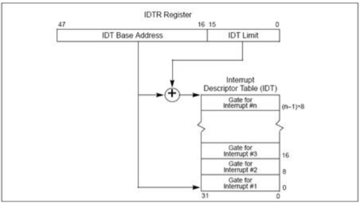
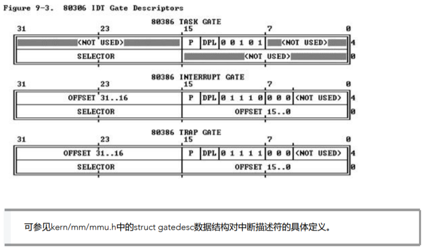
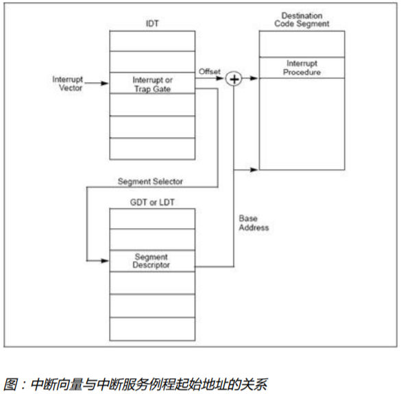
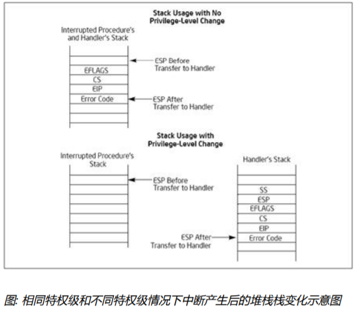
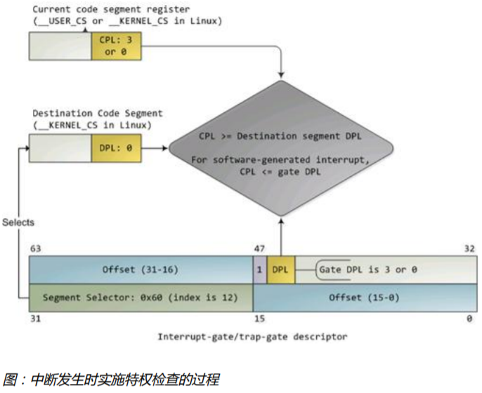
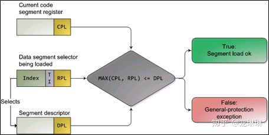
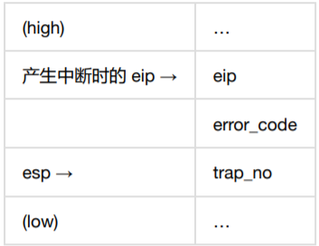
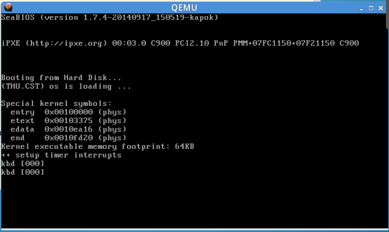
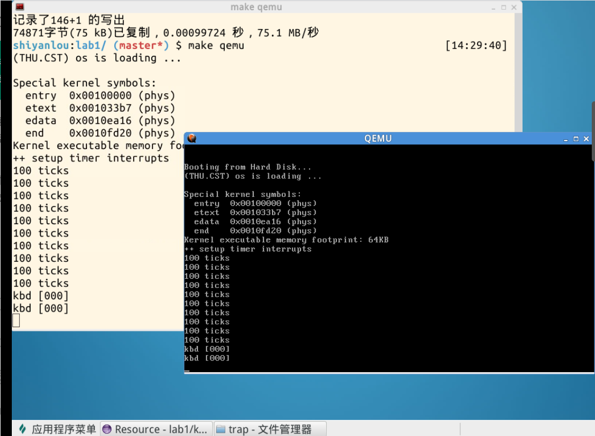

# Lab1

## 练习1：理解通过make生成执行文件的过程。（要求在报告中写出对下述问题的回答）

列出本实验各练习中对应的操作系统原理的知识点，并说明本实验中的实现部分如何对应和体现了原理中的基本概念和关键知识点。

在此练习中，大家需要通过静态分析代码来了解：

1. 操作系统镜像文件ucore.img是如何一步一步生成的？(需要比较详细地解释Makefile中每一条相关命令和命令参数的含义，以及说明命令导致的结果)

   在labcodes_answer/lab1_result目录下执行

   ```
   make clean
   ```

   可以把编译过的删除。

   ```
   make V=
   ```

   可以把执行的过程显示出来：

   ```
   moocos-> make V=
   
   # gcc 命令 .c 转换为 .o
   + cc kern/init/init.c
   gcc -Ikern/init/ -fno-builtin -Wall -ggdb -m32 -gstabs -nostdinc  -fno-stack-protector -Ilibs/ -Ikern/debug/ -Ikern/driver/ -Ikern/trap/ -Ikern/mm/ -c kern/init/init.c -o obj/kern/init/init.o
   + cc kern/libs/readline.c
   gcc -Ikern/libs/ -fno-builtin -Wall -ggdb -m32 -gstabs -nostdinc  -fno-stack-protector -Ilibs/ -Ikern/debug/ -Ikern/driver/ -Ikern/trap/ -Ikern/mm/ -c kern/libs/readline.c -o obj/kern/libs/readline.o
   + cc kern/libs/stdio.c
   gcc -Ikern/libs/ -fno-builtin -Wall -ggdb -m32 -gstabs -nostdinc  -fno-stack-protector -Ilibs/ -Ikern/debug/ -Ikern/driver/ -Ikern/trap/ -Ikern/mm/ -c kern/libs/stdio.c -o obj/kern/libs/stdio.o
   + cc kern/debug/kdebug.c
   gcc -Ikern/debug/ -fno-builtin -Wall -ggdb -m32 -gstabs -nostdinc  -fno-stack-protector -Ilibs/ -Ikern/debug/ -Ikern/driver/ -Ikern/trap/ -Ikern/mm/ -c kern/debug/kdebug.c -o obj/kern/debug/kdebug.o
   + cc kern/debug/kmonitor.c
   gcc -Ikern/debug/ -fno-builtin -Wall -ggdb -m32 -gstabs -nostdinc  -fno-stack-protector -Ilibs/ -Ikern/debug/ -Ikern/driver/ -Ikern/trap/ -Ikern/mm/ -c kern/debug/kmonitor.c -o obj/kern/debug/kmonitor.o
   + cc kern/debug/panic.c
   gcc -Ikern/debug/ -fno-builtin -Wall -ggdb -m32 -gstabs -nostdinc  -fno-stack-protector -Ilibs/ -Ikern/debug/ -Ikern/driver/ -Ikern/trap/ -Ikern/mm/ -c kern/debug/panic.c -o obj/kern/debug/panic.o
   + cc kern/driver/clock.c
   gcc -Ikern/driver/ -fno-builtin -Wall -ggdb -m32 -gstabs -nostdinc  -fno-stack-protector -Ilibs/ -Ikern/debug/ -Ikern/driver/ -Ikern/trap/ -Ikern/mm/ -c kern/driver/clock.c -o obj/kern/driver/clock.o
   + cc kern/driver/console.c
   gcc -Ikern/driver/ -fno-builtin -Wall -ggdb -m32 -gstabs -nostdinc  -fno-stack-protector -Ilibs/ -Ikern/debug/ -Ikern/driver/ -Ikern/trap/ -Ikern/mm/ -c kern/driver/console.c -o obj/kern/driver/console.o
   + cc kern/driver/intr.c
   gcc -Ikern/driver/ -fno-builtin -Wall -ggdb -m32 -gstabs -nostdinc  -fno-stack-protector -Ilibs/ -Ikern/debug/ -Ikern/driver/ -Ikern/trap/ -Ikern/mm/ -c kern/driver/intr.c -o obj/kern/driver/intr.o
   + cc kern/driver/picirq.c
   gcc -Ikern/driver/ -fno-builtin -Wall -ggdb -m32 -gstabs -nostdinc  -fno-stack-protector -Ilibs/ -Ikern/debug/ -Ikern/driver/ -Ikern/trap/ -Ikern/mm/ -c kern/driver/picirq.c -o obj/kern/driver/picirq.o
   + cc kern/trap/trap.c
   gcc -Ikern/trap/ -fno-builtin -Wall -ggdb -m32 -gstabs -nostdinc  -fno-stack-protector -Ilibs/ -Ikern/debug/ -Ikern/driver/ -Ikern/trap/ -Ikern/mm/ -c kern/trap/trap.c -o obj/kern/trap/trap.o
   + cc kern/trap/trapentry.S
   gcc -Ikern/trap/ -fno-builtin -Wall -ggdb -m32 -gstabs -nostdinc  -fno-stack-protector -Ilibs/ -Ikern/debug/ -Ikern/driver/ -Ikern/trap/ -Ikern/mm/ -c kern/trap/trapentry.S -o obj/kern/trap/trapentry.o
   + cc kern/trap/vectors.S
   gcc -Ikern/trap/ -fno-builtin -Wall -ggdb -m32 -gstabs -nostdinc  -fno-stack-protector -Ilibs/ -Ikern/debug/ -Ikern/driver/ -Ikern/trap/ -Ikern/mm/ -c kern/trap/vectors.S -o obj/kern/trap/vectors.o
   + cc kern/mm/pmm.c
   gcc -Ikern/mm/ -fno-builtin -Wall -ggdb -m32 -gstabs -nostdinc  -fno-stack-protector -Ilibs/ -Ikern/debug/ -Ikern/driver/ -Ikern/trap/ -Ikern/mm/ -c kern/mm/pmm.c -o obj/kern/mm/pmm.o
   + cc libs/printfmt.c
   gcc -Ilibs/ -fno-builtin -Wall -ggdb -m32 -gstabs -nostdinc  -fno-stack-protector -Ilibs/  -c libs/printfmt.c -o obj/libs/printfmt.o
   + cc libs/string.c
   gcc -Ilibs/ -fno-builtin -Wall -ggdb -m32 -gstabs -nostdinc  -fno-stack-protector -Ilibs/  -c libs/string.c -o obj/libs/string.o
   
   # ld 命令
   + ld bin/kernel
   ld -m    elf_i386 -nostdlib -T tools/kernel.ld -o bin/kernel  obj/kern/init/init.o obj/kern/libs/readline.o obj/kern/libs/stdio.o obj/kern/debug/kdebug.o obj/kern/debug/kmonitor.o obj/kern/debug/panic.o obj/kern/driver/clock.o obj/kern/driver/console.o obj/kern/driver/intr.o obj/kern/driver/picirq.o obj/kern/trap/trap.o obj/kern/trap/trapentry.o obj/kern/trap/vectors.o obj/kern/mm/pmm.o  obj/libs/printfmt.o obj/libs/string.o
   + cc boot/bootasm.S
   gcc -Iboot/ -fno-builtin -Wall -ggdb -m32 -gstabs -nostdinc  -fno-stack-protector -Ilibs/ -Os -nostdinc -c boot/bootasm.S -o obj/boot/bootasm.o
   + cc boot/bootmain.c
   gcc -Iboot/ -fno-builtin -Wall -ggdb -m32 -gstabs -nostdinc  -fno-stack-protector -Ilibs/ -Os -nostdinc -c boot/bootmain.c -o obj/boot/bootmain.o
   + cc tools/sign.c
   gcc -Itools/ -g -Wall -O2 -c tools/sign.c -o obj/sign/tools/sign.o
   gcc -g -Wall -O2 obj/sign/tools/sign.o -o bin/sign
   + ld bin/bootblock
   ld -m    elf_i386 -nostdlib -N -e start -Ttext 0x7C00 obj/boot/bootasm.o obj/boot/bootmain.o -o obj/bootblock.o
   'obj/bootblock.out' size: 488 bytes
   build 512 bytes boot sector: 'bin/bootblock' success!
   
   # dd 可以把 bootloader 放到虚拟硬盘中去
   dd if=/dev/zero of=bin/ucore.img count=10000
   10000+0 records in
   
   # 生成了两个：bootblock 和 kernel
   10000+0 records out
   
   5120000 bytes (5.1 MB) copied, 0.0315616 s, 162 MB/s
   dd if=bin/bootblock of=bin/ucore.img conv=notrunc
   1+0 records in
   1+0 records out
   
   512 bytes (512 B) copied, 0.000113492 s, 4.5 MB/s
   dd if=bin/kernel of=bin/ucore.img seek=1 conv=notrunc
   146+1 records in
   146+1 records out
   
   74923 bytes (75 kB) copied, 0.000407701 s, 184 MB/s
   [~/moocos/ucore_lab/labcodes_answer/lab1_result]
   moocos-> 
   
   ```
   
   可以看到调用了gcc，把源代码编译成 .o 目标文件。 ld 会把目标文件转换为 .out 可执行程序。dd 可以把 bootloader 放到虚拟硬盘中去。最后，生成了两个：bootblock 和 kernel
   
   **了解bootloader和ucore是怎么一步一步生成的。**
   
   当然，这些步骤取决于一个文件：
   
```
    less Makefile 
```

这个文件比较复杂，一开始不用去管。我们只用知道用了什么 .c 程序最后生成了 bootloader 和 ucore 就OK了！

2. 一个被系统认为是符合规范的**硬盘主引导扇区（MBR）**的特征是什么？

   ```
   less tools/sign.c 
   ```

   从 sign.c 文件来看，其代码有以下特征：

   argc 变量必须为3？？

   ```
       if (argc != 3) {		//argc不等于3会报错？？为什么？？
           fprintf(stderr, "Usage: <input filename> <output filename>\n");
           return -1;
       }
   ```

   st.st_size > 510，大小不能超过510？？

   块大小是512，因为主引导扇区最大512字节：

   ```
   	 22    char buf[512];
   ```

   0x55 和 0xAA 是主引导记录MBR的结束标志字：
   
   ```
        31     buf[510] = 0x55;		//第510个字节是0x55
     32     buf[511] = 0xAA;		//第511个字节是0xAA
   ```
   
   从 sign.c文件来看，有以上特征。
   
   

## 练习2：使用qemu执行并调试lab1中的软件。（要求在报告中简要写出练习过程）

为了熟悉使用**qemu和gdb进行的调试**工作，我们进行如下的小练习：

1. 从CPU加电后执行的第一条指令开始，单步跟踪BIOS的执行。

   在 ucore_lab/labcodes_answer/lab1_result 目录下执行：

   ```
   less Makefile
   ```

   然后键入：

   ```
   /lab1-mon
   ```

   得到：

   ```
   201 lab1-mon: $(UCOREIMG)
   202         $(V)$(TERMINAL) -e "$(QEMU) -S -s -d in_asm -D $(BINDIR)/q.log -monitor stdio -hda $< -serial null"				//将QEMU执行的信息存放在 q202.log 文件中
   
   203         $(V)sleep 2
   204         $(V)$(TERMINAL) -e "gdb -q -x tools/lab1init"		//和debug结合，调试bootloader;初始化执行指令
   205 debug-mon: $(UCOREIMG)
   ```

   ```
   less tools/lab1init
   ```

   这里面都是gdb所识别的命令：

       1 file bin/kernel			//加载bin/kernel
       2 target remote :1234		//与QEMU连接，端口是1234
       3 set architecture i8086	//BIOS阶段是i8086模式
       4 b *0x7c00					//break打断，在0x7c00处
       5 continue
       6 x /2i $pc					//pc是正在执行的指针的地址；x是显示的意思；/2i：显示两条；i是指令
   ```
   moocos-> make lab1-mon
   ```

   

   gdb中使用

   ```
    x /10i $pc
   ```

   可以显示最近的10条待执行的命令。

   **在实验中，经常使用 gdb 对 qemu 进行调试。**

   上面的这些汇编命令在 bootasm.s 文件中：

   

   **gdb 的使用在 练习2 的docs中有详细说明。**

   https://chyyuu.gitbooks.io/ucore_os_docs/content/lab1/lab1_2_1_2_ex2.html 

   

2. 在初始化位置0x7c00设置实地址断点,测试断点正常。

   **看bootloader究竟干什么了**

   bootloader做的事情（在 bootasm.S 文件中）：

   - 为何开启A20，以及如何开启A20
   - 如何初始化GDT表
   - 如何使能和进入保护模式

   

3. 从0x7c00开始跟踪代码运行,将单步跟踪反汇编得到的代码与bootasm.S和 bootblock.asm进行比较。

4. 自己找一个bootloader或内核中的代码位置，设置断点并进行测试。


## 练习3：分析bootloader进入保护模式的过程。（要求在报告中写出分析）

BIOS将通过读取硬盘主引导扇区到内存，并转跳到对应内存中的位置执行bootloader。请**分析bootloader是如何完成从实模式进入保护模式的**。

bootloader做了什么事？


bootloader进入保护模式的过程：

http://ilovestudy.wikidot.com/operating-system-lab-1#toc16

bootasm.S

1. 常量设置

   ```
   .set PROT_MODE_CSEG,        0x8   # kernel code segment selector（代码段选择器“CS”）
   .set PROT_MODE_DSEG,        0x10  # kernel data segment selector（数据段选择器“DS”）
   .set CR0_PE_ON,             0x1   # protected mode enable flag
   ```

2. 关闭中断，将段寄存器置为0

   为什么要关闭中断？？？

   可能是因为接下来要初始化重要的数据段寄存器，要执行内核特权指令？？

   ```
   .globl start
   start:
   .code16                                             # 以16位模式进行汇编
       cli                                             # Disable interrupts
       cld                                             # String operations increment
   
       # 设置重要的数据段寄存器 (DS, ES, SS).
       xorw %ax, %ax                                   # Segment number zero
       movw %ax, %ds                                   # -> Data Segment
       movw %ax, %es                                   # -> Extra Segment
       movw %ax, %ss                                   # -> Stack Segment
   ```

3. 开启A20（看下面）

4. 从实模式切换到保护模式（看下面的”如何初始化GDT表“）

5. 重置其他段寄存器（看下面）

6. 设置栈帧指针 并 调用C代码（bootmain函数）

   ```
       # Set up the stack pointer and call into C. The stack region is from 0--start(0x7c00)
       movl $0x0, %ebp
       movl $start, %esp
       call bootmain				// 调用bootmain函数
   
       # If bootmain returns (it shouldn't), loop.
   spin:
       jmp spin
   ```

7. 数据段

   boot/bootasm.S 中的 lgdt gdtdesc 把全局描述符表的大小和起始地址共8个字节加载到全局描述符表寄存器GDTR中。从代码中可以看到全局描述符表的大小为0x17 + 1 = 0x18，也就是24字节。由于全局描述符表每项大小为8字节，因此**一共有3项**，而第一项是空白项，所以全局描述符表中**只有两个有效的段描述符，分别对应代码段和数据段**。

   ```
   # Bootstrap GDT
   .p2align 2                                   # force 4 byte alignment（强制4字节对齐）
   # 给出3项全局描述符表，分别是空白、代码段和数据段
   gdt:
       SEG_NULLASM                              # 空白
       # SEG_ASM 在 asm.h 中定义了参数信息 SEG_ASM(type,base,lim)
       SEG_ASM(STA_X|STA_R, 0x0, 0xffffffff)    # 代码段全局描述符
       SEG_ASM(STA_W, 0x0, 0xffffffff)          # 数据段全局描述符
   
   gdtdesc:
       .word 0x17                                      # sizeof(gdt) - 1
       .long gdt                                       # address gdt
   ```

   asm.h 中定义了 SEG_ASM 函数的参数信息：

   ```
   #define SEG_ASM(type,base,lim)     # 参数信息                             \
       .word (((lim) >> 12) & 0xffff), ((base) & 0xffff);          \
       .byte (((base) >> 16) & 0xff), (0x90 | (type)),             \
           (0xC0 | (((lim) >> 28) & 0xf)), (((base) >> 24) & 0xff)
   ```

   

提示：需要阅读**小节“保护模式和分段机制”**和lab1/boot/bootasm.S源码，了解如何从实模式切换到保护模式，需要了解：

bootloader设计中，涉及到了从实模式到保护模式的处理。

- 为何开启A20，以及如何开启A20

  问：为何开启A20？

  答：本质是为了完全向下兼容所设计的硬件A20 Gate来模仿以上的回绕特征。

  ​		https://wenku.baidu.com/view/d6efe68fcc22bcd126ff0c00.html

  ​		http://hengch.blog.163.com/blog/static/107800672009013104623747/

  ​		如果A20 Gate被打开，则当程序员给出100000H-10FFEFH之间的地址的时候，系统将真正访问这块内存区域；如果A20 Gate被禁止，则当程序员给出100000H-10FFEFH之间的地址的时候，系统仍然使用8086/8088的方式。

  ​		所以在我们ucore中要使用保护模式，我们应该把A20 Gate打开。

  问：如何开启A20？

  答：理论上讲，我们只要操作8042芯片的输出端口（64h）的bit 1，就可以控制A20 Gate。

  ​		实际上，当你准备向8042的输入缓冲区里写数据时，可能里面还有其它数据没有处理，所以，我们要首先禁止键盘操作，同时等待数据缓冲区中没有数据以后，才能真正地去操作8042打开或者关闭A20 Gate。

  ​		在 bootasm.S文件中开启A20 Gate的代码段：通过8042芯片控制的

  ```
  seta20.1:
      inb $0x64, %al                      # Wait for not busy(8042 input buffer empty).
      testb $0x2, %al
      jnz seta20.1
  
      movb $0xd1, %al                     # 0xd1 -> port 0x64
      outb %al, $0x64                     # 0xd1 means: write data to 8042's P2 port
  
  seta20.2:
      inb $0x64, %al                      # Wait for not busy(8042 input buffer empty).
      testb $0x2, %al
      jnz seta20.2
  
      movb $0xdf, %al        # 0xdf -> port 0x60
      outb %al, $0x60        # 0xdf = 11011111, means set P2's A20 bit(the 1 bit) to 1
  ```

- 如何初始化GDT表

  bootasm.S

  ```
      lgdt gdtdesc				# 加载GDT表
      movl %cr0, %eax				# 加载 cr0 到 eax
      orl $CR0_PE_ON, %eax		# cr0置数：1表示开启保护模式；0代表实模式。这里与分页无关
      							# orl指令可以将指定位置记为1，将 eax 的第0位置记为 1
      movl %eax, %cr0				# 将 cr0 的第0位置记为1
      
      # Jump to next instruction, but in 32-bit code segment.
      # Switches processor into 32-bit mode.
      ljmp $PROT_MODE_CSEG, $protcseg				# 执行完此行代码后就进入了32位保护模式
  ```

  bootasm.S

  重置其他寄存器：

  ```
  .code32
  protcseg:
      # Set up the protected-mode data segment registers
      movw $PROT_MODE_DSEG, %ax                       # Our data segment selector
      movw %ax, %ds                                   # -> DS: Data Segment
      movw %ax, %es                                   # -> ES: Extra Segment
      movw %ax, %fs                                   # -> FS
      movw %ax, %gs                                   # -> GS
      movw %ax, %ss                                   # -> SS: Stack Segment
  ```

- 如何使能和进入保护模式

  

  将控制寄存器CR0的第0位置记为1即可进入保护模式：

  ```
      movl %cr0, %eax
      orl $CR0_PE_ON, %eax
      movl %eax, %cr0
  ```


## 练习4：分析bootloader加载ELF格式的OS的过程。（要求在报告中写出分析）

通过阅读**bootmain.c**，了解bootloader如何**加载ELF文件**。通过分析源代码和通过qemu来运行并调试bootloader&OS，

进入到保护模式之后，bootloader 需要加载 elf 文件。因为ucore是以elf文件格式存在硬盘上的。

- bootloader如何读取硬盘扇区的？

  子问题：bootloader是怎么读取硬盘信息的？

  子问题：elf格式文件需要被分析，从而知道在内存中代码段、数据段的内存怎么分配？

- bootloader是如何加载ELF格式的OS？

  ------

  看bootmain.c文件：

  1. 一些常量定义

     ```
     #define SECTSIZE        512								// 一个扇区大小
     #define ELFHDR          ((struct elfhdr *)0x10000)      // scratch space
     ```

  2. waitdisk函数：等待硬盘准备好

     ```
     /* waitdisk - wait for disk ready */
     // 等待磁盘准备好
     static void
     waitdisk(void) {
         while ((inb(0x1F7) & 0xC0) != 0x40)
             /* do nothing */;
     }
     ```

     inb指令：inb 指令是从I/O端口读取一个字节(BYTE, HALF-WORD) ；具体的话要看**内联汇编**的知识。
  
     while ((inb(0x1F7) & 0xC0) != 0x40) 意思是不断查询读0x1F7寄存器的最高两位，直到最高位为0、次高位为1（这个状态应该意味着磁盘空闲）才返回。
  
     ‭0000 *01*xx xxxx
  
     0000 1100 0000‬	&
  
     ----------------------------
     
     0000 *01*00 0000	此时磁盘为空
     
3. readsect函数：读入一个磁盘扇区
  
   磁盘空闲后，就可以读取扇区了。
  
     ```
     /* readsect - read a single sector at @secno into @dst */
     // 读扇区
     static void
     readsect(void *dst, uint32_t secno) {
         // wait for disk to be ready
         waitdisk();
     	
     	//通过IO地址空间内联汇编实现的（X86中IO寻址方式）
         outb(0x1F2, 1);                         // count = 1；读入的扇区个数为1
         // 读扇区
         outb(0x1F3, secno & 0xFF);
         outb(0x1F4, (secno >> 8) & 0xFF);
         outb(0x1F5, (secno >> 16) & 0xFF);
         outb(0x1F6, ((secno >> 24) & 0xF) | 0xE0);
         
         outb(0x1F7, 0x20);                      // 0x20是读取磁盘的命令，放在0x1F7寄存器中
         										//上面的语句都是读取扇区的，读取的扇区起始编号共28位，分成4部分依次放在0x1F3~0x1F6寄存器中。
         										//outb指令（函数）都是在 libs/x86.h 文件中通过内联汇编实现的
     
         // wait for disk to be ready
         waitdisk();
     
         // 读扇区
         // insl(端口号, 扇区在主存中的起始地址, 读取次数)
         // SECTSIZE是扇区大小，值为512，在bootmain.c 的define被定义
         // 发出命令后，再次等待硬盘空闲。硬盘再次空闲后，开始从0x1F0寄存器中读数据。
         insl(0x1F0, dst, SECTSIZE / 4);				//为什么要除以4？？双字节？？不懂
     }
     ```
  
     SECTSIZE / 4 ？？为什么要除以4呢？？
  
     insl是一个IO端口指令，这个函数包含3个输入参数，port代表端口号，addr代表这个扇区存放在主存中的起始地址，cnt则代表读取的次数。该函数的汇编实现在 libs/x86.h 文件中实现：
  
     ```
     static inline void
     //insl(端口号, 扇区在主存中的起始地址, 读取次数)；通过内联汇编实现
     insl(uint32_t port, void *addr, int cnt) {
         asm volatile (
                 "cld;"
                 "repne; insl;"
                 : "=D" (addr), "=c" (cnt)
                 : "d" (port), "0" (addr), "1" (cnt)
                 : "memory", "cc");
     }
     ```
  
  4. readseg函数
  
     此步已到达“加载kernel步骤”。
  
     补充ELF头部文件知识：
  
     ELF(Executable and linking format)文件格式是Linux系统下的一种常用目标文件(object file)格式，有三种主要类型:
  
     - **用于执行的可执行文件(executable file)，用于提供程序的进程映像，加载的内存执行。 这也是本实验的OS文件类型。**
     - 用于连接的可重定位文件(relocatable file)，可与其它目标文件一起创建可执行文件和共享目标文件。
     - 共享目标文件(shared object file),连接器可将它与其它可重定位文件和共享目标文件连接成其它的目标文件，动态连接器又可将它与可执行文件和其它共享目标文件结合起来创建一个进程映像。
     
     

  这里只分析与本实验相关的ELF可执行文件类型。ELF header在文件开始处描述了整个文件的组织。ELF的文件头包含整个执行文件的控制结构，其定义在elf.h中：
     
  ELF头：
     
     ```
     /* file header */
     struct elfhdr {
         uint32_t e_magic;     // 必须等于 ELF_MAGIC；标志位，用于判断是否为elf文件
         uint8_t e_elf[12];	  // 12 字节，每字节对应意义如下：
     						  // 0 : 1 = 32 位程序；2 = 64 位程序
     						  // 1 : 数据编码方式，0 = 无效；1 = 小端模式；2 = 大端模式
     						  // 2 : 只是版本，固定为 0x1
     						  // 3 : 目标操作系统架构
     						  // 4 : 目标操作系统版本
     						  // 5 ~ 11 : 固定为 0
         uint16_t e_type;      // 1=relocatable, 2=executable, 3=shared object, 4=core image
         uint16_t e_machine;   // 3=x86, 4=68K, etc.
         uint32_t e_version;   // file version, always 1
         uint32_t e_entry;     // 程序入口的虚拟地址
         uint32_t e_phoff;     // program header 表的位置偏移
         uint32_t e_shoff;     // file position of section header or 0
         uint32_t e_flags;     // architecture-specific flags, usually 0
         uint16_t e_ehsize;    // size of this elf header
         uint16_t e_phentsize; // size of an entry in program header
         uint16_t e_phnum;     // program header表中的入口数目
         uint16_t e_shentsize; // size of an entry in section header
         uint16_t e_shnum;     // number of entries in section header or 0
         uint16_t e_shstrndx;  // section number that contains section name strings
     };
  ```
     
  其中重要的两个有：
     
  ```
     uint32_t e_phoff;     // program header 起始地址
     uint16_t e_phnum;     // program header 个数
  ```
     
  
     
  可执行文件的程序头部是一个 program header 结构的数组， 每个结构描述了一个段或者系统准备程序执行所必需的其它信息。
     
  程序段的头：程序段头包含代码段、数据段
     
  ```
     /* program section header */
     struct proghdr {
         uint32_t p_type;   // loadable code or data, dynamic linking info,etc.
         uint32_t p_offset; // 段的偏移值
         uint32_t p_va;     // 段第一个字节放在内存中的虚拟地址
         uint32_t p_pa;     // physical address, not used
         uint32_t p_filesz; // size of segment in file
         uint32_t p_memsz;  // 段在内存中占用的字节数 (bigger if contains bss）
         uint32_t p_flags;  // read/write/execute bits
         uint32_t p_align;  // required alignment, invariably hardware page size
     };
  ```
     
  要用到的重要头信息有：
     
  ```
     uint offset; // 段相对文件头的偏移值，由此可知怎么从文件中找到该段
     uint va; 	 // 段的第一个字节将被放到内存中的虚拟地址，由此可知要将该段加载到内存中的哪个位置
     uint memsz;	 // 段占用的字节数
     ```

  ​		根据ELF Header和Program Header表的信息，我们便可以将**ELF文件中的所有Segment**逐个加载到内存中。

  

  ​		接下来说readseg函数：

  ```
  /* *
   * readseg - read @count bytes at @offset from kernel into virtual address @va,
   * might copy more than asked.
   * */
  // 把bootloader之后的一个个磁盘扇区连续读取，完成分析工作。
  static void
  readseg(uintptr_t va, uint32_t count, uint32_t offset) {
  // readseg(虚拟地址, 段占用大小, offset) 
      uintptr_t end_va = va + count;
  
      // round down to sector boundary
      va -= offset % SECTSIZE;
  
      // 从offset字节转换为扇区，以确定在第几个扇区中。kernel开始于扇区1
      uint32_t secno = (offset / SECTSIZE) + 1;
  
      // If this is too slow, we could read lots of sectors at a time.
      // We'd write more to memory than asked, but it doesn't matter --
      // we load in increasing order.
      
      for (; va < end_va; va += SECTSIZE, secno ++) {
          readsect((void *)va, secno);
      }
  }
  ```

  

  1. bootmain函数：bootloader的入口函数
  
     首先从硬盘中将bin/kernel文件的第一页内容加载到内存地址为0x10000的位置，目的是读取kernel文件的ELF Header信息。
  
     ```
     /* bootmain - the entry of bootloader */
     void
     bootmain(void) {
         // read the 1st page off disk
         // 加载到内存0x10000处，段大小为512字节*8，偏移地址为0
         readseg((uintptr_t)ELFHDR, SECTSIZE * 8, 0);
     
         // 检验是否是有效的ELF
         if (ELFHDR->e_magic != ELF_MAGIC) {
             goto bad;
         }
     	
         struct proghdr *ph, *eph;
     
         // 读取ELF Header的e_phoff字段，得到Program Header表的起始地址；
         // 读取ELF Header的e_phnum字段，得到Program Header表的元素数目。
         ph = (struct proghdr *)((uintptr_t)ELFHDR + ELFHDR->e_phoff);
         eph = ph + ELFHDR->e_phnum;
         
         // 遍历Program Header表中的每个元素，得到每个Segment在文件中的偏移、
         // 要加载到内存中的位置（虚拟地址）及Segment的长度等信息，并通过磁盘I/O进行加载
         for (; ph < eph; ph ++) {
             readseg(ph->p_va & 0xFFFFFF, ph->p_memsz, ph->p_offset);
         }
     
         // 加载完毕，通过ELF Header的e_entry得到内核的入口地址，并跳转到该地址开始执行内核代码
         // 跳到内核程序入口地址，将cpu控制权交给ucore内核代码
         ((void (*)(void))(ELFHDR->e_entry & 0xFFFFFF))();	
     
     bad:
         outw(0x8A00, 0x8A00);
         outw(0x8A00, 0x8E00);
     
         /* do nothing */
         while (1);
     }
     ```

------

  **步骤分析总结**

  读取硬盘扇区的步骤为：

  - 等待硬盘准备好
  - 向内存中0x1F2-0x1F7区域中写入数据，说明需要读取的扇区的信息
  - 等待硬盘准备好
  - 从0x1F0处读入一个扇区的数据

  加载kernel的步骤为：

  - 读取磁盘上的1页（8个扇区），得到ELF头
  - 判断是否为合法ELF文件
  - 从ELF头中获得程序头的位置，从中获得每段的信息
  - 分别读取每段的信息
  - 读入每段对应的扇区并保存
  - 跳转到ELF文件的入口点

提示：可阅读“硬盘访问概述”，“ELF执行文件格式概述”这两小节。


## 练习5：实现函数调用堆栈跟踪函数 （需要编程）

我们需要在lab1中完成kdebug.c中函数print_stackframe的实现，可以通过函数print_stackframe来跟踪函数调用堆栈中记录的返回地址。在如果能够正确实现此函数，可在lab1中执行 “make qemu”后，在qemu模拟器中得到类似如下的输出：

```
……
ebp:0x00007b28 eip:0x00100992 args:0x00010094 0x00010094 0x00007b58 0x00100096
    kern/debug/kdebug.c:305: print_stackframe+22
ebp:0x00007b38 eip:0x00100c79 args:0x00000000 0x00000000 0x00000000 0x00007ba8
    kern/debug/kmonitor.c:125: mon_backtrace+10
ebp:0x00007b58 eip:0x00100096 args:0x00000000 0x00007b80 0xffff0000 0x00007b84
    kern/init/init.c:48: grade_backtrace2+33
ebp:0x00007b78 eip:0x001000bf args:0x00000000 0xffff0000 0x00007ba4 0x00000029
    kern/init/init.c:53: grade_backtrace1+38
ebp:0x00007b98 eip:0x001000dd args:0x00000000 0x00100000 0xffff0000 0x0000001d
    kern/init/init.c:58: grade_backtrace0+23
ebp:0x00007bb8 eip:0x00100102 args:0x0010353c 0x00103520 0x00001308 0x00000000
    kern/init/init.c:63: grade_backtrace+34
ebp:0x00007be8 eip:0x00100059 args:0x00000000 0x00000000 0x00000000 0x00007c53
    kern/init/init.c:28: kern_init+88
ebp:0x00007bf8 eip:0x00007d73 args:0xc031fcfa 0xc08ed88e 0x64e4d08e 0xfa7502a8
<unknow>: -- 0x00007d72 –
……
```

请完成实验，看看输出是否与上述显示大致一致，并解释最后一行各个数值的含义。

提示：可阅读小节“函数堆栈”，了解编译器如何建立函数调用关系的。在完成lab1编译后，查看lab1/obj/bootblock.asm，了解bootloader源码与机器码的语句和地址等的对应关系；查看lab1/obj/kernel.asm，了解 ucore OS源码与机器码的语句和地址等的对应关系。

要求完成函数kern/debug/kdebug.c::print_stackframe的实现，提交改进后源代码包（可以编译执行），并在实验报告中简要说明实现过程，并写出对上述问题的回答。

补充材料：

由于显示完整的栈结构需要解析内核文件中的调试符号，较为复杂和繁琐。代码中有一些辅助函数可以使用。例如可以通过调用print_debuginfo函数完成查找对应函数名并打印至屏幕的功能。具体可以参见kdebug.c代码中的注释。

------

kern/debug/kdebug.c::print_stackframe的实现：

```
void
print_stackframe(void) {
     /* LAB1 YOUR CODE : STEP 1 */
     /* (1) call read_ebp() to get the value of ebp. the type is (uint32_t);
      * (2) call read_eip() to get the value of eip. the type is (uint32_t);
      * (3) from 0 .. STACKFRAME_DEPTH
      *    (3.1) printf value of ebp, eip
      *    (3.2) (uint32_t)calling arguments [0..4] = the contents in address (unit32_t)ebp +2 [0..4]
      *    (3.3) cprintf("\n");
      *    (3.4) call print_debuginfo(eip-1) to print the C calling function name and line number, etc.
      *    (3.5) popup a calling stackframe
      *           NOTICE: the calling funciton's return addr eip  = ss:[ebp+4]
      *                   the calling funciton's ebp = ss:[ebp]
*/
    uint32_t ebp = read_ebp();
    uint32_t eip = read_eip();
    int i;
    for (i = 0; i < STACKFRAME_DEPTH && ebp != 0; i++) {
        cprintf("ebp: 0x%08x eip: 0x%08x args: ", ebp, eip);
        uint32_t *args = (uint32_t *)ebp + 2;
        int j;
        for (j = 0; j < 4; j++) {
            cprintf("0x%08x ", args[j]);
        }
        cprintf("\n");
        print_debuginfo(eip-1);

        eip = ((uint32_t *)ebp)[1];
        ebp = ((uint32_t *)ebp)[0];
    }
}


```

下一步：ebp + 1 的地址给eip，使得eip指向返回地址（return address）
再把ebp的内容给ebp回到上层调用函数继续输出。


最后一行， 7c00 - 7bf8 =  8，地址相差8。因为 bootloader 被加载到了 0x00007c00 地址处，在执行到bootasm最后"call bootmain"指令时，首先将返回地址压栈，再将当前ebp压栈，所以此时esp为0x00007bf8。（现在esp是栈顶）在 bootmain 函数入口处，有mov %esp %ebp指令（esp的值赋给ebp），故bootmain中ebp为0x00007bf8。


## 练习6：完善中断初始化和处理 （需要编程）

补充：中断知识

### 中断与异常

在操作系统中，有三种特殊的中断事件。 

1. 由CPU外部设备引起的外部事件如 I/O中断 、 时钟中断 、 控制台中断 等是异步产生的（即产生 的时刻不确定），与CPU的执行无关，我们称之为异步中断(asynchronous interrupt)也称外部 中断,简称 中断(interrupt)。 
2. 而把在CPU执行指令期间检测到不正常的或非法的条件(如除零错、地址访问越界)所引起的内 部事件称作同步中断(synchronous interrupt)，也称内部中断，简称 异常(exception)。 

3. 把在程序中使用请求系统服务的系统调用而引发的事件，称作 陷入中断(trapinterrupt)，也称 软中断(soft interrupt)，系统调用(system call)简称trap。在后续试验中会进一步讲解系统调 用。

(1) 中断描述符表（INTERRUPT DESCRIPTOR TABLE）

同GDT一样， IDT是一个8字节的描述符数组，但IDT的第一项可以包含一个描述符。**CPU把中断（异常）号乘 以8做为IDT的索引**。IDT可以位于内存的任意位置，CPU通过IDT寄存器（IDTR）的内容来寻址 IDT的起始地址。指令LIDT和SIDT用来操作IDTR。两条指令都有一个显示的操作数：一个6字节 表示的内存地址。指令的含义如下： 

1. LIDT（LoadIDTRegister）指令 ：使用一个包含线性地址基址和界限的内存操作数来加载IDT。 操作系统创建IDT时需要执行它来设定IDT的起始地址。这条指令只能在特权级0执行。（可参见libs/x86.h中的lidt函数实现，其实就是一条汇编指令） 
2. SIDT（StoreIDTRegister）指令 ：拷贝IDTR的基址和界限部分到一个内存地址。这条指令可以 在任意特权级执行。

IDT和IDTR寄存器的结构和关系如下图所示： 



在保护模式下，最多会存在256个Interrupt/Exception Vectors。范围0，31内的32个向量被异常 Exception和NMI使用，但当前并非所有这32个向量都已经被使用，有几个当前没有被使用的，请不要擅自使用它们，它们被保留，以备将来可能增加新的Exception。范围32~255内的向量被保留给用户定义的Interrupts。Intel没有定义，也没有保留这些Interrupts。用户可以将它们用作外部 I/O设备中断（8259A IRQ），或者系统调用（System Call 、Software Interrupts）等。

(2) IDT GATE DESCRIPTORS

Interrupts/Exceptions应该使用Interrupt Gate和Trap Gate，它们之间的唯一区别就是：当调用 Interrupt Gate时，Interrupt会被CPU自动禁止；而调用Trap Gate时，CPU则不会去禁止或打开 中断，而是保留它原来的样子。在IDT中，可以包含如下3种类型的Descriptor： 

- Task-gate descriptor （这里没有使用） 
- **Interrupt-gate descriptor （中断方式用到）** 
- **Trap-gate descriptor（系统调用用到）**

 下图图显示了80386的任务门描述符、中断门描述符、陷阱门描述符的格式：

中断描述符IDT：



(3) 中断处理中硬件负责完成的工作

中断服务例程包括具体负责处理中断（异常）的代码是操作系统的重要组成部分。需要注意区别的是，有两个过程由硬件完成： 

硬件中断处理过程1（起始：从CPU收到中断事件后，打断当前程序或任务的执行，根据某种机制跳转到中断服务例程去执行的过程。其具体流程如下： 

1. CPU在执行完当前程序的每一条指令后，都会去确认在执行刚才的指令过程中中断控制器 （如：8259A）是否发送中断请求过来，如果有那么CPU就会在相应的时钟脉冲到来时从 总线上读取中断请求对应的中断向量； 
2. CPU根据得到的中断向量（以此为索引）到IDT中找到该向量对应的中断描述符，中断描 述符里保存着中断服务例程的段选择子； 
3. CPU使用IDT查到的中断服务例程的段选择子从GDT中取得相应的段描述符，段描述符里保存了中断服务例程的段基址和属性信息，此时CPU就得到了中断服务例程的起始地址， 并跳转到该地址； 
4. **CPU会根据CPL和中断服务例程的段描述符的DPL信息确认是否发生了特权级的转换。**比如当前程序正运行在用户态，而中断程序是运行在内核态的，则意味着发生了特权级的转换，这时CPU会从当前程序的TSS信息（该信息在内存中的起始地址存在TR寄存器中）里取得该程序的内核栈地址，即包括内核态的ss和esp的值，并立即将系统当前使用的栈切换成新的内核栈。这个栈就是即将运行的中断服务程序要使用的栈。紧接着就将当前程序 使用的用户态的ss和esp压到新的内核栈中保存起来； 
5. CPU需要开始保存当前被打断的程序的现场（即一些寄存器的值），以便于将来恢复被打 断的程序继续执行。这需要利用内核栈来保存相关现场信息，即**依次压入当前被打断程序可参见kern/mm/mmu.h中的 struct gatedesc 数据结构对中断描述符的具体定义。** 使用的eflags，cs，eip，errorCode（如果是有错误码的异常）信息；
6. CPU利用中断服务例程的段描述符将其第一条指令的地址加载到cs和eip寄存器中，开始执行中断服务例程。这意味着先前的程序被暂停执行，中断服务程序正式开始工作。

硬件中断处理过程2（结束）：每个中断服务例程在有中断处理工作完成后需要通过iret（或 iretd）指令恢复被打断的程序的执行。CPU执行IRET指令的具体过程如下：

1. 程序执行这条iret指令时，首先会从内核栈里弹出先前保存的被打断的程序的现场信息， 即eflags，cs，eip重新开始执行； 
2.  **如果存在特权级转换（从内核态转换到用户态），则还需要从内核栈中弹出用户态栈的ss 和esp，这样也意味着栈也被切换回原先使用的用户态的栈了；** 
3.  如果此次处理的是带有错误码（errorCode）的异常，CPU在恢复先前程序的现场时，并不会弹出errorCode。这一步需要通过软件完成，即要求相关的中断服务例程在调用iret返 回之前添加出栈代码主动弹出errorCode。

下图显示了从中断向量到GDT中相应中断服务程序起始位置的定位方式:



(4) 中断产生后的堆栈栈变化 

下图显示了给出相同特权级和不同特权级情况下中断产生后的堆栈栈变化示意图：



(5) **中断处理的特权级转换**（Challenge 1）

中断处理得特权级转换是通过门描述符（gate descriptor）和相关指令来完成的。一个门描述符就是一个系统类型的段描述符，一共有4个子类型：

调用门描述符（call-gate descriptor），中断门描述符（interrupt-gate descriptor），陷阱门描述符（trap-gate descriptor）和任务门描述符 （task-gate descriptor）。

与中断处理相关的是**中断门描述符**和**陷阱门描述符**。这些门描述符被存储在中断描述符表（Interrupt Descriptor Table，简称IDT）当中。CPU把中断向量作为IDT表项的索引，用来指出当中断发生时使用哪一个门描述符来处理中断。中断门描述符和陷阱门描述符几乎是一样的。

中断发生时实施特权检查的过程如下图所示：

代码段中含有CPL权限信息。

[CPL是当前执行的程序或任务的特权级。它被存储在CS和SS的第0位和第1位上。]: https://www.cnblogs.com/chenwb89/p/operating_system_004.html



门中的DPL（权限控制）和段选择符一起控制着访问，同时，**段选择符（提供段基址）结合偏移量（Offset）指出了中断处理例程的入口点**。内核一般在门描述符中填入内核代码段的段选择子。产生中断后，CPU一定不会将运行控制从高特权环转向低特权环，**特权级必须要么保持不变（当操作系统内核自己被中断的时候），或被提升（当用户态程序被中断的时候）**。无论哪一种情况，作为结果的CPL必须等于目的代码段的DPL。如果CPL发生了改变，一个堆栈切换操作（通过TSS完成）就会发生。如果中断是被用户态程序中的指令所触发的（比如软件执行INT n生产的中断），还会增加一个额外的检查：



越高的数值代表越低的特权，上图中的MAX(CPL, RPL)用于选择CPL和RPL中特权最低的一个，并与描述符特权级（Descriptor Privilege Level，简称DPL）比较。如果DPL的值大于等于它，那么这个访问可正常进行了。

**门的DPL必须具有与CPL（当前执行的代码段的权限）相同或更低的特权**。这就防止了用户代码随意触发中断。如果这 些检查失败，会产生一个一般保护异常（general-protection exception）。


DPL：描述符特权（Descriptor Privilege Level）

存储在描述符中的权限位，用于描述代码的所属的特权等级，也就是**代码本身真正的特权级**。一个程序可以使用多个段（Data，Code，Stack）也可以只用一个code段等。正常的情况下，当程序的环境建立好后，段描述符都不需要改变——当然DPL也不需要改变，因此**每个段的DPL值是固定**。


CPL：当前任务特权（Current Privilege Level）

表示**当前正在执行的代码所处的特权级**。CPL保存在CS中的最低两位，是针对CS而言的。当选择子成功装入CS寄存器后，相应的选择子中的RPL就变成了 CPL。因为它的位置变了，已经被装入到CS寄存器中了，所表达的意思也发生了变——原来的要求等级已经得到了满足，就是当前自己的等级。

选择子可以有许多个，因此RPL也就有许多个。而CPL就不同了，正在执行的代码在某一时刻就只有这个值唯一的代表程序的CPL。

另外特别要求CS与SS的特权级必须保持一致。对于装入DS、ES、FS、GS的选择子INTEL没有给它们起什么特殊的名称，我也不知道应该叫它们什么，也许可以仍然称它为RPL。

[DPL：描述符特权（Descriptor Privilege Level）]: https://www.cnblogs.com/pang123hui/archive/2010/11/27/2309924.html
[CPL：当前任务特权（Current Privilege Level）]: https://www.cnblogs.com/pang123hui/archive/2010/11/27/2309924.html


### 对中断处理实现

(1) 外设基本初始化设置 

Lab1实现了中断初始化和对键盘、串口、时钟外设进行中断处理。串口的初始化函 数 serial_init（位于 /kern/driver/console.c）中涉及中断初始化工作的很简单：

```
……
//使能串口1接收字符后产生中断
outb(COM1+COM_IER,COM_IER_RDI);
……
//通过中断控制器使能串口1中断
pic_enable(IRQ_COM1);

```

键盘的初始化函数 kbd_init（位于 kern/driver/console.c中）完成了对键盘的中断初始化工作， 具体操作更加简单：

```
……
//通过中断控制器使能键盘输入中断
pic_enable(IRQ_KBD);

```

时钟是一种有着特殊作用的外设，其作用并不仅仅是计时。在后续章节中将讲到，正是由于有了 规律的时钟中断，才使得无论当前CPU运行在哪里，操作系统都可以在预先确定的时间点上获得 CPU控制权。这样**当一个应用程序运行了一定时间后，操作系统会通过时钟中断获得CPU控制权**，并可把CPU资源让给更需要CPU的其他应用程序。时钟的初始化函数 clock_init（位于 kern/driver/clock.c中）完成了对时钟控制器8253的初始化：

```
……
//设置时钟每秒中断100次
outb(IO_TIMER1,TIMER_DIV(100)%256);
outb(IO_TIMER1,TIMER_DIV(100)/256);
//通过中断控制器使能时钟中断
pic_enable(IRQ_TIMER);
```

(2) 中断初始化设置 

操作系统如果要正确处理各种不同的中断事件，就需要安排应该由哪个中断服务例程负责处理特定的中断事件。系统将所有的中断事件统一进行了编号（0～255），这个编号称为中断向量。

以 ucore为例，操作系统内核启动以后，会通过 idt_init 函数初始化 idt 表 (参见 trap.c)，而其中 vectors 中存储了中断处理程序的入口地址。vectors 定义在 vector.S 文件中，通过一个工具程序 vector.c 生成。其中仅有 System call 中断的权限为**用户权限 (DPL_USER)，即仅能够使用 int0x30 指令**。此外还有对 tickslock 的初始化，该锁用于处理时钟中断。 vector.S 文件通过 vectors.c 自动生成，其中定义了每个中断的入口程序和入口地址 (保存在 vectors 数组中)。其中，中断可以分成两类： 

- 一类是压入错误编码的 (error code)，
- 另一类不压入错误编码。 - 对于第二类， vector.S 自动压入一个 0。 此外，还会压入相应中断的中断号。在压入两个必要 的参数之后，中断处理函数跳转到统一的入口 alltraps 处。

 (3) 中断的处理过程

trap函数（定义在trap.c中）是对中断进行处理的过程，所有的中断在经过中断入口函数 __alltraps预处理后 (定义在 trapasm.S中) ，都会跳转到这里。在处理过程中，根据不同的中断类型，进行相应的处理。在相应的处理过程结束以后，trap将会返回，被中断的程序会继续运行。 整个中断处理流程大致如下： 

trapasm.S 

1) 产生中断后，CPU 跳转到相应的中断处理入口 (vectors)，并在桟中压入相应的 error_code（是否存在与异常号相关） 以及 trap_no，然后跳转到 alltraps 函数入口： 注意：此处的跳转是 jmp 过程



在栈中保存当前被打断程序的 trapframe 结构(参见过程trapasm.S)。设置 kernel (内核) 的数据段寄存器，最后压入 esp，作为 trap 函数参数 (structtrapframe*tf) 并跳转到中断处理函数 trap 处：

注意：此时的跳转是 call 调用，会压入返回地址 eip，注意区分此处eip与trapframe中eip。

trapframe的结构为：

```
structtrapframe
{
uintedi;
uintesi;
uintebp;
…
ushortes;
ushortpadding1;
ushortds;
ushortpadding2;
uinttrapno;
uinterr;
uinteip;
…
}

```

观察 trapframe 结构与中断产生过程的压桟顺序。 需要明确 pushal 指令都保存了哪些寄存器，按照什么顺序？

2) 详细的中断分类以及处理流程如下：

**根据中断号对不同的中断进行处理**。其中，若中断号是 IRQ_OFFSET+IRQ_TIMER 为时钟中断，则 把ticks 将增加一。

- 若中断号是 IRQ_OFFSET+IRQ_COM1 为串口中断，则显示收到的字符。

- 若中断号是 IRQ_OFFSET+IRQ_KBD 为键盘中断，则显示收到的字符。 

- 若为其他中断且产生在内核状态，则挂起系统；

3) 结束 trap 函数的执行后，通过 ret 指令返回到 alltraps 执行过程。

从栈中恢复所有寄存器的值。 调整 esp 的值：跳过栈中的 trap_no 与 error_code，使 esp指向中断返回 eip，通过 iret 调 用恢复 cs、 eflag以及 eip，继续执行。 

至此，对整个lab1中的主要部分的背景知识和实现进行了阐述。请大家能够根据前面的练习要求完成所有的练习。

[]: http://jszx.fudan.edu.cn/_upload/article/files/3e/a4/2ee2f76243e7985e5d1e57347450/c1d17e31-5919-4cfb-9be8-41dfff0be555.pdf	"实验1：系统软件的启动过程 - 复旦大学计算机实验教学中心"

------

请完成编码工作和回答如下问题：

1. 中断描述符表（也可简称为保护模式下的中断向量表）中一个表项占多少字节？其中哪几位代表中断处理代码的入口？

   每个中断描述符表（IDT）8字节~64位，由 gatedesc 结构体定义，共有256个IDT，共2K字节。

   中断向量是中断服务程序的入口地址（包含段基址CS和偏移量IP）。CS和IP合在一起叫中断向量。

   Ps：在实模式下是CS:IP，在保护模式下是CS:EIP

   kern/mm/mmu.h：

   ```
   struct gatedesc {
       unsigned gd_off_15_0 : 16;       	// offset偏移地址
       unsigned gd_ss : 16;            	// segment selector
       unsigned gd_args : 5;           	// # args, 0 for interrupt/trap gates
       unsigned gd_rsv1 : 3;            	// reserved(should be zero I guess)
       unsigned gd_type : 4;            	// type(STS_{TG,IG32,TG32})
       unsigned gd_s : 1;                	// must be 0 (system)
       unsigned gd_dpl : 2;            	// 特权级
       unsigned gd_p : 1;                	// Present
       unsigned gd_off_31_16 : 16;         // offset偏移地址
   };
   ```

   **第16 ~ 32位是段选择子（segment selector）**，用于索引全局描述符表GDT来获取中断处理代码对应的**段地址**：

   

​		RPL：请求特权级RPL(Request Privilege Level)

​		RPL保存在选择子的最低两位。 RPL 说明的是进程对段访问的请求权限，意思是**当前进程想要的请求权限**。 RPL 的值由程序员自己来自由的设置，并不一定RPL>=CPL，但是当RPL<CPL时，实际起作用的就是CPL了，因为访问时的特权检查是判断：EPL=max(RPL,CPL)<=DPL是否成立，所以**RPL可以看成是每次访问时的附加限制**，RPL=0时附加限制最小，RPL=3时附加限制最大。所以你不要想通过来随便设置一个rpl来访问一个比cpl更内层的段。

​		因为你不可能得到比自己更高的权限，你申请的权限一定要比你实际权限低才能通过CPU的审查，才能对你放行。所以实际上RPL的作用是程序员可以把自己的程序降级运行——有些时候为了更好的安全性,程序可以在适当的时机把自身降低权限（RPL设成更大的值）。

[RPL：请求特权级RPL(Request Privilege Level)]: https://www.cnblogs.com/pang123hui/archive/2010/11/27/2309924.html

​		Ps：段选择子在寄存器中。

​		Ps：段选择子的index指向段描述符。段描述符内有CS，和offset配合即可找到中断服务函数的地址。

​		**第0～15位：偏移地址的0～15位；第48～63位：偏移地址的16～31位。**

​		好啦！通过以上加粗的部分，现在就可以找到中断服务函数的地址了！

2. 请编程完善kern/trap/trap.c中对中断向量表进行初始化的函数idt_init。在idt_init函数中，依次对所有中断入口进行初始化。使用mmu.h中的SETGATE宏，填充idt数组内容。每个中断的入口由tools/vectors.c生成，使用trap.c中声明的vectors数组即可。

   kern/trap/trap.c::idt_init

   ```
   /* idt_init - initialize IDT to each of the entry points in kern/trap/vectors.S */
   void
   idt_init(void) {
        /* LAB1 YOUR CODE : STEP 2 */
        /* (1) Where are the entry addrs of each Interrupt Service Routine (ISR)?
         *     All ISR's entry addrs are stored in __vectors. where is uintptr_t __vectors[] ?
         *     __vectors[] is in kern/trap/vector.S which is produced by tools/vector.c
         *     (try "make" command in lab1, then you will find vector.S in kern/trap DIR)
         *     You can use  "extern uintptr_t __vectors[];" to define this extern variable which will be used later.
         * (2) Now you should setup the entries of ISR in Interrupt Description Table (IDT).
         *     Can you see idt[256] in this file? Yes, it's IDT! you can use SETGATE macro to setup each item of IDT
         * (3) After setup the contents of IDT, you will let CPU know where is the IDT by using 'lidt' instruction.
         *     You don't know the meaning of this instruction? just google it! and check the libs/x86.h to know more.
         *     Notice: the argument of lidt is idt_pd. try to find it!
         */
   	extern uintptr_t  __vectors[];
   	int i;
   	for (i = 0; i < sizeof(idt) / sizeof(struct gatedesc); i++) {		//idt: 256 IDT; struct gatedesc: one IDT's size
   		SETGATE(idt[i], 0, GD_KTEXT, __vectors[i], DPL_KERNEL);
   	}
   	SETGATE(idt[T_SWITCH_TOK], 0, GD_KTEXT, __vectors[T_SWITCH_TOK], DPL_USER);
   	lidt(&idt_pd);		// 完成对IDT的加载
   }
   ```

   Ps：T_SWITCH_TOK的发生时机是在用户空间的，所以对应的dpl需要修改为DPL_USER。

   [T_SWITCH_TOK的发生时机是在用户空间的，所以对应的dpl需要修改为DPL_USER。]: https://zhuanlan.zhihu.com/p/52022017

   

   作用：初始化中断描述符表

   1. __vectors[]数组用来对应中断描述符表中的256个中断符。然后经过for循环运用SETGATE函数进行中断门的初始化。

   2. 经过对一些参数的设置完成初始化过程，关注下咱们传入的参数，首先是idt[i]，在这里就是对应的门的编号；0，在这里是咱们传入的istrap，传入0表示是一个中断门，而不是陷阱；

   3. 咱们能够看到是一个全局变量，能够读到内核的text，在这里至关于段选择子，能够选择须要的数据；__vectors[]，读取0~15低16位的数据；DPL_KERNEL,权限级设置，标明拥有内核权限。

   4. 接下来，就须要对用户态转内核态的中断表进行初始化了，和上面的不一样之处只是在于特权值的不一样，因此咱们操作一下。

   5. 最后加载IDT全局描述符表。

      []: https://blog.csdn.net/tiu2014/article/details/53998595

3. 请编程完善trap.c中的中断处理函数trap，在对时钟中断进行处理的部分填写trap函数中处理时钟中断的部分，使操作系统每遇到100次时钟中断后，调用print_ticks子程序，向屏幕上打印一行文字”100 ticks”。

   trap.c::trap

   ```
   /* trap_dispatch - dispatch based on what type of trap occurred */
   static void
   trap_dispatch(struct trapframe *tf) {
       char c;
   
       switch (tf->tf_trapno) {
       case IRQ_OFFSET + IRQ_TIMER:
           /* LAB1 YOUR CODE : STEP 3 */
           /* handle the timer interrupt */
           /* (1) After a timer interrupt, you should record this event using a global variable (increase it), such as ticks in kern/driver/clock.c
            * (2) Every TICK_NUM cycle, you can print some info using a funciton, such as print_ticks().
            * (3) Too Simple? Yes, I think so!
            */
       ticks++;
       if  (ticks % TICK_NUM == 0) {
       	print_ticks();
       }
           break;
       case IRQ_OFFSET + IRQ_COM1:
           c = cons_getc();
           cprintf("serial [%03d] %c\n", c, c);
           break;
       case IRQ_OFFSET + IRQ_KBD:
           c = cons_getc();
           cprintf("kbd [%03d] %c\n", c, c);
           break;
       //LAB1 CHALLENGE 1 : YOUR CODE you should modify below codes.
       case T_SWITCH_TOU:
       case T_SWITCH_TOK:
           panic("T_SWITCH_** ??\n");
           break;
       case IRQ_OFFSET + IRQ_IDE1:
       case IRQ_OFFSET + IRQ_IDE2:
           /* do nothing */
           break;
       default:
           // in kernel, it must be a mistake
           if ((tf->tf_cs & 3) == 0) {
               print_trapframe(tf);
               panic("unexpected trap in kernel.\n");
           }
       }
   }
   ```

   

> 【注意】除了系统调用中断(T_SYSCALL)使用陷阱门描述符且权限为用户态权限以外，其它中断均使用特权级(DPL)为０的中断门描述符，权限为内核态权限；而ucore的应用程序处于特权级３，需要采用｀int 0x80`指令操作（这种方式称为软中断，软件中断，Tra中断，在lab5会碰到）来发出系统调用请求，并要能实现从特权级３到特权级０的转换，所以系统调用中断(T_SYSCALL)所对应的中断门描述符中的特权级（DPL）需要设置为３。

要求完成问题2和问题3 提出的相关函数实现，提交改进后的源代码包（可以编译执行），并在实验报告中简要说明实现过程，并写出对问题1的回答。完成这问题2和3要求的部分代码后，运行整个系统，可以看到大约每1秒会输出一次”100 ticks”，而按下的键也会在屏幕上显示。

提示：可阅读小节“中断与异常”。


## 扩展练习 Challenge 1（需要编程）

扩展proj4,增加syscall功能，即增加一用户态函数（可执行一特定系统调用：获得时钟计数值），当内核初始完毕后，可从内核态返回到用户态的函数，而用户态的函数又通过系统调用得到内核态的服务（通过网络查询所需信息，可找老师咨询。如果完成，且有兴趣做代替考试的实验，可找老师商量）。需写出详细的设计和分析报告。完成出色的可获得适当加分。

提示： 规范一下 challenge 的流程。

kern_init 调用 switch_test，该函数如下：

```
    static void
    switch_test(void) {
        print_cur_status();          // print 当前 cs/ss/ds 等寄存器状态
        cprintf("+++ switch to  user  mode +++\n");
        switch_to_user();            // switch to user mode
        print_cur_status();
        cprintf("+++ switch to kernel mode +++\n");
        switch_to_kernel();         // switch to kernel mode
        print_cur_status();
    }
```

switch*to** 函数建议通过 中断处理的方式实现。主要要完成的代码是在 trap 里面处理 T_SWITCH_TO* 中断，并设置好返回的状态。

在 lab1 里面完成代码以后，执行 make grade 应该能够评测结果是否正确。

------

kern/init/init.c：

```
void
kern_init(void){
    extern char edata[], end[];
    memset(edata, 0, end - edata);

    cons_init();                // init the console

    const char *message = "(THU.CST) os is loading ...";
    cprintf("%s\n\n", message);

    print_kerninfo();

    grade_backtrace();

    pmm_init();                 // init physical memory management

    pic_init();                 // 中断控制器初始化（使用了特殊的硬件：8259）
    							// 我们可以理解为把8259配置好后，相应的外设就能产生中断并被CPU处理
    idt_init();                 // 初始化IDT；练习6的第2题已经实现

    clock_init();               // 初始化时钟中断（与硬件8253相关）
    intr_enable();              // 使能中断

    //LAB1: CAHLLENGE 1 If you try to do it, uncomment lab1_switch_test()
    // user/kernel mode switch test
    lab1_switch_test();

    /* do nothing */
    while (1);
}
```

intr_enable()：

```
#include <x86.h>
#include <intr.h>

/* intr_enable - enable irq interrupt */
void
intr_enable(void) {								// 中断使能enable
    sti();										// 使用了内联汇编
}

/* intr_disable - disable irq interrupt */
void
intr_disable(void) {							// 使能disable
    cli();
}
```

trap/trap.h：（摘取部分代码）

其中有个很重要的数据结构 struct trapframe

作用：保存了被打断的那一刻重要的寄存器信息。

```
struct trapframe {
	/* 产生中断后，软件保存的信息 */
    struct pushregs tf_regs;
    uint16_t tf_gs;
    uint16_t tf_padding0;
    uint16_t tf_fs;
    uint16_t tf_padding1;
    uint16_t tf_es;
    uint16_t tf_padding2;
    uint16_t tf_ds;
    uint16_t tf_padding3;
    uint32_t tf_trapno;
   
    /* 产生中断后，CPU硬件保存的信息 */
    uint32_t tf_err;
    uintptr_t tf_eip;
    uint16_t tf_cs;
    uint16_t tf_padding4;
    uint32_t tf_eflags;
    
    /* 用户产生中断切换到内核态，要额外多保存的信息，以便于最后恢复到用户态 */
    /* X86模式下，用户态设置为特权级3，内核态为0 */
    uintptr_t tf_esp;
    uint16_t tf_ss;
    uint16_t tf_padding5;
} __attribute__((packed));
```

```
 //LAB1 CHALLENGE 1 : YOUR CODE you should modify below codes.
    case T_SWITCH_TOU:
        if (tf->tf_cs != USER_CS) {
            switchk2u = *tf;
            switchk2u.tf_cs = USER_CS;
            
            switchk2u.tf_ds = switchk2u.tf_es = switchk2u.tf_ss = USER_DS;
            switchk2u.tf_esp = (uint32_t)tf + sizeof(struct trapframe) - 8;
		
            // 设置eflags的IO位，让用户态可以使用io。
            // 如果 CPL > IOPL（权限不够）, 那么就会产生一个保护。
            switchk2u.tf_eflags |= FL_IOPL_MASK;
		
            // set temporary stack
            // then iret will jump to the right stack
            // iret回到用户栈
            *((uint32_t *)tf - 1) = (uint32_t)&switchk2u;
        }
        break;				
    case T_SWITCH_TOK:						// 切换到内核模式
        if (tf->tf_cs != KERNEL_CS) {
            tf->tf_cs = KERNEL_CS;
            
            tf->tf_ds = tf->tf_es = KERNEL_DS;
            tf->tf_eflags &= ~FL_IOPL_MASK;			// 关闭用户态使用IO特权为位
            
            // 定义临时栈
            switchu2k = (struct trapframe *)(tf->tf_esp - (sizeof(struct trapframe) - 8));
            memmove(switchu2k, tf, sizeof(struct trapframe) - 8);
            *((uint32_t *)tf - 1) = (uint32_t)switchu2k;
        }
        break;
```


参考资料与文献：

(28 封私信 _ 80 条消息) 如何理解保护模式_ - 知乎.mhtml

AT&T_GCC_ASM简单介绍-geekerunix-ChinaUnix博客.mhtml

 GNU汇编伪指令操作_运维_leumber的专栏-CSDN博客.mhtml

 I_O操作函数inb, outb, inw, outw_运维_kunlong0909的专栏-CSDN博客.mhtml

Lab_1：练习4——分析bootloader加载ELF格式的OS的过程 - chuyaoxin - 博客园.mhtml

 MIT 6.828 JOS学习笔记5. Exercise 1.3 - fatsheep9146 - 博客园.mhtml', 'name.py', 'Scientific Toolworks Understand 5.1.999 Mac 破解版 序列号 功能强大的代码编程工具_麦氪派.mhtml

ucore lab1 练习4_marszxa的博客-CSDN博客.mhtml

ucore 操作系统实验 lab1小结（含Challenge） – 此生虽苦 来日方长.mhtml

ucore-lab1-练习6report - Frank__Chen - 博客园.mhtml', 'ucore学习之旅之lab1-练习4 - 知乎.mhtml

_UCore实验一：系统软件启动过程_操作系统_Guten_Tag的博客-CSDN博客.mhtml

《ucore lab1 练习3》实验报告_qq_44768749的博客-CSDN博客.mhtml

一个操作系统的实现_关于CPL、RPL、DPL - 云说风轻 - 博客园.mhtml', '关于A20 Gate - whowin的日志 - 网易博客.mhtml_

关于A20_操作系统_车子（chezi）-CSDN博客.mhtml

关于printf输出格式%#08x的解释_C_C++_wangbinyantai的专栏-CSDN博客.mhtml

史上最全的Vim命令 - 知乎.mhtml

堆栈中的EIP EBP ESP_操作系统_大头针的专栏-CSDN博客.mhtm

实验1：系统软件的启动过程 - 复旦大学计算机实验教学中心.pdf

操作系统 内存地址（逻辑地址、线性地址、物理地址）概念_C_C++_Leves’ Blog-CSDN博客.mhtml

操作系统实验（1）：系统软件启动过程 - 张慕晖的博客.mhtml操作系统开发之——打开A20 - mfmdaoyou - 博客园.mhtml

操作系统篇-调用门与特权级（CPL、DPL和RPL） - 卫卐 - 博客园.mhtml', '激活A20地址线详解.doc