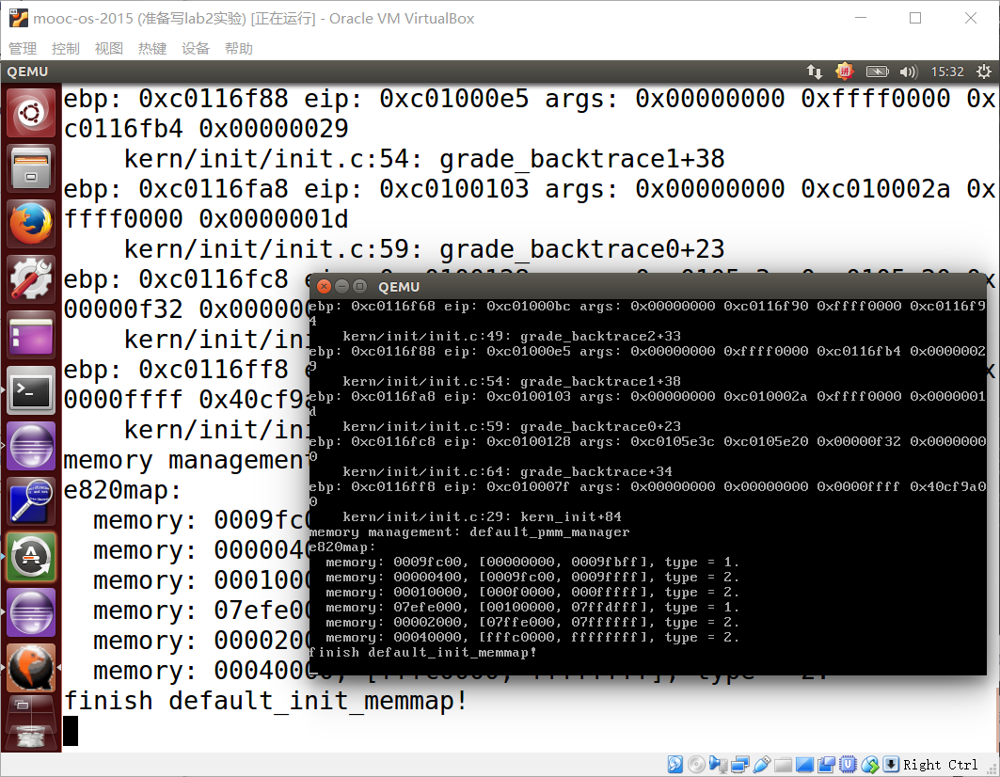
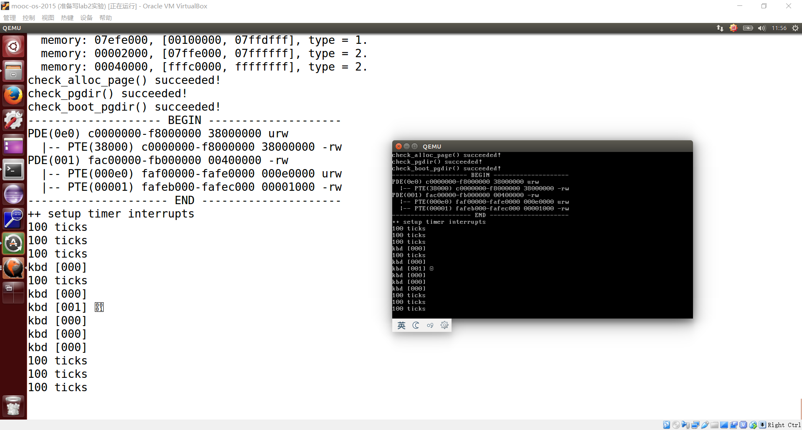

[TOC]

# Lab2

## **练习0：填写已有实验**

本实验依赖实验1。请把你做的实验1的代码填入本实验中代码中有“LAB1”的注释相应部分。提示：可采用diff和patch工具进行半自动的合并（merge），也可用一些图形化的比较/merge工具来手动合并，比如meld，eclipse中的diff/merge工具，understand中的diff/merge工具等。


Lab1中需要合并的文件：

- kdebug.c中函数print_stackframe
- kern/trap/trap.c中对中断向量表进行初始化的函数idt_init
- trap.c中的中断处理函数trap


## **练习1：实现 first-fit 连续物理内存分配算法（需要编程）**

在实现first fit 内存分配算法的回收函数时，要考虑地址连续的空闲块之间的合并操作。提示:在建立空闲页块链表时，需要按照空闲页块起始地址来排序，形成一个有序的链表。可能会修改default_pmm.c中的default_init，default_init_memmap，default_alloc_pages， default_free_pages等相关函数。请仔细查看和理解default_pmm.c中的注释。

首先根据练习1的要求，在default_pmm.c文件注释中要求重写

- default_init，
- default_init_memmap（需要重写），
- default_alloc_pages（需要重写）， 
- default_free_pages （需要重写）

4个函数。

first-fit连续物理内存分配算法大概思路：分配n个字节，使用第一个可用空间比n大的空闲块。

首先，针对内存，分为下面的几大模块：

1. 探测物理内存
2. 物理内存管理的初始化
3. 内存段页式管理
4. 地址映射
5. 自映射

可参考这里写的探测内存的方法：https://twinkle0331.github.io/ucore-lab2.html

当我们在bootloader中完成对物理内存空间的探测后， 我们就可以根据得到的信息来对可用的内存空间进行管理。在ucore中， 我们**将物理内存空间按照页的大小(4KB)进行管理**， 页的信息用Page这个结构体来保存。下面是Page在Lab2中的具体描述：

kern/mm/memlayout.h：

```
struct Page {
    int ref;                        // 映射此物理页的虚拟页个数
    uint32_t flags;                 // 物理页的状态标记
    unsigned int property;          // 空闲时，代表以此为首的连续空闲页的数量
    list_entry_t page_link;         // 把多个连续内存空闲块链接在一起的双向链表指针
};
```

ref：映射此物理页的虚拟页个数。一旦某页表中有一个页表项设置了虚拟页到这个Page管理的物理页的映射关系，就会把Page的ref加一。反之，若是解除，那就减一。

flags：表示此物理页的状态标记，有两个标志位，第一个表示是否被保留，如果被保留了则设为1（比如内核代码占用的空间）。第二个表示此页是否是free的。如果设置为1，表示这页是free的，可以被分配；如果设置为0，表示这页已经被分配出去了，不能被再二次分配。

property：记录某连续内存空闲块的大小。

page_link：是便于把多个连续内存空闲块链接在一起的双向链表指针，连续内存空闲块利用这个页的成员变量 page_link 来链接比它地址小和大的其他连续内存空闲块。

libs/list.h 双向链表：

双向链表在 libs/list.h 结构体定义并提供基本操作函数：

```
struct list_entry {
    struct list_entry *prev, *next;
};

typedef struct list_entry list_entry_t;

static inline void list_init(list_entry_t *elm) __attribute__((always_inline));
static inline void list_add(list_entry_t *listelm, list_entry_t *elm) __attribute__((always_inline));
static inline void list_add_before(list_entry_t *listelm, list_entry_t *elm) __attribute__((always_inline));
static inline void list_add_after(list_entry_t *listelm, list_entry_t *elm) __attribute__((always_inline));
static inline void list_del(list_entry_t *listelm) __attribute__((always_inline));
static inline void list_del_init(list_entry_t *listelm) __attribute__((always_inline));
static inline bool list_empty(list_entry_t *list) __attribute__((always_inline));
static inline list_entry_t *list_next(list_entry_t *listelm) __attribute__((always_inline));
static inline list_entry_t *list_prev(list_entry_t *listelm) __attribute__((always_inline));

static inline void __list_add(list_entry_t *elm, list_entry_t *prev, list_entry_t *next) __attribute__((always_inline));
static inline void __list_del(list_entry_t *prev, list_entry_t *next) __attribute__((always_inline));
```

kern/mm/memlayout.h：

```
/* free_area_t - maintains a doubly linked list to record free (unused) pages */
typedef struct {
    list_entry_t free_list;         // 是一个双向链表的指针
    unsigned int nr_free;           // 当前空闲页的个数
} free_area_t;
```

free_list：list_entry_t 是一个双向链表，所以 **list_entry_t free_list 是一个 list_entry 结构的双向链表指针**。
nr_free：记录当前空闲页的个数。

先来看 default_pmm.c::default_init ：

```
// 初始化空闲页块链表
static void
default_init(void) {
    list_init(&free_list);			
    nr_free = 0;					// 一开始空闲块是0个
}
```

初始化free_list并将nr_free设置为0。free_list用于记录空闲的mem块。nr_free是空闲mem块的总数。

default_init函数已经完成，我们不需要操作。

default_pmm.c::default_init_memmap：

```
* (3) default_init_memmap:  CALL GRAPH: kern_init --> pmm_init-->page_init-->init_memmap--> pmm_manager->init_memmap
 *              This fun is used to init a free block (with parameter: addr_base, page_number).
 *              First you should init each page (in memlayout.h) in this free block, include:
 *                  p->flags should be set bit PG_property (means this page is valid. In pmm_init fun (in pmm.c),
 *                  the bit PG_reserved is setted in p->flags)
 *                  if this page  is free and is not the first page of free block, p->property should be set to 0.
 *                  if this page  is free and is the first page of free block, p->property should be set to total num of block.
 *                  p->ref should be 0, because now p is free and no reference.
 *                  We can use p->page_link to link this page to free_list, (such as: list_add_before(&free_list, &(p->page_link)); )
 *              Finally, we should sum the number of free mem block: nr_free+=n
```


```
// 初始化n个空闲页块
static void
default_init_memmap(struct Page *base, size_t n) {
    assert(n > 0);					// 断言需要分配的内存块大小n大于0
    struct Page *p = base;
    // 将每个空闲页初始化并连接
    for (; p != base + n; p ++) {
        assert(PageReserved(p));	// 断言页被内核所保留，？？？不太懂
        p->flags = 0;				// 把这个连续空闲块的flags都设置为0
        p->property = 0;			// 再把这个连续空闲块的property都设置为0
        set_page_ref(p, 0);		// 清除引用该物理页的引用数
        SetPageProperty(p);		// 置1：所有空闲页第1位也就是PG_property位置为1   
        // 头插法
        list_add_before(&free_list, &(p->page_link));
    }
    base->property = n;// 对整块的第1个页面，其property属性记录的是连续空闲页的数量
    nr_free += n;	   // 空闲页个数
}
```



default_pmm.c::default_alloc_pages

 \* (4) default_alloc_pages: search find a first free block (block size >=n) in free list and reszie the free block, return the addr
 \*        of malloced block.
 \*        (4.1) So you should search freelist like this:
 \*            list_entry_t le = &free_list;
 \*            while((le=list_next(le)) != &free_list) {
 \*            ....
 \*         (4.1.1) In while loop, get the struct page and check the p->property (record the num of free block) >=n?
 \*            struct Page *p = le2page(le, page_link);
 \*            if(p->property >= n){ ...
 \*         (4.1.2) If we find this p, then it' means we find a free block(block size >=n), and the first n pages can be malloced.
 \*           Some flag bits of this page should be setted: PG_reserved =1, PG_property =0
 \*           unlink the pages from free_list
 \*           (4.1.2.1) If (p->property >n), we should re-caluclate number of the the rest of this free block,
 \*              (such as: le2page(le,page_link))->property = p->property - n;)
 \*         (4.1.3)  re-caluclate nr_free (number of the the rest of all free block)
 \*         (4.1.4)  return p
 \*        (4.2) If we can not find a free block (block size >=n), then return NULL

```
static void
default_init_memmap(struct Page *base, size_t n) {
    assert(n > 0);
    struct Page *p = base;
    for (; p != base + n; p ++) {
        assert(PageReserved(p));
        p->flags = p->property = 0;
        set_page_ref(p, 0);
        SetPageProperty(p);
        list_add_before(&free_list, &(p->page_link));
    }
    base->property = n;
    nr_free += n;
}

static struct Page *
default_alloc_pages(size_t n) {
    assert(n > 0);
    if (n > nr_free) {
        return NULL;
    }

    list_entry_t *len;			// 跟以前的p和q双指针差不多，le相当于前指针，len后指针
    list_entry_t *le = &free_list;
    while ((le = list_next(le)) != &free_list) {
        struct Page *p = le2page(le, page_link);
        if (p->property >= n) {
            // 分配页数
            int i;
            for (i = 0; i < n; i++) {
            	len = list_next(le);
            	struct Page *pp = le2page(le, page_link);
            	// 每一页的标志位改写
            	// 被内核所保留
            	SetPageReserved(pp);
            	// 不是头页
            	ClearPageProperty(pp);
            	// 既然分配好了，下一步就将其从freelist中删除
            	list_del(le);
            	le = len;
            }
            if (p->property > n) {
				// p指针移动到顶部（这里好象是反着的，其实到了头页）
				// 修改头页的标志位，可参考高书8.3.2
				//struct Page *p = le2page(le, page_link);
				le2page(le, page_link)->property = p->property - n;
			}
            // 修改头页的标志位
            ClearPageProperty(p);
            SetPageReserved(p);
            nr_free -= n;
            return p;
        }
    }
    return NULL;
}
```


default_pmm.c::default_free_pages

(5) default_free_pages: relink the pages into  free list, maybe merge（合并） small free blocks into big free blocks.

​	(5.1) according the base addr of withdrawed blocks（取消的块）, search free list, find the correct position

​			(from low to high addr), and insert the pages. (may use list_next, le2page, list_add_before)

​	(5.2) reset the fields of pages（页标志）, such as p->ref, p->flags (PageProperty)

​	(5.3) try to merge low addr or high addr blocks. Notice: should change some pages's p->property correctly.

```
// 释放掉n个页块
static void
default_free_pages(struct Page *base, size_t n) {
    assert(n > 0);
    // 断言base位置的页被内核所保留
    assert(PageReserved(base));

    list_entry_t le = &free_list;
    struct Page *p = NULL;
    while((le=list_next(le)) != &free_list) {
    	// 获取list对应的page
    	p = le2page(le, page_link);
		if (p>base) {
			break;
		}
    }

    // 对每个页进行遍历
    for (p = base; p < base + n; p ++) {
        // 将每个页插入到链表中
    	list_add_before(le, &(p->page_link));
    }
    // //以下3行用于修改首个页的属性，仅修改首页属性即可
    //base->flags = 0;
    //base->property = n;			// 归还的块的首页仍然记录连续空闲页的数目，暂时为n
    //set_page_ref(p, 0);			// 物理页应用数清空
    //ClearPageProperty(page);	// 先清零
    //SetPageProperty(base);		// 置1：所有空闲页第1位也就是PG_property位置为1
    // 下面这几句话是有顺序的？？？
    base->flags = 0;
    set_page_ref(base, 0);
    // 声明是头页
    SetPageProperty(base);
    // 记录空闲页的数目n
    base->property = n;
    

    // 如果是高位，则向高地址合并(高书图8-5)
    p = le2page(le, page_link);
    if (p == base+n) {
    	base->property = base->property + p->property;
    	p->property = 0;
    }
    
    // 向低地址合并(高书图8-6)
    le = list_prev(&(base->page_link));
    p = le2page(le, page_link);
    if (le != &free_list && p == base-1) {
		while (le != &free_list) {
			if (p->property > 0) {
				// p位于高地址，向低地址合并
				p->property += base->property;
				base->property = 0;
				break;
			}
			p = le2page(le, page_link);
			le = list_prev(le);
		}
    }
    nr_free += n;
}
```

请在实验报告中简要说明你的设计实现过程。请回答如下问题：

- 你的first fit算法是否有进一步的改进空间

  first fit有多种实现方式，上面采用的是清华大学ucore参考答案的实现代码。由于free代码有四类情况，清华答案中是分成了两类（向高地址合并和向低地址合并）。还可以按高一凡书的方法进行free。

## **练习2：实现寻找虚拟地址对应的页表项（需要编程）**

通过设置页表和对应的页表项，可建立虚拟内存地址和物理内存地址的对应关系。其中的get_pte函数是设置页表项环节中的一个重要步骤。此函数找到一个虚地址对应的二级页表项的内核虚地址，如果此二级页表项不存在，则分配一个包含此项的二级页表。本练习需要补全get_pte函数 in kern/mm/pmm.c，实现其功能。请仔细查看和理解get_pte函数中的注释。get_pte函数的调用关系图如下所示：

 图1 get_pte函数的调用关系图

参考：https://www.jianshu.com/p/3558942fe14f

在保护模式中，x86 体系结构将内存地址分成三种：逻辑地址（也称虚地址）、线性地址和物理地址。

逻辑地址即是程序指令中使用的地址，物理地址是实际访问内存的地址。

逻辑地址通过段式管理的地址映射可以得到线性地址，线性地址通过页式管理的地址映射得到物理地址。

**逻辑地址 --> 线性地址 -->物理地址**

对于32位线性地址，分为三个部分


​													页目录表（PDE）				页表（PTE）地址				


在mmu.h中有定义说明：

```
// A linear address 'la' has a three-part structure as follows:
//
// +--------10------+-------10-------+---------12----------+
// | Page Directory |   Page Table   | Offset within Page  |
// |      Index     |     Index      |                     |
// +----------------+----------------+---------------------+
//  \--- PDX(la) --/ \--- PTX(la) --/ \---- PGOFF(la) ----/
//  \----------- PPN(la) -----------/
//
// The PDX, PTX, PGOFF, and PPN macros decompose（分解） linear addresses as shown.
// To construct a linear address la from PDX(la), PTX(la), and PGOFF(la),
// use PGADDR(PDX(la), PTX(la), PGOFF(la)).

// page directory index
// 得到一级页表项对应的入口地址
#define PDX(la) ((((uintptr_t)(la)) >> PDXSHIFT) & 0x3FF)

// page table index
#define PTX(la) ((((uintptr_t)(la)) >> PTXSHIFT) & 0x3FF)

// page number field of address
#define PPN(la) (((uintptr_t)(la)) >> PTXSHIFT)

// offset in page
#define PGOFF(la) (((uintptr_t)(la)) & 0xFFF)
```

根据LAZY，这里我们并没有一开始就存在所有的二级页表，而是等到需要的时候再添加对应的二级页表。

- 当建立从一级页表到二级页表的映射时，需要注意设置控制位。这里应该设置同时设置 上PTE_U、PTE_W 和 PTE_P（定义可在mm/mmu.h）。

  ```
  /* page table/directory entry flags */
  #define PTE_P           0x001                   // Present
  #define PTE_W           0x002                   // Writeable
  #define PTE_U           0x004                   // User
  ```

- 如果原来就有二级页表，或者新建立了页表，则只需返回对应项的地址即可。

- 如果 create参数为 0，则get_pte返回NULL；如果 create参数不为 0，则 get_pte 需要申请一个新的物理页。

kern/mm/pmm.c::get_pte

//get_pte - get pte and return the kernel virtual address of this pte for la
//        - if the PT contians this pte didn't exist, alloc a page for PT
// parameter:
//  pgdir:  the kernel virtual base address of PDT
//  la:     the linear address need to map
//  create: a logical value to decide if alloc a page for PT
// return vaule: the kernel virtual address of this pte

// 参考注释，它告诉你用哪些宏和函数可以帮助我们完成pte_t函数

- pde_t 全称为page directory entry，也就是一级页表的表项（注意：pgdir实际不是表项，而是一级页表本身，pgdir给出页表起始地址（相当于数组名）。）
- pte_t 全称为page table entry，表示二级页表的表项。
- uintptr_t 表示为线性地址，由于段式管理只做直接映射，所以它也是逻辑地址。

- `PTE_U`: 位3，表示用户态的软件可以读取对应地址的物理内存页内容
- `PTE_W`: 位2，表示物理内存页内容可写
- `PTE_P`: 位1，表示物理内存页存在

```
// 获取页表项的地址
pte_t *
get_pte(pde_t *pgdir, uintptr_t la, bool create) {
    /* LAB2 EXERCISE 2: YOUR CODE
     *
     * If you need to visit a physical address, please use KADDR()
     * please read pmm.h for useful macros
     *
     * Maybe you want help comment, BELOW comments can help you finish the code
     *
     * Some Useful MACROs and DEFINEs, you can use them in below implementation.
     * MACROs or Functions:
     *   PDX(la) = the index of page directory entry of VIRTUAL ADDRESS la.
     *   KADDR(pa) : takes a physical address and returns the corresponding kernel virtual address.
     *   set_page_ref(page,1) : means the page be referenced by one time
     *   page2pa(page): get the physical address of memory which this (struct Page *) page  manages
     *   struct Page * alloc_page() : allocation a page
     *   memset(void *s, char c, size_t n) : sets the first n bytes of the memory area pointed by s
     *                                       to the specified value c.
     * DEFINEs:
     *   PTE_P           0x001                   // page table/directory entry flags bit : Present
     *   PTE_W           0x002                   // page table/directory entry flags bit : Writeable
     *   PTE_U           0x004                   // page table/directory entry flags bit : User can access
     */

    pde_t *pdep = &pgdir[PDX(la)];   	 // (1) find page directory entry
    // 入口不存在
    if (!(PTE_P & *pdep)) {              // (2) check if entry is not present 
    	struct Page *page = NULL;
    	// 不需要分配或申请新的页失败，返回NULL
    	if (!create || (page = alloc_page()) == NULL) {      // (3) check if creating is needed, then alloc page for page table
            return NULL;                 // CAUTION: this page is used for page table, not for common data page
        }
    	// 到这里，如果是需要申请新的页的话一定执行过了alloc_page()函数
    	// 设置引用数目
    	set_page_ref(page,1);					// (4) set page reference
        // 得到该物理页的地址
    	uintptr_t pa = page2pa(page); 			// (5) get linear address of page
    	// 物理地址转为虚拟地址
    	// If you need to visit a physical address, please use KADDR()
    	// KADDR(pa)将物理地址转换为内核虚拟地址，第二个参数将这一页清空，第三个参数是4096也就是一页的大小
    	memset(KADDR(pa), 0, PGSIZE);           // (6) clear page content using memset
    	// 页目录项内容 = (页表起始物理地址 &0x0FFF) | PTE_U | PTE_W | PTE_P
        *pdep = pa | PTE_U | PTE_W | PTE_P;     // (7) set page directory entry's permission（许可）
    }
    // KADDR(PDE_ADDR(*pdep)):这部分是由页目录项地址得到关联的页表物理地址， 再转成虚拟地址
    // PTX(la)：返回虚拟地址la的页表项索引
    // 最后返回的是虚拟地址la对应的页表项入口地址
    // 这里不是很懂？？？
    // 害，不懂就ctrl f找找其他函数是怎么返回的
    return &((pte_t *)KADDR(PDE_ADDR(*pdep)))[PDX(la)];
    //return NULL;          // (8) return page table entry

}
```

请在实验报告中简要说明你的设计实现过程。请回答如下问题：

请描述页目录项（Pag Director Entry）和页表（Page Table Entry）中每个组成部分的含义和以及对ucore而言的潜在用处。


pde（页目录项）的各个组成部分为：

- A, D, W：这些与高速缓存相关的位，记录该页是否被访问过、不允许高速缓存过或执行了写穿透策略。如果uCore需要与硬件的cache进行交互（即这些位并非由硬件设定），就需要用到这些位。

- US：决定了当前页的访问权限（内核or用户）：uCore可以通过这些位进行用户态和内核态程序访问权限的控制。
- RW：决定了当前页的是否可写属性：当uCore需要对某一页进行保护的时候，需要用到此位,用于权限控制。
- **P：决定当前页是否存在**：uCore需要根据这个标志确定页表是否存在，并是否建立新的相关页表。

pte（页表项）的各个组成部分为：

- PCD：与上述的D位相同。
- G：控制TLB地址的更新策略。
- D：该页是否被写过。如果uCore需要对高速缓存实现更复杂的控制则可能用到该位。同时，在页换入或是换出的时候可能需要判断是否更新高速缓存。
- **P：决定是否存在。**

具体还可以参考X86手册。

如果ucore执行过程中访问内存，出现了页访问异常，请问硬件要做哪些事情？


## **练习3：释放某虚地址所在的页并取消对应二级页表项的映射（需要编程）**

当释放一个包含某虚地址的物理内存页时，需要让对应此物理内存页的管理数据结构Page做相关的清除处理，使得此物理内存页成为空闲；另外还需把表示虚地址与物理地址对应关系的二级页表项清除。请仔细查看和理解page_remove_pte函数中的注释。为此，需要补全在 kern/mm/pmm.c中的page_remove_pte函数。page_remove_pte函数的调用关系图如下所示：


图2 page_remove_pte函数的调用关系图

pmm.c::page_remove_pte

```
//page_remove_pte - free an Page sturct which is related linear address la
//                - and clean(invalidate) pte which is related linear address la
//note: PT is changed, so the TLB need to be invalidate 
static inline void
page_remove_pte(pde_t *pgdir, uintptr_t la, pte_t *ptep) {
    /* LAB2 EXERCISE 3: YOUR CODE
     *
     * Please check if ptep is valid, and tlb must be manually updated if mapping is updated
     *
     * Maybe you want help comment, BELOW comments can help you finish the code
     *
     * Some Useful MACROs and DEFINEs, you can use them in below implementation.
     * MACROs or Functions:
     *   struct Page *page pte2page(*ptep): get the according page from the value of a ptep
     *   free_page : free a page
     *   page_ref_dec(page) : decrease page->ref. NOTICE: ff page->ref == 0 , then this page should be free.
     *   tlb_invalidate(pde_t *pgdir, uintptr_t la) : Invalidate a TLB entry, but only if the page tables being
     *                        edited are the ones currently in use by the processor.
     * DEFINEs:
     *   PTE_P           0x001                   // page table/directory entry flags bit : Present
     */
#if 0
    if (PTE_P & *ptep) {                 //(1) check if this page table entry is present
        struct Page *page = pte2page(*ptep); 	//(2) find corresponding page to pte
        if (page_ref_dec(page) == 0) {          //(3) decrease page reference
        	free_page(page);
        }                          
        *ptep = 0;	  		//(4) and free this page when page reference reachs 0（归零）
        tlb_invalidate(pgdir, la);              //(5) clear second page table entry
                                  				//(6) flush tlb
    }
#endif
}
```

注释已经写得很明白了，参考注释一步步就能写出来。

请在实验报告中简要说明你的设计实现过程。请回答如下问题：

- 数据结构Page的全局变量（其实是一个数组）的每一项与页表中的页目录项和页表项有无对应关系？如果有，其对应关系是啥？

  memlayout.h：

  ```
  /* *
   * struct Page - Page descriptor structures. Each Page describes one
   * physical page. In kern/mm/pmm.h, you can find lots of useful functions
   * that convert Page to other data types, such as phyical address.
   * */
  struct Page {
      int ref;                        // page frame's reference counter
      uint32_t flags;                 // array of flags that describe the status of the page frame
      unsigned int property;          // the num of free block, used in first fit pm manager
      list_entry_t page_link;         // free list link
  };
  
  /* Flags describing the status of a page frame */
  #define PG_reserved                 0       // if this bit=1: the Page is reserved for kernel, cannot be used in alloc/free_pages; otherwise, this bit=0 
  #define PG_property                 1       // if this bit=1: the Page is the head page of a free memory block(contains some continuous_addrress pages), and can be used in alloc_pages; if this bit=0: if the Page is the the head page of a free memory block, then this Page and the memory block is alloced. Or this Page isn't the head page.
  
  #define SetPageReserved(page)       set_bit(PG_reserved, &((page)->flags))
  #define ClearPageReserved(page)     clear_bit(PG_reserved, &((page)->flags))
  #define PageReserved(page)          test_bit(PG_reserved, &((page)->flags))
  #define SetPageProperty(page)       set_bit(PG_property, &((page)->flags))
  #define ClearPageProperty(page)     clear_bit(PG_property, &((page)->flags))
  #define PageProperty(page)          test_bit(PG_property, &((page)->flags))
  ```

  有对应关系，例如 PG_reserved 表示是否被内核所保留，与页表项的 PTE_U 有关联，PTE_U 表示用户态是否可访问。

- 如果希望虚拟地址与物理地址相等，则需要如何修改lab2，完成此事？ **鼓励通过编程来具体完成这个问题**

  请参考：https://twinkle0331.github.io/ucore-lab2.html，我还不是很懂

练习0、1、2、3全部写好后，运行效果如图：



## 参考文献

https://blog.csdn.net/qq_19876131/article/details/51706978

https://segmentfault.com/a/1190000009450840

[https://yuerer.com/%E6%93%8D%E4%BD%9C%E7%B3%BB%E7%BB%9F-uCore-Lab-2/](https://yuerer.com/操作系统-uCore-Lab-2/)

https://twinkle0331.github.io/ucore-lab2.html

https://wenku.baidu.com/view/a0d3f514a45177232e60a273.html

https://blog.csdn.net/tangyuanzong/article/details/78913388

http://blog.gqylpy.com/gqy/24219/

https://blog.csdn.net/tangyuanzong/java/article/details/78913388

https://www.jianshu.com/p/3558942fe14f

https://www.cnblogs.com/iBinary/p/8307728.html

