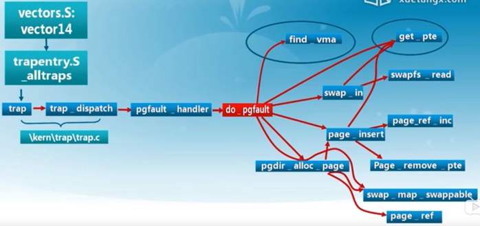
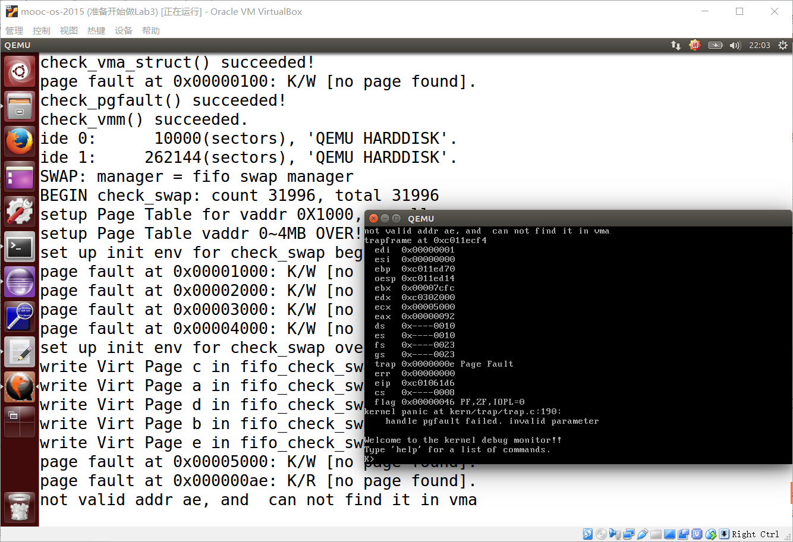
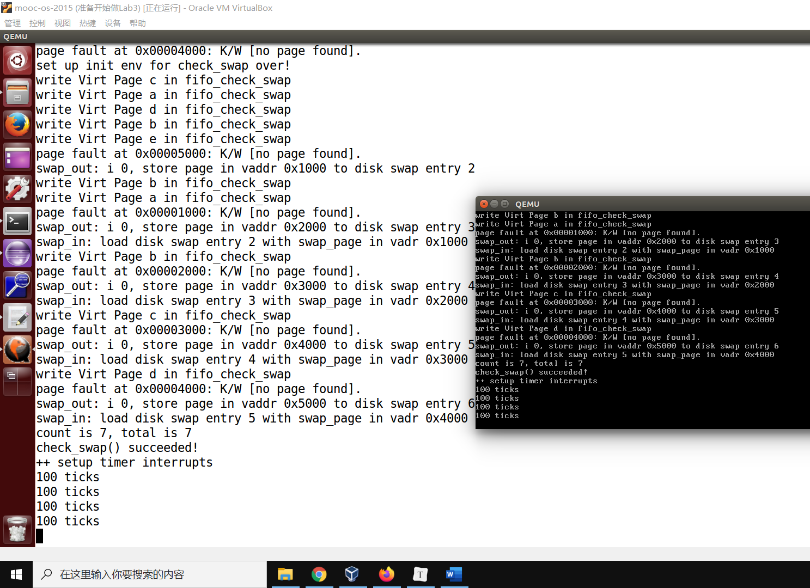
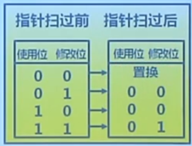
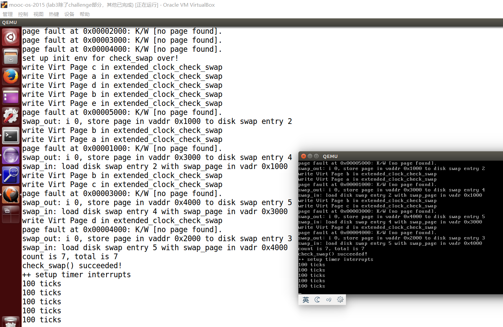

# Lab3 虚拟内存管理

lab3主要完成了什么？

- 首先是本实验借助实验一和实验二
- 借助于页表机制和中断异常处理机制完成Page Fault异常（缺页异常）处理和FIFO页替换算法（最简单的先进先出替换算法）的实现

lab3主要函数介绍：

- swap.c::check_swap(void)：测试页交换算法是否正确
- swap_fifo.c、swap_fifo.h：FIFO算法的描述和实现

- swap.h struct swap_manager：不同交换算法的实现框架

剩下的函数和结构体等可以看word笔记。



find_vma：判断地址是否是一个合法的地址。

swap_in会把访问异常的地址转换为页号，页号去映射磁盘扇区号。通过swapfs_read读到内存中来。然后还要重新建立“虚页-物理页”对应关系。

get_pte：创建新页表。

然后原路返回，返回到产生异常的指令重新执行。

## 练习0：填写已有实验

本实验依赖实验1/2。请把你做的实验1/2的代码填入本实验中代码中有“LAB1”,“LAB2”的注释相应部分。

Lab1中需要合并的文件：

- kdebug.c中函数print_stackframe
- kern/trap/trap.c中对中断向量表进行初始化的函数idt_init
- trap.c中的中断处理函数trap（就是ticks++这部分）

Lab2中需要合并的文件：

- default_pmm.c::
  - default_init_memmap
  - default_alloc_pages
  - default_free_pages

- kern/mm/pmm.c::get_pte函数

- kern/mm/pmm.c中的page_remove_pte函数

## 练习1：给未被映射的地址映射上物理页（需要编程）

完成do_pgfault（mm/vmm.c）函数，**给未被映射的地址映射上物理页**。设置访问权限的时候需要参考页面所在 VMA 的权限，同时需要注意映射物理页时需要操作内存控制结构所指定的页表，而不是内核的页表。注意：在LAB2 EXERCISE 1处填写代码。执行

```
make　qemu
```

后，如果通过check_pgfault函数的测试后，会有“check_pgfault() succeeded!”的输出，表示练习1基本正确。

请在实验报告中简要说明你的设计实现过程。请回答如下问题：

- 请描述页目录项（Pag Director Entry）和页表（Page Table Entry）中组成部分对ucore实现页替换算法的潜在用处。

  

  下面的标识符介绍，我只将需要用到的写上，其余暂时用不上的等以后再说

  - D Dirty 脏页位 当 CPU 对这个页进行写操作时 会置 1 在后面的Clock算法会用到
  - A Accessed 访问位 若为 1 则 说明 CPU 访问过了；CPU 会定时清 0 记录被置 1 的频率 当内存不足时 会将 使用频率较低的页面换出到外存 同时将 P位 置 0 下次访问 该页时 会引起 Pagefault 异常 中断处理程序再将此页换上
  - US User/Superviosr 普通用户/超级用户位
  - RW Read/Write 读写位
  - P Present 存在位（虚拟页的关键标识符，若为 0 则发起缺页异常）

  我们检测一个虚拟页是否在物理页中存在就是通过PDE查找对应的PTE。如果存在PTE（全是0是不存在PTE，非零数字代表存在），同时present标志位为0。则需要引发缺页异常，执行页替换算法。

- 如果ucore的缺页服务例程在执行过程中访问内存，出现了页访问异常，请问硬件要做哪些事情？

答：

​	简单的说，需要将当前页访问异常的错误代码进行状态保存（快照，使用kernel stack保存），然后把CS:IP指向中断服务例程，去执行中断处理函数。

参考本文：https://zhuanlan.zhihu.com/p/81010728

首先，我们先看vmm.h头文件，里面有两个很重要的结构体。这两个结构体描述了一个合法的程序所需要的内存空间。


vma_struct 链表的作用是描述了虚拟内存的合法性，每块合法的连续的 page 组成一个 vma。

```
// 虚拟内存空间
struct vma_struct {
    struct mm_struct *vm_mm; // the set of vma using the same PDT 
    uintptr_t vm_start;      // vma的起始地址      
    uintptr_t vm_end;        // vma的结束地址（不含vm_end本身）
    uint32_t vm_flags;       // 标志位，作用看下面
    list_entry_t list_link;  // 双向链表 从小到大将虚拟内存空间链接起来
};
```

vm_flags表示了这个虚拟内存空间的属性，目前的属性包括

> #define VM_READ 0x00000001   //只读
> #define VM_WRITE 0x00000002  //可读写
> #define VM_EXEC 0x00000004   //可执行

```
// 描述一个进程的虚拟地址空间
struct mm_struct {
    list_entry_t mmap_list;        // 双向链表的头节点
    struct vma_struct *mmap_cache; // current accessed vma, used for speed purpose
    pde_t *pgdir;                  // the PDT of these vma
    int map_count;                 // the count of these vma
    void *sm_priv;                   // the private data for swap manager
};
```

vmm.c::do_pgfault

```
    /*LAB3 EXERCISE 1: YOUR CODE*/
    // 通过addr这个线性地址返回对应的虚拟页pte 如果没有get_pte会创建一个虚拟页 同时ptep等于0
    ptep = get_pte(mm->pgdir, addr, 1);             //(1) try to find a pte, if pte's PT(Page Table) isn't existed, then create a PT.
    // ptep等于NULL代表alloc_page创建虚拟页失败
    if (ptep == NULL) {
    	goto failed;
    }
    // 等于0是创建好虚拟页后还没有物理页与之对应
    if (*ptep == 0) {
    	// 尝试分配物理页
    	if (pgdir_alloc_page(mm->pgdir, addr, perm) == NULL) {     //(2) if the phy addr isn't exist, then alloc a page & map the phy addr with logical addr
    		goto failed;
    	}
    }
    // 执行到这里的时候，代表存在虚拟页并且原来都有与之对应的物理页，下面尝试换入
    else {
    /*LAB3 EXERCISE 2: YOUR CODE
    * Now we think this pte is a  swap entry, we should load data from disk to a page with phy addr,
    * and map the phy addr with logical addr, trigger swap manager to record the access situation of this page.
    *
    *  Some Useful MACROs and DEFINEs, you can use them in below implementation（实现）.
    *  MACROs or Functions:
    *    swap_in(mm, addr, &page) : alloc a memory page, then according to the swap entry in PTE for addr,
    *                               find the addr of disk page, read the content of disk page into this memroy page
    *    page_insert ： build the map of phy addr of an Page with the linear addr la
    *    swap_map_swappable ： set the page swappable
    */
        if(swap_init_ok) {
        	// 将磁盘中的页换入到内存
            struct Page *page=NULL;
            swap_in(mm, addr, &page);                      //(1）According to the mm AND addr, try to load the content of right disk page
            // 建立虚拟地址和物理地址之间的对应关系                         						 //    into the memory which page managed.
            page_insert(mm->pgdir, page, addr, perm);      //(2) According to the mm, addr AND page, setup the map of phy addr <---> logical addr
            // 最后的swap_in等于1使页面可替换
            swap_map_swappable(mm, addr, page, 1);         //(3) make the page swappable.
            page->pra_vaddr = addr;
        }
        else {
            cprintf("no swap_init_ok but ptep is %x, failed\n",*ptep);
            goto failed;
        }
   }

   ret = 0;
failed:
    return ret;
}
```



Ps：我写完练习2后又返回来看了看，发现好像练习1是有点问题。

建议看我这个更新后的版本，主要是if (swap_init_ok)这一段：

```
if(swap_init_ok) {
        	// 将磁盘中的页换入到内存
            struct Page *page=NULL;
            ret = swap_in(mm, addr, &page);                        //(1）According to the mm AND addr, try to load the content of right disk page
            if (ret != 0) {
            	cprintf("swap_in in do_pgfault failed\n");
            	goto failed;
            }
            // 建立虚拟地址和物理地址之间的对应关系                         						 //    into the memory which page managed.
            page_insert(mm->pgdir, page, addr, perm);              //(2) According to the mm, addr AND page, setup the map of phy addr <---> logical addr
            // 最后的swap_in等于1使页面可替换
            swap_map_swappable(mm, addr, page, 1);     //(3) make the page swappable.
            //page->pra_vaddr = addr;
        }
        else {
            cprintf("no swap_init_ok but ptep is %x, failed\n",*ptep);
            goto failed;
        }
```

## 练习2：补充完成基于FIFO的页面替换算法（需要编程）

完成vmm.c中的do_pgfault函数，并且在实现FIFO算法的swap_fifo.c中完成map_swappable和swap_out_vistim函数。通过对swap的测试。注意：在LAB2 EXERCISE 2处填写代码。执行

```
make　qemu
```

后，如果通过check_swap函数的测试后，会有“check_swap() succeeded!”的输出，表示练习2基本正确。

请在实验报告中简要说明你的设计实现过程。

请在实验报告中回答如下问题：

- 如果要在ucore上实现"extended clock页替换算法"请给你的设计方案，现有的swap_manager框架是否足以支持在ucore中实现此算法？如果是，请给你的设计方案。如果不是，请给出你的新的扩展和基此扩展的设计方案。并需要回答如下问题

  - 需要被换出的页的特征是什么？

    页表项的 Dirty Bit 为 0 的页——换出

  - 在ucore中如何判断具有这样特征的页？

    参考《现代操作系统》P115

    可以用D位（访问位）和A位（修改位）来实现简单的页面置换算法。当启动一个新进程时，两位都设置位0。D位（访问位）被定期的清零——以区别最近被访问和没有被访问的页。

    所以，由两个标志位可以产生四种可能情况：

    | 情况   | D位（访问位） | A位（修改位） | 解释                           |
    | ------ | ------------- | ------------- | ------------------------------ |
    | 第一类 | 0             | 0             | 未访问、未修改（需要置换出去） |
    | 第二类 | 0             | 1             | 在中断刚刚产生时就变成了这一类 |
    | 第三类 | 1             | 0             | 需要置换出去                   |
    | 第四类 | 1             | 1             |                                |

    以上四类情况，我们最先置换出第一类，最后一类的置换优先级最低（不易被置换）。

  - 何时进行换入和换出操作？

    换入是在缺页异常的时候 换出是在物理页帧满的时候

答：实现FIFO算法的swap_fifo.c中完成map_swappable和swap_out_vistim函数

swap_fifo.c::map_swappable

其实就是实现两个函数，

一个是换入函数：_fifo_map_swappable()

一个是换出函数：_fifo_swap_out_victim()

注意啊，这个双向链表的特征是从前面入队列，后面出队列。

```
/*
 * (3)_fifo_map_swappable: According FIFO PRA, we should link the most recent arrival page at the back of pra_list_head qeueue
 */
static int
_fifo_map_swappable(struct mm_struct *mm, uintptr_t addr, struct Page *page, int swap_in)
{
    list_entry_t *head=(list_entry_t*) mm->sm_priv;
    list_entry_t *entry=&(page->pra_page_link);
 
    assert(entry != NULL && head != NULL);
    //record the page access situlation（情况）
    /*LAB3 EXERCISE 2: YOUR CODE*/ 
    //(1)link the most recent arrival page at the back of the pra_list_head qeueue.
    list_add(head, entry);				// 用list_add()和list_add_after()都行，查看下这个双向链表的操作函数（在list.h）就知道了。
    return 0;
}
```

```
/*
 *  (4)_fifo_swap_out_victim: According FIFO PRA, we should unlink the  earliest arrival page in front of pra_list_head qeueue,
 *                            then set the addr of addr of this page to ptr_page.
 */
static int
_fifo_swap_out_victim(struct mm_struct *mm, struct Page ** ptr_page, int in_tick)
{
     list_entry_t *head=(list_entry_t*) mm->sm_priv;
         assert(head != NULL);
     assert(in_tick==0);
     /* Select the victim */
     /*LAB3 EXERCISE 2: YOUR CODE*/ 
     //(1)  unlink the  earliest arrival page in front of pra_list_head qeueue
     // 尾部删除，因为是双向链表，所以很方便找到尾部
     // tail指向尾部
     list_entry_t *tail = head->prev;
     struct Page *page = le2page(tail, pra_page_link);
     list_del(tail);
     //(2)  set the addr of addr of this page to ptr_page
     *ptr_page = page;
     return 0;
}
```



## 扩展练习 Challenge：实现识别dirty bit的 extended clock页替换算法（需要编程）

challenge部分不是必做部分，不过在正确最后会酌情加分。需写出有详细的设计、分析和测试的实验报告。完成出色的可获得适当加分。

答：

该challenge部分是实现扩展的时钟算法。推荐参考书《现代操作系统》

- D Dirty 脏页位 当 CPU 对这个页进行写操作时 会置 1，代码中用PTE_D位表示
- A Accessed 访问位 若为 1 则 说明 CPU 访问过了；CPU 会定时清 0 记录被置 1 的频率；当内存不足时 会将 使用频率较低的页面换出到外存 同时将 P位 置 0，下次访问 该页时 会引起 Pagefault 异常中断处理程序，再将此页换上。

参考练习2中的问题。

具体步骤：

需要新建文件swap_extended_clock.c和swap_extended_clock.h，内容分别从swap_fifo.c和swap_fifo.h中复制。因为除了_extended_clock_map_swappable()函数和_extended_clock_swap_out_victim()函数之外，其他的东西都差不多一样。

无非就是，swap_extended_clock.c中的

#include <swap_fifo.h>改成了

#include <swap_extended_clock.h>

所有函数带fifo的改成extended_clock

以及最后的struct swap_manager swap_manager_extended_clock中的带fifo的内容改为extended_clock

swap_extended_clock.h文件也一样。

以上不是重点，重点是在swap_extended_clock.c文件中修改extended_clock_map_swappable()函数和_extended_clock_swap_out_victim()函数

_extended_clock_map_swappable()

```
static int
_extended_clock_map_swappable(struct mm_struct *mm, uintptr_t addr, struct Page *page, int swap_in)
{
    list_entry_t *head=(list_entry_t*) mm->sm_priv;
    list_entry_t *entry=&(page->pra_page_link);
    assert(entry != NULL && head != NULL);

    list_add(head, entry);
    // 初始访问位和修改位均置0
    struct Page *ptr = le2page(entry, pra_page_link);
    pte_t *pte = get_pte(mm -> pgdir, ptr -> pra_vaddr, 0);
    // 将PTE_A（访问位）和PTE_D（读写位）置0
    *pte &= ~PTE_D;
    *pte &= ~PTE_A;
    return 0;
}
```

解释上面：初始化，将访问位和读写位置0

_extended_clock_swap_out_victim()



```
static int
_extended_clock_swap_out_victim(struct mm_struct *mm, struct Page ** ptr_page, int in_tick)
{
	// 两个指针，一个指向头，一个指向尾
    list_entry_t *head = (list_entry_t*)mm->sm_priv;
    assert(head != NULL);
    assert(in_tick == 0);
    list_entry_t *tail = head->prev;
    assert(head != tail);

    // 怎么实现指针旋转的？答案是通过tail指针不断向前移动，直到tail == head时终止
    // 实现extended clock算法（参考：《现代操作系统P115页》）
    int i;
    for (i = 0; i < 3; i ++) {
        while (tail != head) {
            struct Page *page = le2page(tail, pra_page_link);
            pte_t *ptep = get_pte(mm->pgdir, page->pra_vaddr, 0);

            // 第一类情况 访问位和修改位都是0 意味着没有访问也没有被修改 应最先被置换出去，该置换函数也只将第一类情况置换出去
            if (!(*ptep & PTE_A) && !(*ptep & PTE_D)) {
                list_del(tail);
                *ptr_page = page;
                return 0;
            }
            // (PTE_D, PTE_A) = 1, 0或者是0, 1
            if ((*ptep & PTE_A) ^ (*ptep & PTE_D)) {
                // 访问位和修改位都置0,可参考word笔记
            	*ptep &= ~PTE_D;
                *ptep &= ~PTE_A;
            }
            // (PTE_D, PTE_A) = (1,1)
            if ((*ptep & PTE_A) && (*ptep & PTE_D)) {
            	// 访问了 所以访问位要置0
                *ptep &= ~PTE_A;
            }
            tail = tail->prev;
        }
        tail = tail->prev;
    }
}
```

解释上面：请看插图和注释

完成上面的之后，还需要指定虚存管理用extended clock方式运行。将原来的fifo替换为extend clock：

```
//#include <swap_fifo.h>
#include <swap_extended_clock.h>

//sm = &swap_manager_fifo;
  sm = &swap_manager_extended_clock;
```



## 参考文献

https://zhuanlan.zhihu.com/p/81010728

[https://yuerer.com/%E6%93%8D%E4%BD%9C%E7%B3%BB%E7%BB%9F-uCore-Lab-3/](https://yuerer.com/操作系统-uCore-Lab-3/)

https://blog.csdn.net/qq_19876131/java/article/details/51706995

[https://husy1994.github.io/2018/07/22/%E3%80%90ucore%E3%80%91lab3/](https://husy1994.github.io/2018/07/22/[ucore]lab3/)

《现代操作系统》

https://asymptotic-freedom.xyz/posts/69d005/