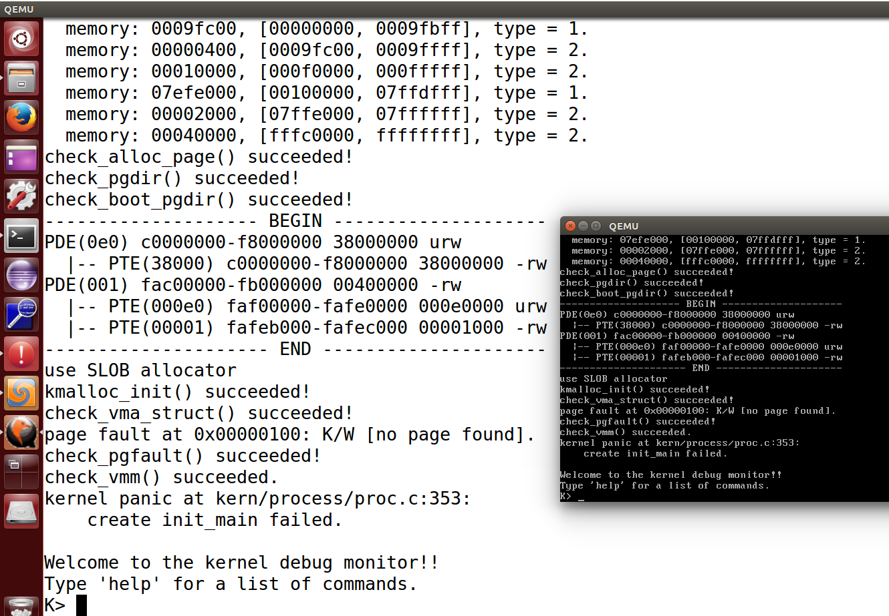
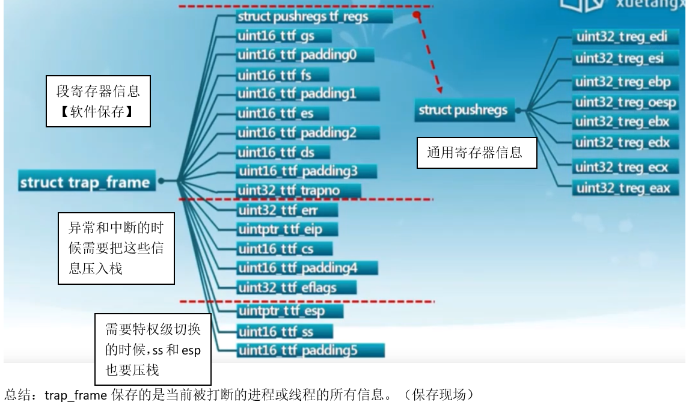
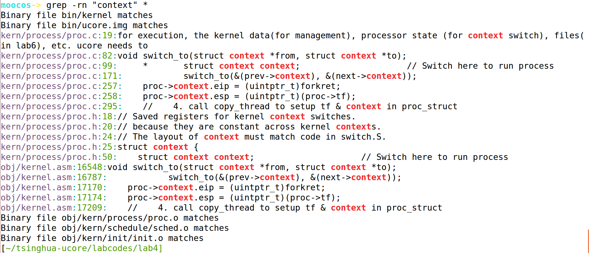
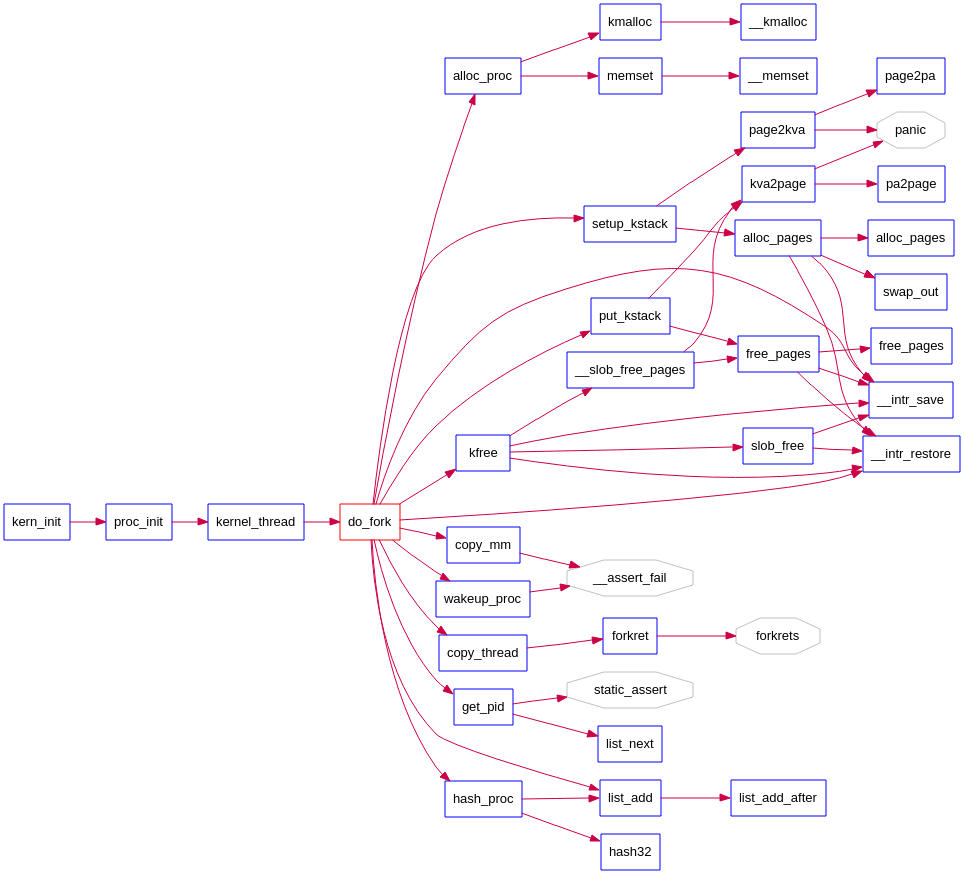
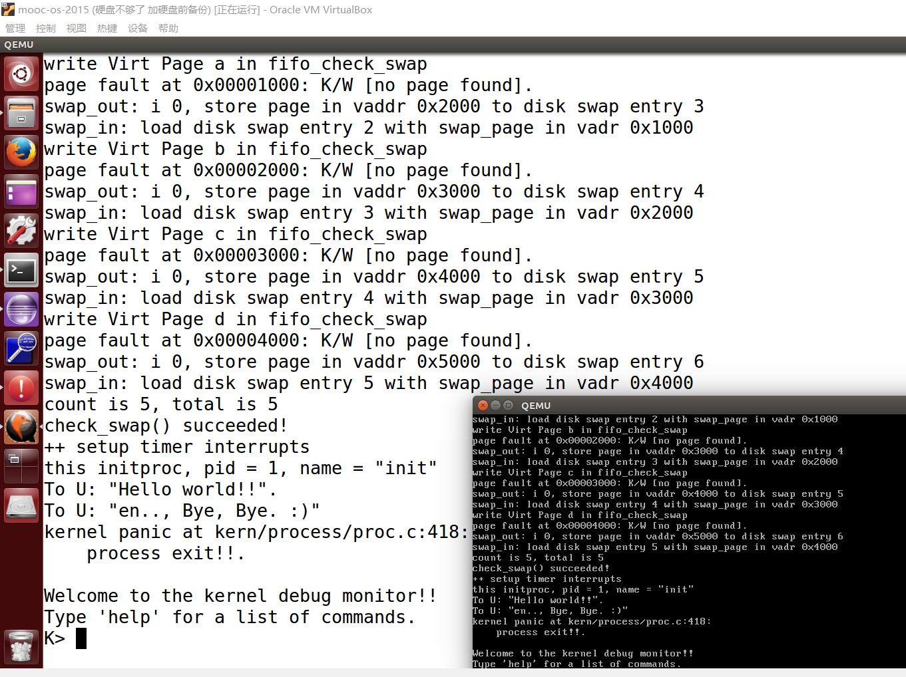

# Lab4 内核线程管理

## 练习0：填写已有实验

本实验依赖实验1/2/3。请把你做的实验1/2/3的代码填入本实验中代码中有“LAB1”,“LAB2”,“LAB3”的注释相应部分。

Lab1中需要合并的文件：

- kdebug.c 中函数print_stackframe
- kern/trap/trap.c 中对中断向量表进行初始化的函数idt_init
- trap.c 中的中断处理函数trap（不加）

Lab2中需要合并的文件：

- default_pmm.c::
  - default_init_memmap
  - default_alloc_pages
  - default_free_pages
- kern/mm/pmm.c::get_pte函数
- kern/mm/pmm.c中的page_remove_pte函数

Lab3中需要合并的文件：

- vmm.c::do_pgfault
- kern/mm/swap_fifo.c::
  - _fifo_map_swappable
  - _fifo_swap_out_victim

合并之后运行lab4：



## 练习1：分配并初始化一个进程控制块（需要编码）

alloc_proc函数（位于kern/process/proc.c中）负责分配并返回一个新的struct proc_struct结构，用于存储新建立的内核线程的管理信息。ucore需要对这个结构进行最基本的初始化，你需要完成这个初始化过程。

> 【提示】在alloc_proc函数的实现中，需要初始化的proc_struct结构中的成员变量至少包括：state/pid/runs/kstack/need_resched/parent/mm/context/tf/cr3/flags/name。

答：

```
// alloc_proc - alloc a proc_struct and init all fields of proc_struct
static struct proc_struct *
alloc_proc(void) {
    struct proc_struct *proc = kmalloc(sizeof(struct proc_struct));
    if (proc != NULL) {
    //LAB4:EXERCISE1 YOUR CODE
    /*
     * below fields in proc_struct need to be initialized
     *       enum proc_state state;                      // Process state
     *       int pid;                                    // Process ID
     *       int runs;                                   // the running times of Proces
     *       uintptr_t kstack;                           // Process kernel stack
     *       volatile bool need_resched;                 // bool value: need to be rescheduled to release CPU?
     *       struct proc_struct *parent;                 // the parent process
     *       struct mm_struct *mm;                       // Process's memory management field
     *       struct context context;                     // Switch here to run process
     *       struct trapframe *tf;                       // Trap frame for current interrupt
     *       uintptr_t cr3;                              // CR3 register: the base addr of Page Directroy Table(PDT)
     *       uint32_t flags;                             // Process flag
     *       char name[PROC_NAME_LEN + 1];               // Process name
     */
    	proc->state = PROC_UNINIT;							// 进程状态：未初始化
    	proc->pid = -1;										// 未分配的进程pid是-1 先设置pid为无效值-1，用户调完alloc_proc函数后再根据实际情况设置pid。
    	proc->runs = 0;
    	proc->kstack = 0;									// 内核栈位置
    	proc->need_resched = 0;								// 是否需要调度
    	proc->parent = NULL;								// 父进程
    	proc->mm = NULL;									// 虚拟内存结构体（lab4实验可忽略）
    	/*
    	 * void *memset(void *s, int c, unsigned long n)
    	 * 函数解释：将s中当前位置后面的n个字节 （typedef unsigned int size_t ）用 ch 替换并返回 s
    	 * 该函数用于清空一个结构体中所有的成员变量，下面解释三个参数：
    	 * 第一个参数：位置指针，例如数组名、结构体首地址
    	 * 第二个参数：替换为什么
    	 * memset 函数的第三个参数 n 的值一般用 sizeof() 获取
    	 */
    	memset(&proc->context, 0, sizeof(struct context)); 	// 上下文结构体
    	proc->tf = NULL;
    	proc->cr3 = boot_cr3;
    	proc->flags = 0;
    	// 清空数组就不用sizeof了，第三个参数直接写数组的大小-1即可
    	memset(&proc->name, 0, PROC_NAME_LEN);

    }
    return proc;
}
```

请在实验报告中简要说明你的设计实现过程。请回答如下问题：

- 请说明proc_struct中`struct context context`和`struct trapframe *tf`成员变量含义和在本实验中的作用是啥？（提示通过看代码和编程调试可以判断出来）

答：

注意：这里是初始化进程控制块，而不是创建进程。

struct context context，通过查看context结构体：

```
struct context {
    uint32_t eip;
    uint32_t esp;
    uint32_t ebx;
    uint32_t ecx;
    uint32_t edx;
    uint32_t esi;
    uint32_t edi;
    uint32_t ebp;
};
```

可以发现，context保存的是寄存器信息。

struct trapframe *tf，结构体trapframe：



```
struct trapframe {
	/* 段寄存器信息 */
    struct pushregs tf_regs;
    uint16_t tf_gs;
    uint16_t tf_padding0;
    uint16_t tf_fs;
    uint16_t tf_padding1;
    uint16_t tf_es;
    uint16_t tf_padding2;
    uint16_t tf_ds;
    uint16_t tf_padding3;
    uint32_t tf_trapno;
    /* below here defined by x86 hardware */
    /* 异常和中断时候需要把下列信息压栈 */
    uint32_t tf_err;
    uintptr_t tf_eip;
    uint16_t tf_cs;
    uint16_t tf_padding4;
    uint32_t tf_eflags;
    /* below here only when crossing rings, such as from user to kernel */
    /* 需要特权级转换的时候，下列信息压栈 */
    uintptr_t tf_esp;
    uint16_t tf_ss;
    uint16_t tf_padding5;
} __attribute__((packed));
```

使用命令查询涉及到 context 的文件行号，找到相关的代码：

```
[root@wuseyukui]# grep -rn "context" *

说明：
-r 是递归查找

-n 是显示行号

* : 表示当前目录所有文件，也可以是某个文件名
```



对context结构体进行设置的代码：

kern/process/proc.c:257:    proc->context.eip = (uintptr_t)forkret;
kern/process/proc.c:258:    proc->context.esp = (uintptr_t)(proc->tf);

obj/kernel.asm:17170:    proc->context.eip = (uintptr_t)forkret;
obj/kernel.asm:17174:    proc->context.esp = (uintptr_t)(proc->tf);

在kernel.asm文件的16787行的  switch_to 函数用于执行上下文切换：

obj/kernel.asm:16787:            switch_to(&(prev->context), &(next->context));

 switch_to 函数的具体汇编代码意义以及保存现场恢复现场实现请参考word笔记和视频P61讲。

## 练习2：为新创建的内核线程分配资源（需要编码）

创建一个内核线程需要分配和设置好很多资源。kernel_thread函数通过调用**do_fork**函数完成具体内核线程的创建工作。do_kernel函数会调用alloc_proc函数来分配并初始化一个进程控制块，但alloc_proc只是找到了一小块内存用以记录进程的必要信息，并没有实际分配这些资源。ucore一般通过do_fork实际创建新的内核线程。do_fork的作用是，创建当前内核线程的一个副本，它们的执行上下文、代码、数据都一样，但是存储位置不同。在这个过程中，需要给新内核线程分配资源，并且复制原进程的状态。你需要完成在kern/process/proc.c中的do_fork函数中的处理过程。它的大致执行步骤包括：

- 调用alloc_proc，首先获得一块用户信息块。
- 为进程分配一个内核栈。
- 复制原进程的内存管理信息到新进程（但内核线程不必做此事）
- 复制原进程上下文到新进程
- 将新进程添加到进程列表
- 唤醒新进程
- 返回新进程号

答：

首先，先回看word笔记“进程创建”这一讲。会发现创建新进程需要做下面的工作基本都是复制父进程。只有pid号改变了。

看函数调用图：




kern/process/proc.c::do_fork

```
int
do_fork(uint32_t clone_flags, uintptr_t stack, struct trapframe *tf) {
    int ret = -E_NO_FREE_PROC;
    struct proc_struct *proc;
    if (nr_process >= MAX_PROCESS) {
        goto fork_out;
    }
    ret = -E_NO_MEM;
    //LAB4:EXERCISE2 YOUR CODE
    /*
     * Some Useful MACROs, Functions and DEFINEs, you can use them in below implementation.
     * MACROs or Functions:
     *   alloc_proc:   create a proc struct and init fields (lab4:exercise1)
     *   setup_kstack: alloc pages with size KSTACKPAGE as process kernel stack
     *   copy_mm:      process "proc" duplicate OR share process "current"'s mm according clone_flags
     *                 if clone_flags & CLONE_VM, then "share" ; else "duplicate"
     *   copy_thread:  setup the trapframe on the  process's kernel stack top and
     *                 setup the kernel entry point and stack of process
     *   hash_proc:    add proc into proc hash_list
     *   get_pid:      alloc a unique pid for process
     *   wakup_proc:   set proc->state = PROC_RUNNABLE
     * VARIABLES:
     *   proc_list:    the process set's list
     *   nr_process:   the number of process set
     */

    //    1. call alloc_proc to allocate a proc_struct
    //    2. call setup_kstack to allocate a kernel stack for child process
    //    3. call copy_mm to dup OR share mm according clone_flag
    //    4. call copy_thread to setup tf & context in proc_struct
    //    5. insert proc_struct into hash_list && proc_list
    //    6. call wakup_proc to make the new child process RUNNABLE
    //    7. set ret vaule using child proc's pid

    /*
	 * 想干的事：创建当前内核线程的一个副本，它们的执行上下文、代码、数据都一样，但是存储位置不同，PID不同。
	 */
	// 调用alloc_proc() 为要创建的线程分配空间
	// 如果第一步 alloc 都失败的话，应该来说是比较严重的错误。直接退出。
	if ((proc = alloc_proc()) == NULL) {
		goto fork_out;
	}
	// 获取被拷贝的进程的pid号 即父进程的pid
	//proc->parent = current;
	// 分配大小为 KSTACKPAGE 的页面作为进程内核堆栈
	setup_kstack(proc);
	// 拷贝原进程的内存管理信息到新进程
	copy_mm(clone_flags, proc);
	// 拷贝原进程上下文到新进程
	copy_thread(proc, stack, tf);


	bool intr_flag;
	// 停止中断
	local_intr_save(intr_flag);
	// {} 用来限定花括号中变量的作用域，使其不影响外面。
	{
		proc->pid = get_pid();
		// 新进程添加到 hash方式组织的的进程链表，以便于以后对某个指定的线程的查找（速度更快）
		hash_proc(proc);
		// 将线程加入到所有线程的链表中，以便于调度
		list_add(&proc_list, &(proc->list_link));
		// 将全局线程的数目加1
		nr_process ++;
	}
	// 允许中断
	local_intr_restore(intr_flag);


	// 唤醒新进程
	wakeup_proc(proc);
	// 新进程号
	ret = proc->pid;

fork_out:
    return ret;

bad_fork_cleanup_kstack:
    put_kstack(proc);
bad_fork_cleanup_proc:
    kfree(proc);
    goto fork_out;
}
```

请在实验报告中简要说明你的设计实现过程。请回答如下问题：

- 请说明ucore是否做到给每个新fork的线程一个唯一的id？请说明你的分析和理由。

答：

一方面，从上面的代码可以看出。在分配PID之前禁止了中断，然后再分配OK后允许中断。相当于事务的隔离性。

查看pid分配函数 proc.c::get_pid：

```
static int
get_pid(void) {
    static_assert(MAX_PID > MAX_PROCESS);
    struct proc_struct *proc;
    list_entry_t *list = &proc_list, *le;

    // 两个静态变量 next_safe = MAX_PID, last_pid = MAX_PID; 指向最大可以分配的pid号码
    static int next_safe = MAX_PID, last_pid = MAX_PID;

    if (++ last_pid >= MAX_PID) {
        last_pid = 1;
        goto inside;
    }

    if (last_pid >= next_safe) {
    inside:
        next_safe = MAX_PID;
    repeat:
        le = list;
        while ((le = list_next(le)) != list) {
            proc = le2proc(le, list_link);
            if (proc->pid == last_pid) {
            	// 如果last_pid+1 后等于MAX_PID，意味着pid已经分配完了
                if (++ last_pid >= next_safe) {
                    // 如果last_pid超出最大pid范围，则last_pid重新从1开始编号
                	if (last_pid >= MAX_PID) {
                        last_pid = 1;
                    }
                    next_safe = MAX_PID;
                    // 重新编号去 现在 last_pid == 1; next_safe == MAX_PID;
                    goto repeat;
                }
            }
            // 上面的是需要重新编号的情况，下面是不需要的情况
            // 满足 last_pid < proc->pid < next_safe
            else if (proc->pid > last_pid && next_safe > proc->pid) {
                // last_pid < proc->pid < next_safe
            	// last_pid < proc->pid
            	//			< next_safe
            	next_safe = proc->pid;
            }
        }
    }
    // last_pid作为新颁发的编号
    return last_pid;
}
```

注释很明确的说明了原因：分为需要从1开始编号的情况和无需重新编号共计两种情况。

## 练习3：阅读代码，理解 proc_run 函数和它调用的函数如何完成进程切换的。（无编码工作）

请在实验报告中简要说明你对proc_run函数的分析。并回答如下问题：

答：

先搜下proc_run函数在哪被调用过：

moocos-> grep -rn "proc_run" *
Binary file bin/kernel matches
Binary file bin/ucore.img matches
kern/schedule/sched.c:40:            proc_run(next);
kern/process/proc.c:33:      +                                   + proc_run +
kern/process/proc.c:207:// proc_run - make process "proc" running on cpu
kern/process/proc.c:210:proc_run(struct proc_struct *proc) {
kern/process/proc.h:65:void proc_run(struct proc_struct *proc);
obj/kernel.asm:16746:c0108839 <proc_run>:
obj/kernel.asm:16748:// proc_run - make process "proc" running on cpu
obj/kernel.asm:16751:proc_run(struct proc_struct *proc) {
obj/kernel.asm:16758:c0108847:	74 63                	je     c01088ac <proc_run+0x73>
obj/kernel.asm:17823:            proc_run(next);
obj/kernel.asm:17826:c0109072:	e8 c2 f7 ff ff       	call   c0108839 <proc_run>
obj/kernel.sym:563:c0108839 proc_run
Binary file obj/kern/schedule/sched.o matches
Binary file obj/kern/process/proc.o matches

发现在 schedule/sched.c::schedule函数中被调用过：

```
if (next != current) {
    // 交给CPU去执行
    proc_run(next);
}
```

proc_run(next)函数：

```
void
proc_run(struct proc_struct *proc) {
	// current是当前正在运行的线程
	// proc是将要运行的线程
	/* 先判断下将要运行的线程是不是已经在运行中了 */
    if (proc != current) {
        bool intr_flag;
        // prev是当前正在执行的线程
        // next是准备要执行的线程
        struct proc_struct *prev = current, *next = proc;

        // 禁止中断 目的是事务的隔离性 不让其冲突
        local_intr_save(intr_flag);
        {
            current = proc;
            load_esp0(next->kstack + KSTACKSIZE);
            // 将当前的cr3寄存器修改为需要运行的线程（线程）的页目录表
            lcr3(next->cr3);
            // 开始执行（切换线程函数）
            switch_to(&(prev->context), &(next->context));
        }
        local_intr_restore(intr_flag);
    }
}
```

然后就可以去执行线程了。

- 在本实验的执行过程中，创建且运行了几个内核线程？

  答：

  第0个内核线程 -- idleproc：最初的内核线程

  第1个内核线程init_main：打印字符串用的

- 语句`local_intr_save(intr_flag);....local_intr_restore(intr_flag);`在这里有何作用?请说明理由

  答：

  上面一题已解答。作用就是先禁止中断，执行完下面代码后再允许中断。——避免事务冲突。

  ```
  current = proc;
  load_esp0(next->kstack + KSTACKSIZE);
  lcr3(next->cr3);
  switch_to(&(prev->context), &(next->context));
  ```

完成代码编写后，编译并运行代码：make qemu



如果可以得到如 附录A所示的显示内容（仅供参考，不是标准答案输出），则基本正确。

## 参考文献

https://www.jianshu.com/p/50dd281a82f0

https://blog.csdn.net/tangyuanzong/article/details/78692050

https://blog.csdn.net/wuseyukui/article/details/84138443

https://blog.csdn.net/yuantian2987/article/details/12572155