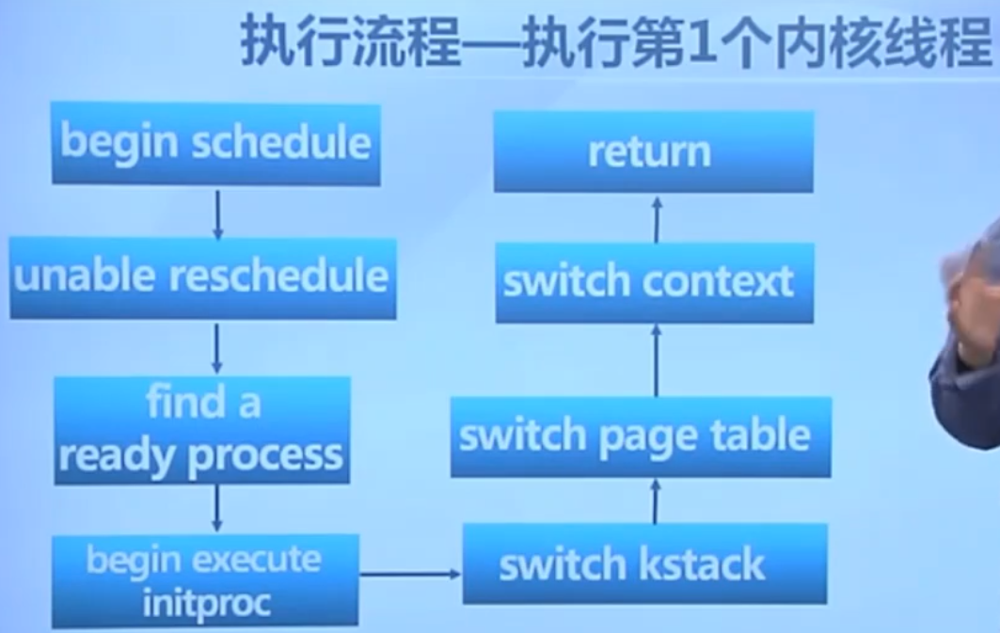
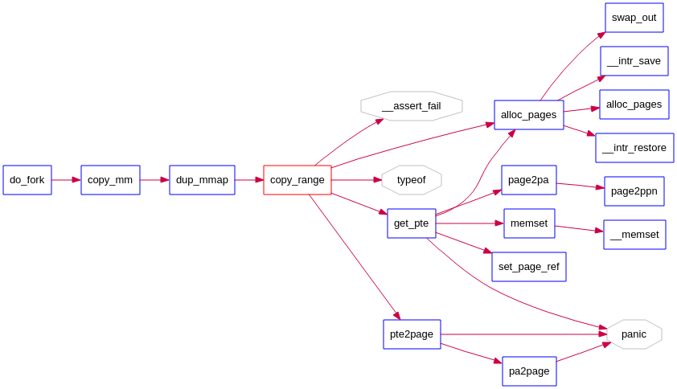
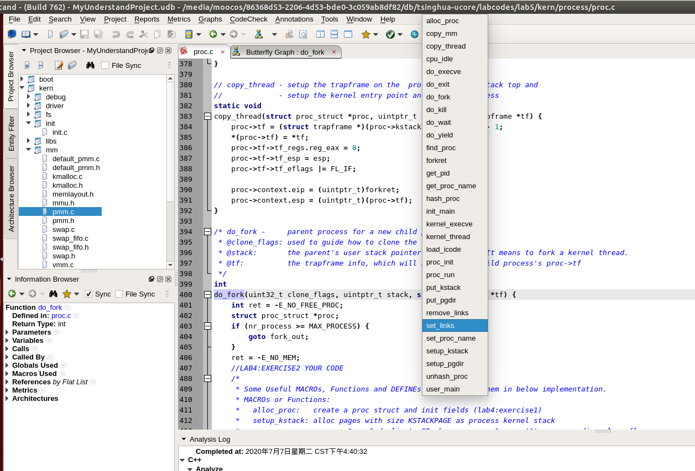
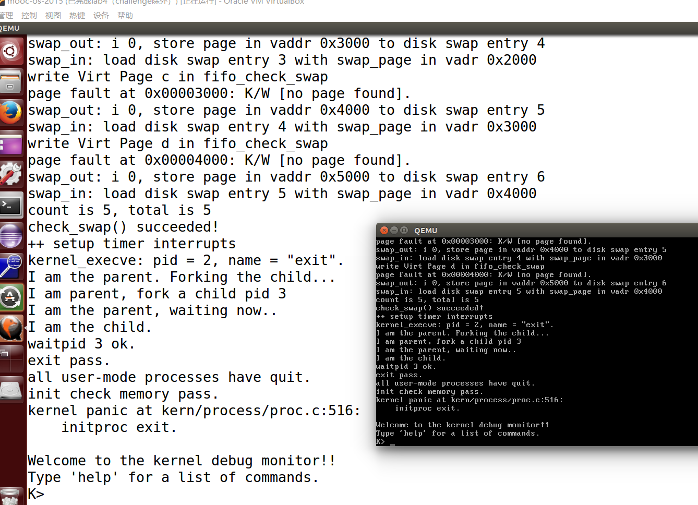
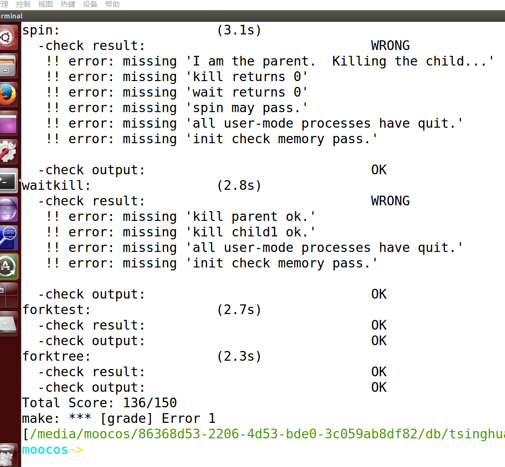

# 实验5 创建用户进程

## 练习0：填写已有实验

本实验依赖实验1/2/3/4。请把你做的实验1/2/3/4的代码填入本实验中代码中有“LAB1”/“LAB2”/“LAB3”/“LAB4”的注释相应部分。注意：为了能够正确执行lab5的测试应用程序，可能需对已完成的实验1/2/3/4的代码进行进一步改进。


好烦这个步骤，hhh。我们从之前的md中找到下面的内容，然后挨个使用meld工具进行填充。

好像还需要改进，那，我们先填充吧。

Lab1中需要合并的文件：

- kdebug.c 中函数print_stackframe
- kern/trap/trap.c 中对中断向量表进行初始化的函数idt_init
- trap.c 中的中断处理函数trap

Lab2中需要合并的文件：

- default_pmm.c::
  - default_init_memmap
  - default_alloc_pages
  - default_free_pages
- kern/mm/pmm.c::get_pte函数
- kern/mm/pmm.c中的page_remove_pte函数

Lab3中需要合并的文件：

- vmm.c::do_pgfault
- kern/mm/swap_fifo.c::
  - _fifo_map_swappable
  - _fifo_swap_out_victim

lab4中需要合并的文件：

- kern/process/proc.c
  - alloc_proc：负责分配并返回一个新的struct proc_struct结构
  - do_fork：创建当前内核线程的一个副本，它们的执行上下文、代码、数据都一样，但是存储位置不同。


## 练习1: 加载应用程序并执行（需要编码）

**do_execv**函数调用load_icode（位于kern/process/proc.c中）来加载并解析一个处于内存中的ELF执行文件格式的应用程序，建立相应的用户内存空间来放置应用程序的代码段、数据段等，且要设置好proc_struct结构中的成员变量trapframe中的内容，确保在执行此进程后，能够从应用程序设定的起始执行地址开始执行。需设置正确的trapframe内容。

请在实验报告中简要说明你的设计实现过程。

答：

load_icode 函数是由 do_execve 函数调用的，do_execve 函数是exec系统调用的最终处理的函数。——功能为将某一个指定的ELF可执行二进制文件加载到当前内存中来，然后将当前进程就执行该文件（寄居蟹干的事，load_icode就好比是寄居蟹自己的肉，他想住进海螺的壳中）。


load_icode 函数的功能则在于为执行新的程序初始化好内存空间。

​	通过注释可以发现，load_icode函数分为6部分，LAB5:EXERCISE1需要我们填写的就是第6部分——就是伪造中断返回现场，使得系统调用返回后可以正确的跳转到需要运行的程序的入口。

​	load_icode 函数的1-5部分则是一系列对用户内存空间的初始化，这部分将在LAB8的编码实现中具体体现，因此在本LAB中暂时不加具体说明。

​	完成了上述分析，可以具体确定应当怎么初始化tf中的变量了：

- 由于最终是在用户态下运行的，所以需要将段寄存器初始化为用户态的代码段、数据段、堆栈段；
- esp应当指向先前的步骤中创建的用户栈的栈顶；
- eip应当指向ELF可执行文件加载到内存之后的入口处；
- eflags中应当初始化为中断使能，注意eflags的第1位是恒为1的；
- 设置ret为0，表示正常返回；

需要设置好proc_struct结构中的成员变量trapframe中的内容。

kern/process/proc.c：

```
    //(6) setup trapframe for user environment
    struct trapframe *tf = current->tf;
    memset(tf, 0, sizeof(struct trapframe));
    /* LAB5:EXERCISE1 YOUR CODE
     * should set tf_cs,tf_ds,tf_es,tf_ss,tf_esp,tf_eip,tf_eflags
     * NOTICE: If we set trapframe correctly, then the user level process can return to USER MODE from kernel. So
     *          tf_cs should be USER_CS segment (see memlayout.h)
     *          tf_ds=tf_es=tf_ss should be USER_DS segment
     *          tf_esp should be the top addr of user stack (USTACKTOP)
     *          tf_eip should be the entry point of this binary program (elf->e_entry)
     *          tf_eflags should be set to enable computer to produce Interrupt
     */
    tf->tf_cs = USER_CS;
    tf->tf_ds = tf->tf_es = tf->tf_ss = USER_DS;
    tf->tf_esp = USTACKTOP;
    tf->tf_eip = elf->e_entry;			// 起始地址
    tf->tf_eflags = FL_IF;				// 允许中断
```

请在实验报告中描述当创建一个用户态进程并加载了应用程序后，CPU是如何让这个应用程序最终在用户态执行起来的。即这个用户态进程被ucore选择占用CPU执行（RUNNING态）到具体执行应用程序第一条指令的整个经过。

答：

我们可以先回顾下lab4中执行内核程序的流程：



我们先从头理一下内核态进程是怎么来的，参考上个lab4实验的第0号内核进程和第1号内核进程——该进程只打印输出了“”：

创建进程：

1. 首先，操作系统都是从init/init.c开始执行，调用 proc_init(); 函数初始化进程。
2. proc_init(); 调用 alloc_proc() 创建进程（第一步初始化，设置一些进程标志信息）。

运行进程：

1. 首先，操作系统都是从init/init.c开始执行，调用cpu_idle();函数运行一个idle process
2. cpu_idle(void) 调用 schedule(); 函数执行。schedule(); 函数本身是个调度计划表，最终会调用 proc_run(next); 函数运行一个进程。
   1. 切换栈
   2. 切换page table
   3. proc_run(struct proc_struct *proc) 调用 switch_to(&(prev->context), &(next->context)); 函数（切换context）
3. 执行完switch_to后，开始执行forkret(void)函数，当iret返回时，会跳到entry.S 中的 kernel_thread_entry。

------

上面的练习1相当于创建了一只鸡（创建进程），下面我们要让鸡下蛋（父进程通过fork生下子进程，运行进程）。

## 练习2: 父进程复制自己的内存空间给子进程（需要编码）

**创建子进程的函数do_fork**在执行中将拷贝当前进程（即父进程）的用户内存地址空间中的合法内容到新进程中（子进程），完成内存资源的复制。具体是通过copy_range函数（位于kern/mm/pmm.c中）实现的，请补充copy_range的实现，确保能够正确执行。

请在实验报告中简要说明如何设计实现”Copy on Write 机制“，给出概要设计，鼓励给出详细设计。

> Copy-on-write（简称COW）的基本概念是指如果有多个使用者对一个资源A（比如内存块）进行读操作，则每个使用者只需获得一个指向同一个资源A的指针，就可以该资源了。若某使用者需要对这个资源A进行写操作，系统会对该资源进行拷贝操作，从而使得该“写操作”使用者获得一个该资源A的“私有”拷贝—资源B，可对资源B进行写操作。该“写操作”使用者对资源B的改变对于其他的使用者而言是不可见的，因为其他使用者看到的还是资源A。

答：

copy_range被copy_mm调用。do_fork又调用copy_mm。如下图所示：



说真的，我刚看这个练习2的时候一脸懵逼，根本不知道copy_range是干啥的，被谁调用的。

我用Understand看了调用图后才明白。原来是让我代码实现拷贝内存的具体实现函数。

copy_range函数（位于kern/mm/pmm.c中）：


需要修改的内容：

proc.c::do_fork：

update step 1: set child proc's parent to current process, make sure current process's wait_state is 0

```
    proc->parent = current;
    assert(proc->wait_state == 0);
```

update step 5: insert proc_struct into hash_list && proc_list, set the relation links of process

这里，似乎在说的是添加proc到link中。我们原来已经写过list_add(&proc_list, &(proc->list_link));函数用于实现这个功能，参考其他人写的文献后，发现应该使用set_links函数。

然而我不知道这个函数在哪，就用understand看了下proc.c中所有的函数。找到他了。



```
set_links(proc);
```

最后完成lab5后运行截图：



make grade：



分数不是满分，有两处错误。我暂时没找到原因，也没太懂这几个printf的源文件是在哪出现的。

## 参考文献

https://blog.csdn.net/qq_19876131/article/details/51707000

https://www.jianshu.com/p/8c852af5b403

[https://yuerer.com/%E6%93%8D%E4%BD%9C%E7%B3%BB%E7%BB%9F-uCore-Lab-5/](https://yuerer.com/操作系统-uCore-Lab-5/)