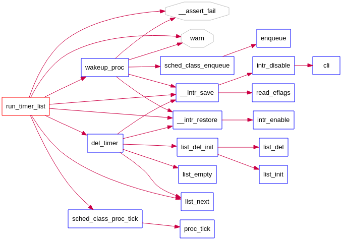

# 实验六: 调度器

实验五完成了用户进程的管理，可在用户态运行多个进程。但到目前为止，采用的调度策略是很简单的FIFO调度策略。本次实验，主要是熟悉ucore的系统调度器框架，以及基于此框架的Round-Robin（RR） 调度算法。然后参考RR调度算法的实现，完成Stride Scheduling调度算法。

## 练习0：填写已有实验

本实验依赖实验1/2/3/4/5。请把你做的实验2/3/4/5的代码填入本实验中代码中有“LAB1”/“LAB2”/“LAB3”/“LAB4”“LAB5”的注释相应部分。并确保编译通过。注意：为了能够正确执行lab6的测试应用程序，**可能需对已完成的实验1/2/3/4/5的代码进行进一步改进**。

答：

我们要合并之前的代码，隔了这么长时间，肯定记不得了。但是我想到之前让填代码的地方都有注释，会写LAB1巴拉巴拉什么的。那我们通过grep去查这个注释不就知道之前代码的地方了吗。

我们先在Lab6实验文件夹中查找“LAB1”：


kern/trap/trap.c:45:     /* LAB1 YOUR CODE : STEP 2 */
kern/trap/trap.c:217:        /* LAB1 YOUR CODE : STEP 3 */
kern/debug/kdebug.c:338:     /* LAB1 YOUR CODE : STEP 1 */

合并的时候我们发现从lab1中合并到lab6中的代码，看下右边的提示，好像是让我们从lab5中合并才对。


那我们先不管，先从lab1开始，然后lab2，lab3这样下去，一个一个查。实在不行，后面我再覆盖掉不就完了。

moocos-> grep -rn "LAB2" *
kern/mm/pmm.c:366:    /* LAB2 EXERCISE 2: YOUR CODE
kern/mm/pmm.c:419:    /* LAB2 EXERCISE 3: YOUR CODE
kern/mm/default_pmm.c:12:// LAB2 EXERCISE 1: YOUR CODE
kern/mm/default_pmm.c:198:// LAB2: below code is used to check the first fit allocation algorithm (your EXERCISE 1) 
[/media/moocos/86368d53-2206-4d53-bde0-3c059ab8df82/db/tsinghua-ucore/labcodes/lab6]
moocos-> 


Lab3中需要合并的文件：

- vmm.c::do_pgfault
- kern/mm/swap_fifo.c::
  - _fifo_map_swappable
  - _fifo_swap_out_victim


lab4中需要合并的文件：

- kern/process/proc.c
  - alloc_proc：负责分配并返回一个新的struct proc_struct结构
  - do_fork：创建当前内核线程的一个副本，它们的执行上下文、代码、数据都一样，但是存储位置不同。


我们现在已经使用grep和meld工具把前五个实验的代码移植过去了。

接下来，先不管修改。我们先直接 make V=下，然后make qemu：


------

好了，现在我们已经使用meld工具合并完了。下一步，题目说还需要修改一些信息才可以完成lab6。好在，实验代码通过注释告诉我们了在哪修改，怎么修改。

emmm...先不管。先看下面的练习1。


## 练习1: 使用 Round Robin 调度算法（不需要编码）

完成练习0后，建议大家比较一下（可用kdiff3等文件比较软件）个人完成的lab5和练习0完成后的刚修改的lab6之间的区别，分析了解lab6采用RR调度算法后的执行过程。执行make grade，大部分测试用例应该通过。但执行priority.c应该过不去。

请在实验报告中完成：

- 请理解并分析sched_calss中各个函数指针的用法，并接合Round Robin 调度算法描ucore的调度执行过程
- 请在实验报告中简要说明如何设计实现”多级反馈队列调度算法“，给出概要设计，鼓励给出详细设计

答：

sched_calss？？？直觉来看，拼错了吧。应该是sched_class还差不多。

既然是调度器，那肯定在schedule文件夹中找源文件。就一个.h头文件。那就是他了——sched.h

果不其然，打开后发现第35行开始就有sched_class结构体。大概率这就是ucore的调度框架了。 

```
struct sched_class {
    // the name of sched_class
    const char *name;
    // Init the run queue
    void (*init)(struct run_queue *rq);
    // put the proc into runqueue, and this function must be called with rq_lock
    void (*enqueue)(struct run_queue *rq, struct proc_struct *proc);
    // get the proc out runqueue, and this function must be called with rq_lock
    void (*dequeue)(struct run_queue *rq, struct proc_struct *proc);
    // choose the next runnable task
    struct proc_struct *(*pick_next)(struct run_queue *rq);
    // dealer of the time-tick
    void (*proc_tick)(struct run_queue *rq, struct proc_struct *proc);
    /* for SMP support in the future
     *  load_balance
     *     void (*load_balance)(struct rq* rq);
     *  get some proc from this rq, used in load_balance,
     *  return value is the num of gotten proc
     *  int (*get_proc)(struct rq* rq, struct proc* procs_moved[]);
     */
};
```

Round Robin 调度算法可参考schedule/default_sched.c文件中的注释。

------

到了这里，我们突然想起来，RR算法其实已经帮我们写好了，而且练习1也说了不需要编码。但我们make qemu后发现还是不能正常运行的。问题应该是练习0中我们还没改写代码。

下一步，我们改写。

怎么改？我哪知道在哪里改，改什么？？

很简单，我们先看lab1附近的代码，看看有没有什么提示。

kdebug.c中没啥收获，看trap.c：


也没啥收获，LAB5中改过了。

看来lab1没有，接下来看lab2。

没啥收获，看lab3。

有没有，那就继续看lab4。——到这里，隐隐约约感觉要修改的代码应该和lab4、lab5的进程管理会有关系，和前面三个实验关系应该不大，前三个都是中断、内存管理、页置换这些东西。

果然，在lab4的 proc.c 文件中第113行左右开始发现了小提示。


既然都是对proc（进程）的标志位进行扩充和修改，那我们需要想下，哪里用到了proc？

当然是在lab4（内核线程）和lab5（用户进程）中用到了proc。

我们知道，proc.c 文件是进程的状态描述文件。

```
------------------------------
process state       :     meaning               -- reason
    PROC_UNINIT     :   uninitialized           -- alloc_proc
    PROC_SLEEPING   :   sleeping                -- try_free_pages, do_wait, do_sleep
    PROC_RUNNABLE   :   runnable(maybe running) -- proc_init, wakeup_proc, 
    PROC_ZOMBIE     :   almost dead             -- do_exit

-----------------------------
```

我们从进程的生命周期看起，进程刚开始需要初始化。——alloc_proc函数

```
static struct proc_struct *
alloc_proc(void) {
    struct proc_struct *proc = kmalloc(sizeof(struct proc_struct));
    if (proc != NULL) {
    //LAB4:EXERCISE1 YOUR CODE
    /*
     * below fields in proc_struct need to be initialized
     *       enum proc_state state;                      // Process state
     *       int pid;                                    // Process ID
     *       int runs;                                   // the running times of Proces
     *       uintptr_t kstack;                           // Process kernel stack
     *       volatile bool need_resched;                 // bool value: need to be rescheduled to release CPU?
     *       struct proc_struct *parent;                 // the parent process
     *       struct mm_struct *mm;                       // Process's memory management field
     *       struct context context;                     // Switch here to run process
     *       struct trapframe *tf;                       // Trap frame for current interrupt
     *       uintptr_t cr3;                              // CR3 register: the base addr of Page Directroy Table(PDT)
     *       uint32_t flags;                             // Process flag
     *       char name[PROC_NAME_LEN + 1];               // Process name
     */

     //LAB5 YOUR CODE : (update LAB4 steps)
    /*
     * below fields(add in LAB5) in proc_struct need to be initialized	
     *       uint32_t wait_state;                        // waiting state
     *       struct proc_struct *cptr, *yptr, *optr;     // relations between processes
	 */
     //LAB6 YOUR CODE : (update LAB5 steps)
    /*
     * below fields（以下字段）(add in LAB6) in proc_struct need to be initialized（初始化）
     * 当然，这些字段都在 proc.h 头文件中的 proc_struct 结构体中定义过了。
     *     struct run_queue *rq;                       // running queue contains Process（运行队列）
     *     list_entry_t run_link;                      // the entry linked in run queue（运行队列指针）
     *     int time_slice;                             // time slice for occupying the CPU（时间片）
     *     skew_heap_entry_t lab6_run_pool;            // FOR LAB6 ONLY: the entry in the run pool
     *     uint32_t lab6_stride;                       // FOR LAB6 ONLY: the current stride of the process
     *     uint32_t lab6_priority;                     // FOR LAB6 ONLY: the priority of process, set by lab6_set_priority(uint32_t)
     */

    	/*
    	 * 执行的是第一步初始化工作
    	 */

    	proc->state = PROC_UNINIT;							// 设置了进程的状态为“初始”态，这表示进程已经 “出生”了，正在获取资源茁壮成长中；

    	proc->pid = -1;										// 未分配的进程pid是-1 先设置pid为无效值-1，用户调完alloc_proc函数后再根据实际情况设置pid。
															// 设置了进程的pid为-1，这表示进程的“身份证号”还没有办好；

    	proc->cr3 = boot_cr3;								// boot_cr3指向了uCore启动时建立好的内核虚拟空间的页目录表首地址
															// 表明由于该内核线程在内核中运行，故采用为uCore内核已经建立的页表，即设置为在uCore内核页表的起始地址boot_cr3。

    	proc->runs = 0;
		proc->kstack = 0;									// 记录了分配给该进程/线程的内核栈的位置
		proc->need_resched = 0;								// 是否需要调度
		proc->parent = NULL;								// 父进程
		proc->mm = 0;									// 虚拟内存结构体（lab4实验可忽略）
		/*
		 * void *memset(void *s, int c, unsigned long n)
		 * 函数解释：将s中当前位置后面的n个字节 （typedef unsigned int size_t ）用 ch 替换并返回 s
		 * 该函数用于清空一个结构体中所有的成员变量，下面解释三个参数：
		 * 第一个参数：位置指针，例如数组名、结构体首地址
		 * 第二个参数：替换为什么
		 * memset 函数的第三个参数 n 的值一般用 sizeof() 获取
		 */
		memset(&(proc->context), 0, sizeof(struct context)); 	// 上下文结构体
		proc->tf = NULL;

		proc->flags = 0;
		// 清空数组就不用sizeof了，第三个参数直接写数组的大小-1即可
		memset(proc->name, 0, PROC_NAME_LEN);

		// LAB5新增的
		proc->wait_state = 0;							// 进程刚开始创建，都是等待状态。原因是因为需要调度。
		proc->cptr = proc->yptr = proc->optr = NULL;

		// LAB6新增
		proc->rq = NULL;                       			// 运行队列，刚alloc进程肯定没有放入任何队列，所以为NULL
		// 下面这个 run_link 我刚开始也不知道是什么玩意儿，但我知道 run_link 肯定要在调度函数中使用到。我就去 default_sched.c 里面搜，慢慢就懂用途了。
		// run_link 是个双向链表，list_entry_t 这个结构体我们已经很熟悉了，ucore整个数据结构很多都基于 list_entry_t 。
		// 那我们想啊，你要用这个双向链表，这个数据结构本身已经封装好了，那应该是有函数可以供其初始化的，也就是新创建一个双向链表。
		// lish.h 文件中查下，可以用 list_init(list_entry_t *elm) 这个函数新建。
		list_init(&(proc->run_link));                   // 运行队列的指针
		proc->time_slice = 0;                           // 时间片，初始化为0
		// 下面这 skew_heap_entry_t lab6_run_pool;
		// lab6_run_pool 又是啥玩意儿？？
		// 点 skew_heap_entry_t 进入看看，指不定和刚才的 list_entry_t 是差不多的东西，或许已经封装好函数了可以直接调用。
		// 果然发现一个函数 skew_heap_init(skew_heap_entry_t *a)
		skew_heap_init(&(proc->lab6_run_pool));			// FOR LAB6 ONLY: the entry in the run pool
		proc->lab6_stride = 0;                       	// 初始化步数
		proc->lab6_priority = 0;                     	// 初始化优先级

    }
    return proc;
}
```

哦嚯！不报错了，最起码不报刚才的调度错误了。


运行个 make grade 试试：


emm，看来还有错。害，最起码比原来少了不是吗，原来可是0分。

突然想起一件事，之前lab1中ticket计数。一到中断就会打印个什么东西来着。刚好这个lab6需要用到时钟中断以便于切换进程。我去 trap.c 文件中看看去。


这行，感觉不对。你这中断后虽然允许被调度。但好像缺少个调度器什么的吧。。

害，不用猜了，刚发现前面第 246 行提示了。——不得不说，这次试验真简单，自己都不用猜，该告诉你的都明确告诉你了。

注释翻译过来的意思说，增加一个函数，在每次滴答的时候需要更新系统时间，迭代计时器，并触发计时器结束调用调度器。

调度... ...调度的话应该在 sched.c 文件中吧。——废话，也就这一个文件。

找了下，就这个函数有关：


这样改，对不对额。make grade看下：


还是这分... ...那肯定没改对。

仔细想想。

看下调度类，试试这个：


不是这个，写这个直接死循环。



参考了下文献，应该是写 sched_class_proc_tick 才对。那为什么呢？

我还是感觉直接写 run_timer_list没错啊，这是它的母函数。


mmp... ...刚才这个 grade程序卡死不是因为的程序的问题，我重启了下ubuntu再运行make grade就好了。


执行make grade，大部分测试用例应该通过。但执行priority.c应该过不去。——OK，完成！


## 练习2: 实现 Stride Scheduling 调度算法（需要编码）

**首先需要换掉RR调度器的实现，即用default_sched_stride_c覆盖default_sched.c**。然后根据此文件和后续文档对Stride度器的相关描述，完成Stride调度算法的实现。

后面的实验文档部分给出了Stride调度算法的大体描述。这里给出Stride调度算法的一些相关的资料（目前网上中文的资料比较欠缺）。

- [strid-shed paper location1](http://wwwagss.informatik.uni-kl.de/Projekte/Squirrel/stride/node3.html)
- [strid-shed paper location2](http://citeseerx.ist.psu.edu/viewdoc/summary?doi=10.1.1.138.3502&rank=1)
- 也可GOOGLE “Stride Scheduling” 来查找相关资料

执行：make grade。如果所显示的应用程序检测都输出ok，则基本正确。如果只是priority.c过不去，可执行 make run-priority 命令来单独调试它。大致执行结果可看附录。（ 使用的是 qemu-1.0.1 ）。

请在实验报告中简要说明你的设计实现过程。

答：

- 为了将来还能看到RR算法代码，我们在schedule文件夹下建了一个文件用于备份 default_sched.c 文件。然后我们把 default_sched_stride_c 文件内的内容拷贝到default_sched.c 文件中。

- default_sched_stride_c 里面已经写了很多注释了，我们参考下注释和网课视频，根据Stride Scheduling算法思路完成代码。
- stride scheduling算法可以用双向链表或者斜堆这两种数据结构来存储和表达。当然，这两种数据结构不需要我们去实现，已经写好了，只用我们去调用就可以。
- 我们还可以参考下参考答案以便于理解，例如条件编译。
- 其中比较重要的函数，跟算法关系比较大的函数有：stride_pick_next
- 具体代码和思路请看上传到github上的代码注释。


如果只是priority.c过不去，可执行 make run-priority 命令来单独调试它：


make qemu：


## 参考文献

https://blog.csdn.net/qq_19876131/article/details/51707003

[https://yuerer.com/%E6%93%8D%E4%BD%9C%E7%B3%BB%E7%BB%9F-uCore-Lab-6/](https://yuerer.com/操作系统-uCore-Lab-6/)

https://www.jianshu.com/p/68c3d15fdbef