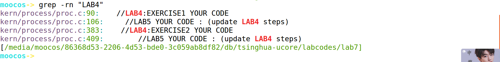
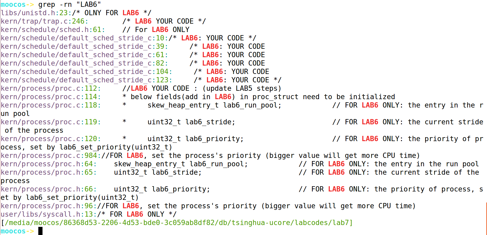
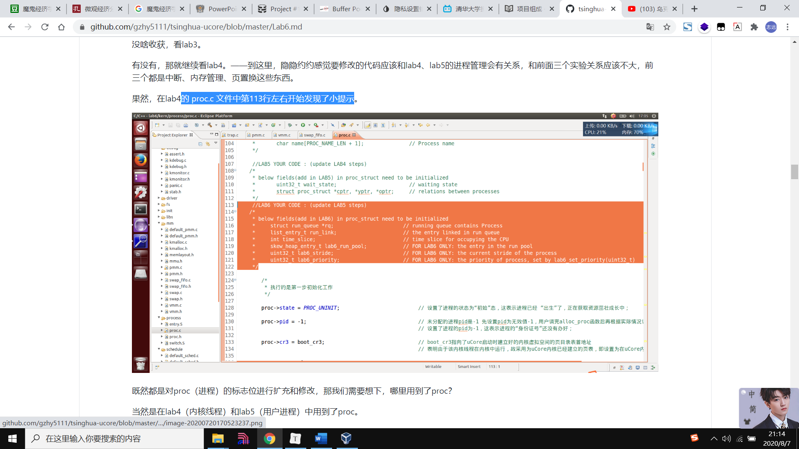
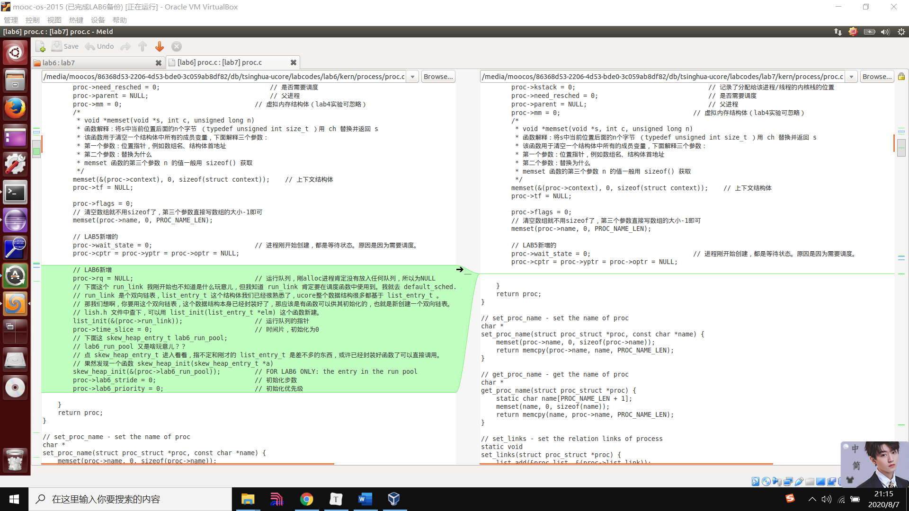

# 实验七：同步互斥

#### 练习0：填写已有实验

本实验依赖实验1/2/3/4/5/6。请把你做的实验1/2/3/4/5/6的代码填入本实验中代码中有“LAB1”/“LAB2”/“LAB3”/“LAB4”/“LAB5”/“LAB6”的注释相应部分。并确保编译通过。注意：为了能够正确执行lab7的测试应用程序，可能需对已完成的实验1/2/3/4/5/6的代码进行进一步改进。

答：

使用grep指令在LAB7代码中以此搜查“LAB1”~“LAB6”注释部分所在行号，以便于使用meld软件合并代码。


遇到这种右边LAB7中有新的注释的情况，我们把新的注释保留着，不要覆盖，然后把LAB1源代码贴到右边。

最后我们再研究新给的注释。

LAB1代码，最终只合并了 STEP 1、STEP 2、STEP 3


grep LAB2：


合并过去的代码有：

```
kern/mm/pmm.c:366:    /* LAB2 EXERCISE 2: YOUR CODE
kern/mm/pmm.c:419:    /* LAB2 EXERCISE 3: YOUR CODE
kern/mm/default_pmm.c:12:// LAB2 EXERCISE 1: YOUR CODE
```


LAB3：


```
kern/mm/vmm.c:437:    /*LAB3 EXERCISE 1: YOUR CODE
kern/mm/vmm.c:455:    /*LAB3 EXERCISE 1: YOUR CODE*/
kern/mm/vmm.c:462:    /*LAB3 EXERCISE 2: YOUR CODE
kern/mm/swap_fifo.c:52:    /*LAB3 EXERCISE 2: YOUR CODE*/ 
kern/mm/swap_fifo.c:67:     /*LAB3 EXERCISE 2: YOUR CODE*/ 
```


LAB4：



```
kern/process/proc.c:90:    //LAB4:EXERCISE1 YOUR CODE
kern/process/proc.c:383:    //LAB4:EXERCISE2 YOUR CODE
```


LAB5：


```
kern/trap/trap.c:57:     /* LAB5 YOUR CODE */ 
kern/trap/trap.c:239:        /* LAB5 YOUR CODE */
kern/process/proc.c:106:     //LAB5 YOUR CODE : (update LAB4 steps)
kern/process/proc.c:444:	//LAB5 YOUR CODE : (update LAB4 steps)
kern/process/proc.c:682:    /* LAB5:EXERCISE1 YOUR CODE
```


LAB6：



kern/trap/trap.c:246:        /* LAB6 YOUR CODE */

emm，似乎太乱了，我们参考下之前LAB6的实验md文档吧。看看都哪些文件被动过。


RR算法是实验原始代码已经实现好的，我们不需要修改。

先运行下试试看。


存在报错。参考下之前md留下来的思路：



去 proc.c 文件看看。

果然，有LAB6新增的代码：



合并过去。


哦嚯，缺页异常，怎么回事。去trap.c看看

不对不对，，往前翻翻。


这好像是哲学家就餐问题导致的缺页错误吧。这应该和LAB7有关。是正常的。

下面我们直接看练习1吧。

（先不管练习0中说的需要修改的地方，我们先不改。先看练习1）


---

2020.8.9 补充：

因为昨天写完LAB7后，运行一直出错，今天我怀疑是实验环境问题。实验环境的磁盘大小一直就不够，今早起来打开实验环境后彻底死机了。不得不说，实验手册提供的虚拟机镜像只有8G的大小，安装上虚拟机后，根目录就剩下700M左右的空间，十分有限。

没有办法，今天我用VirtualBox又新建了一个实验环境。

但不幸的是实验代码丢掉了，，我又从自己的github仓库中下载了。

然后开始合并LAB1-LAB6的代码。


现在，LAB6的大步调度算法我们暂时没有更新。其他的都合并好了。执行下make qemu：


make grade：


priority就是大步调度算法检测的程序，出现WRONG是因为LAB6的代码我们没有合并。（其实我也合并过，但会出现运行错误，我不明白为什么，等我做完LAB7后再倒回去看看吧）


现在这么来看，没什么问题，我们放心的去做LAB7练习一。


#### 练习1: 理解内核级信号量的实现和基于内核级信号量的哲学家就餐问题（不需要编码）

完成练习0后，建议大家比较一下（可用meld等文件diff比较软件）个人完成的lab6和练习0完成后的刚修改的lab7之间的区别，分析了解lab7采用信号量的执行过程。执行`make grade`，大部分测试用例应该通过。

答：

执行个 make grade 看看：


明显，很多案例不通过， 应该是哪里还有问题。我们倒回去看看合并的时候有没有缺少。

害。。我不知道为什么。我检查了很久，没发现原因。我现在怀疑是LAB7写完后才能正确运行，现在报错是正常的。

---

2020.8.9补充：我又重新clone了自己的github仓库，合并了LAB1-LAB5的代码。现在没事了。开始做练习1。（其实做完练习一已经写好了，但今天不知怎么的，倒腾虚拟机的时候就丢失了。）


请在实验报告中给出内核级信号量的设计描述，并说明其大致执行流程。

答：

内核级信号量的实现：请参考sync文件夹中的sem.c wait.c wait.h文件中的注释。很详细了。可以类比多线程抢购火车票问题。

内核级信号量的哲学家就餐问题：注释很清楚。

请在实验报告中给出给用户态进程/线程提供信号量机制的设计方案，并比较说明给内核级提供信号量机制的异同。

#### 练习2: 完成内核级条件变量和基于内核级条件变量的哲学家就餐问题（需要编码）

首先掌握管程机制，然后基于信号量实现完成条件变量实现，然后用管程机制实现哲学家就餐问题的解决方案（基于条件变量）。

答：

1. 先基于信号量完成条件变量的实现。

2. 用管程机制（基于条件变量）实现哲学家就餐问题

位于lab7_figs/kern/sync/check_sync.c中的check_sync函数可以理解为是实验七的起始执行点，是实验七的总控函数。进一步分析此函数，可以看到这个函数主要分为了两个部分，第一部分是实现基于信号量的哲学家问题，第二部分是实现基于管程的哲学家问题。

我们找到check_sync函数：


与LAB6进行对比，我们用LAB6的代码替换过去。检查下 到底是哲学家问题本身所造成的报错还是替换导致的错误。


依然报错，我们怀疑是合并的时候有错误。

**最终，发现了原因。应该是LAB5的用户进程有问题，当时在lab5中使用grade指令评分的时候就不是满分，应该是这里存在的问题在LAB7中暴露出来了。**

没有办法，我现在去LAB5实验文件夹中修改LAB5。

**（不对吧，应该是完成这个练习后，执行make grade才会输出ok。我们先不管了。先去写练习1）。**

2020.8.9补充：上面这个问题，我重新下载了实验代码并合并后，就没有这个问题了。先不管了。开始重新写wait和signal函数。

------

基于信号量实现完成条件变量实现：即完成wait和signal函数

首先先看monitor.h函数，看看结构体的定义和作用。

我们回过头看下执行效果：


发现一个神奇的问题，采用条件变量实现的五个哲学家要么同时思考，要么同时吃饭。显然就表示基于条件变量实现的哲学家问题，肯定是还没完成代码实现。接下来我们要做的就是实现它。

同时，我发现使用信号量实现的哲学家问题，在输出结果，是没有问题的。这也是供我们参考的（练习一部分）。


代码实现部分，我一边参考word笔记，一边写的。

Ps：有的注释不知道怎么翻译成代码，就去参考下 check_sync.c 文件。最好看下授课视频。讲得很清楚。

make qemu：


执行：`make grade` 。如果所显示的应用程序检测都输出ok，则基本正确。如果只是某程序过不去，比如matrix.c，则可执行

```
make run-matrix
```

答：

执行make grade：


priority执行不过去是因为我没有将LAB6的 大步调度算法 拷贝过去，用的还是代码中默认实现的RR（即 时间片轮转调度算法）。——不影响，这不是重点。


---


命令来单独调试它。大致执行结果可看附录。

请在实验报告中给出内核级条件变量的设计描述，并说明其大致执行流程。

请在实验报告中给出给用户态进程/线程提供条件变量机制的设计方案，并比较说明给内核级提供条件变量机制的异同。

请在实验报告中回答：能否不用基于信号量机制来完成条件变量？如果不能，请给出理由，如果能，请给出设计说明和具体实现。

#### 扩展练习 Challenge ：　在ucore中实现简化的死锁和重入探测机制

在ucore下实现一种探测机制，能够在多进程/线程运行同步互斥问题时，动态判断当前系统是否出现了死锁产生的必要条件，是否产生了多个进程进入临界区的情况。 如果发现，让系统进入monitor状态，打印出你的探测信息。

#### 扩展练习 Challenge ：　参考Linux的RCU机制，在ucore中实现简化的RCU机制

在ucore 下实现下Linux的RCU同步互斥机制。可阅读相关Linux内核书籍或查询网上资料，可了解RCU的设计实现细节，然后简化实现在ucore中。 要求有实验报告说明你的设计思路，并提供测试用例。下面是一些参考资料：

- http://www.ibm.com/developerworks/cn/linux/l-rcu/
- http://www.diybl.com/course/6_system/linux/Linuxjs/20081117/151814.html