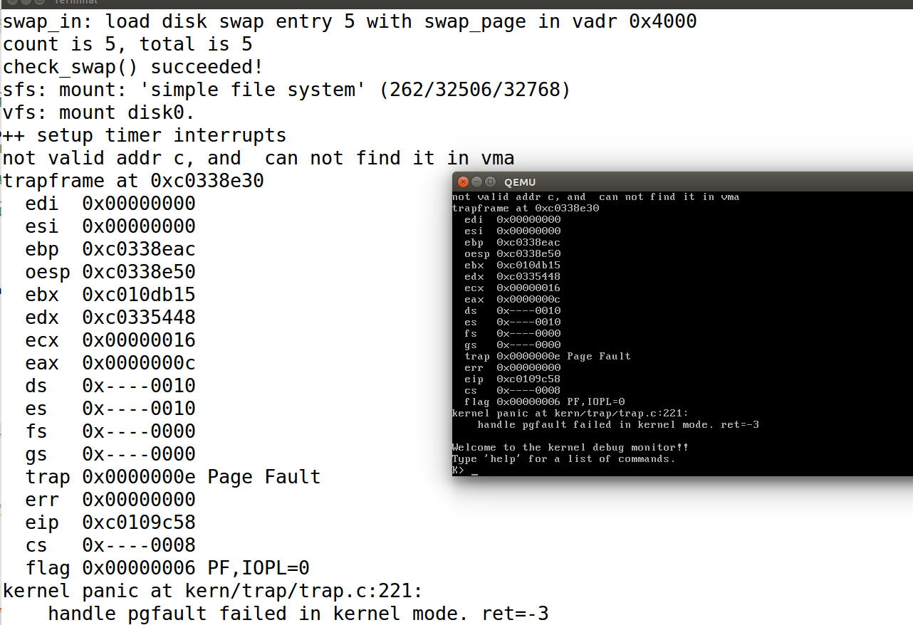

# 实验八：文件系统

## 实验内容

实验七完成了在内核中的同步互斥实验。本次实验涉及的是文件系统，通过分析了解ucore文件系统的总体架构设计，完善读写文件操作，从新实现基于文件系统的执行程序机制（即改写do_execve），从而可以完成执行存储在磁盘上的文件和实现文件读写等功能。


### 练习

对实验报告的要求：

- 基于markdown格式来完成，以文本方式为主
- 填写各个基本练习中要求完成的报告内容
- 完成实验后，请分析ucore_lab中提供的参考答案，并请在实验报告中说明你的实现与参考答案的区别
- 列出你认为本实验中重要的知识点，以及与对应的OS原理中的知识点，并简要说明你对二者的含义，关系，差异等方面的理解（也可能出现实验中的知识点没有对应的原理知识点）
- 列出你认为OS原理中很重要，但在实验中没有对应上的知识点

#### 练习0：填写已有实验

本实验依赖实验1/2/3/4/5/6/7。请把你做的实验1/2/3/4/5/6/7的代码填入本实验中代码中有“LAB1”/“LAB2”/“LAB3”/“LAB4”/“LAB5”/“LAB6” /“LAB7”的注释相应部分。并确保编译通过。注意：为了能够正确执行lab8的测试应用程序，可能需对已完成的实验1/2/3/4/5/6/7的代码进行进一步改进。

答：

之前合并那么多次了，还是使用grep指令找到LAB1~LAB7的注释部分，然后用meld合并。可参考下LAB7的md笔记。

LAB1合并的文件有：

kern/debug/kdebug.c:338:     /* LAB1 YOUR CODE : STEP 1 */
kern/trap/trap.c:45:     /* LAB1 YOUR CODE : STEP 2 */
kern/trap/trap.c:217:        /* LAB1 YOUR CODE : STEP 3 */

报告：lab1中没有发现有关lab8的注释。


LAB2需要合并的文件有：

kern/mm/default_pmm.c:12:// LAB2 EXERCISE 1: YOUR CODE
kern/mm/pmm.c:366:    /* LAB2 EXERCISE 2: YOUR CODE
kern/mm/pmm.c:419:    /* LAB2 EXERCISE 3: YOUR CODE

报告：lab2中没有发现有关lab8的注释。


LAB3合并的文件：

kern/mm/swap_fifo.c:52:    /*LAB3 EXERCISE 2: YOUR CODE*/ 
kern/mm/swap_fifo.c:67:     /*LAB3 EXERCISE 2: YOUR CODE*/ 
kern/mm/vmm.c:437:    /*LAB3 EXERCISE 1: YOUR CODE
kern/mm/vmm.c:455:    /*LAB3 EXERCISE 1: YOUR CODE*/
kern/mm/vmm.c:462:    /*LAB3 EXERCISE 2: YOUR CODE

报告：lab3中没有发现有关lab8的注释。


LAB4合并的文件：

kern/process/proc.c:93:    //LAB4:EXERCISE1 YOUR CODE**（发现有关LAB8的注释）**

注释：//LAB8:EXERCISE2 YOUR CODE HINT:need add some code to init fs in proc_struct, ...

kern/process/proc.c:430:    //LAB4:EXERCISE2 YOUR CODE


LAB5合并的文件：

lab5使用grep有点混杂，我们看下lab6实现的markdown文件。

**大多LAB5的合并是在proc.c文件，这里面还有大量LAB8的注释。**

练习二：kern/mm/pmm.c


LAB6合并的文件：

LAB6涉及到调度器，实验默认提供了一个RR调度算法。实验材料也说了：练习1: 使用 Round Robin 调度算法（不需要编码），是不需要编码的。

所以我们可以不管lab6的合并，直接用RR调度算法就可以。


LAB7合并的文件：

kern/sync/check_sync.c:124:     // LAB7 EXERCISE1: YOUR CODE
kern/sync/check_sync.c:138:     // LAB7 EXERCISE1: YOUR CODE
kern/sync/monitor.c:28:   //LAB7 EXERCISE1: YOUR CODE
kern/sync/monitor.c:47:    //LAB7 EXERCISE1: YOUR CODE

报告：lab7中没有发现有关lab8的注释。


补充&友情提示：

alloc_proc::proc.c

```
static struct proc_struct *
alloc_proc(void) {
    struct proc_struct *proc = kmalloc(sizeof(struct proc_struct));
    if (proc != NULL) {
    //LAB4:EXERCISE1 YOUR CODE
    /*
     * below fields in proc_struct need to be initialized
     *       enum proc_state state;                      // Process state
     *       int pid;                                    // Process ID
     *       int runs;                                   // the running times of Proces
     *       uintptr_t kstack;                           // Process kernel stack
     *       volatile bool need_resched;                 // bool value: need to be rescheduled to release CPU?
     *       struct proc_struct *parent;                 // the parent process
     *       struct mm_struct *mm;                       // Process's memory management field
     *       struct context context;                     // Switch here to run process
     *       struct trapframe *tf;                       // Trap frame for current interrupt
     *       uintptr_t cr3;                              // CR3 register: the base addr of Page Directroy Table(PDT)
     *       uint32_t flags;                             // Process flag
     *       char name[PROC_NAME_LEN + 1];               // Process name
     */
     //LAB5 YOUR CODE : (update LAB4 steps)
    /*
     * below fields(add in LAB5) in proc_struct need to be initialized	
     *       uint32_t wait_state;                        // waiting state
     *       struct proc_struct *cptr, *yptr, *optr;     // relations between processes
	 */
     //LAB6 YOUR CODE : (update LAB5 steps)
    /*
     * below fields（以下字段）(add in LAB6) in proc_struct need to be initialized（初始化）
     * 当然，这些字段都在 proc.h 头文件中的 proc_struct 结构体中定义过了。
     *     struct run_queue *rq;                       // running queue contains Process（运行队列）
     *     list_entry_t run_link;                      // the entry linked in run queue（运行队列指针）
     *     int time_slice;                             // time slice for occupying the CPU（时间片）
     *     skew_heap_entry_t lab6_run_pool;            // FOR LAB6 ONLY: the entry in the run pool
     *     uint32_t lab6_stride;                       // FOR LAB6 ONLY: the current stride of the process
     *     uint32_t lab6_priority;                     // FOR LAB6 ONLY: the priority of process, set by lab6_set_priority(uint32_t)
     */
    //LAB8:EXERCISE2 YOUR CODE HINT:need add some code to init fs in proc_struct, ...

    	... ...
    	
		// LAB8新增的
		proc->filesp = NULL;
    }
    return proc;
}
```

新增了一行：proc->filesp = NULL;

修改完后，开始写练习1和练习2，但写完后make qemu会出现一个熟悉的错误：



缺页异常。

该错误是如何造成的？

此前，在lab7中也出现过，但第二天新建了一个全新的实验环境后再合并lab1~lab6的代码后，重新做lab7，就没有问题了。

之前考虑可能是虚拟机空间不够导致的缺页异常。**这次我执行了lab7的代码，发现没有任何问题，所以这跟空间不足没有关系。**

经过参考 https://github.com/AmadeusChan/ucore_os_lab/blob/master/lab8/kern/process/proc.c

发现是do_fork函数缺少复制实现。

do_fork::proc.c：

```
int
do_fork(uint32_t clone_flags, uintptr_t stack, struct trapframe *tf) {
    int ret = -E_NO_FREE_PROC;
    struct proc_struct *proc;
    if (nr_process >= MAX_PROCESS) {
        goto fork_out;
    }
    ret = -E_NO_MEM;
    //LAB4:EXERCISE2 YOUR CODE
    //LAB8:EXERCISE2 YOUR CODE  HINT:how to copy the fs in parent's proc_struct?
    /*
     * Some Useful MACROs, Functions and DEFINEs, you can use them in below implementation.
     * MACROs or Functions:
     *   alloc_proc:   create a proc struct and init fields (lab4:exercise1)
     *   setup_kstack: alloc pages with size KSTACKPAGE as process kernel stack
     *   copy_mm:      process "proc" duplicate OR share process "current"'s mm according clone_flags
     *                 if clone_flags & CLONE_VM, then "share" ; else "duplicate"
     *   copy_thread:  setup the trapframe on the  process's kernel stack top and
     *                 setup the kernel entry point and stack of process
     *   hash_proc:    add proc into proc hash_list
     *   get_pid:      alloc a unique pid for process
     *   wakup_proc:   set proc->state = PROC_RUNNABLE
     * VARIABLES:
     *   proc_list:    the process set's list
     *   nr_process:   the number of process set
     */

    //    1. call alloc_proc to allocate a proc_struct
    //    2. call setup_kstack to allocate a kernel stack for child process
    //    3. call copy_mm to dup OR share mm according clone_flag
    //    4. call copy_thread to setup tf & context in proc_struct
    //    5. insert proc_struct into hash_list && proc_list
    //    6. call wakup_proc to make the new child process RUNNABLE
    //    7. set ret vaule using child proc's pid

	
	... ...
	
	
	// lab8新增
	copy_files(clone_flags, proc);

fork_out:
    return ret;

bad_fork_cleanup_fs:  //for LAB8
    put_files(proc);
bad_fork_cleanup_kstack:
    put_kstack(proc);
bad_fork_cleanup_proc:
    kfree(proc);
    goto fork_out;
}
```

新增了一行：copy_files(clone_flags, proc);

然后再运行就没有问题了。

**所以以后实验中遇到缺页异常就去proc.c函数中找问题。看来之前lab7代码出现此问题应该是meld合并代码的时候漏了什么。**


#### 练习1: 完成读文件操作的实现（需要编码）

首先**了解打开文件的处理流程**，然后参考本实验**后续的文件读写操作的过程分析**，编写在sfs_inode.c中sfs_io_nolock读文件中数据的实现代码。

答：

**在学习此练习之前好好看看word笔记，搭配网课视频反复看，直到看懂。同时，实验手册中的https://chyyuu.gitbooks.io/ucore_os_docs/content/lab8/lab8_3_7_2_file_read.html读文件部分好好看看。如果很难理解inode的话，可以看看自己当时收藏的网页，上面的链式文件系统啊、索引式文件系统啊，讲的非常详细。**

实验中没有按照从上到下先讲文件系统抽象层，再讲具体的文件系统。这是由于如果能够理解Simple FS（简称SFS）文件系统，就可更好地分析文件系统抽象层的设计。即从具体走向抽象。

SFS文件系统的布局如下图所示。


第0个块（4K）是超级块（superblock），它包含了关于文件系统的所有关键参数：

文件系统总参数：

```
// 第0个块（4K）是超级块（superblock），它包含了关于文件系统的所有关键参数，当计算机被启动或文件系统被首次接触时，超级块的内容就会被装入内存。
struct sfs_super {
    uint32_t magic;                         /* magic number, should be SFS_MAGIC */
    uint32_t blocks;            			// 记录了SFS中所有block的数量，即 img 的大小
    uint32_t unused_blocks;                 // 记录了SFS中还没有被使用的block的数量
    char info[SFS_MAX_INFO_LEN + 1];        /* infomation for sfs  */
};
```

磁盘索引节点：

```
// 磁盘索引节点代表了一个实际位于磁盘上的文件。首先我们看看在硬盘上的索引节点的内容：
struct sfs_disk_inode {
    uint32_t size;                                  // 如果inode表示常规文件，则size是文件大小 
    uint16_t type;                                  // inode的文件类型 					
    uint16_t nlinks;                                // 此inode的硬链接数 					
    uint32_t blocks;                                // 此inode的数据块数的个数 			
    // direct[]直接指向了保存文件内容数据的数据块索引值
    uint32_t direct[SFS_NDIRECT];              // 此inode的直接数据块索引值（有SFS_NDIRECT个）
    // indirect指向的是间接数据块（indirect block），此数据块实际存放的全部是数据块索引，这些数据块索引指向的数据块才被用来存放文件内容数据。
    uint32_t indirect;                              // 此inode的一级间接数据块索引值 		
//    uint32_t db_indirect;                           /* double indirect blocks */
//   unused
};
```

对于普通文件，索引值指向的 block 中保存的是文件中的数据。

而**对于目录**，索引值指向的数据保存的是目录下所有的文件名以及对应的索引节点所在的索引块（磁盘块）所形成的数组。数据结构如下：

```
struct sfs_disk_entry {
    uint32_t ino;                                  // 磁盘 block 编号,FS 下，为了实现的简便（偷懒），每个 inode 直接用他所在的磁盘 block 的编号作为 inode 编号。
    char name[SFS_MAX_FNAME_LEN + 1];              // 表示目录下文件或文件夹的名称（文件夹或文件名）
};
```

内存中的索引节点：

```
// 内存中的索引节点
struct sfs_inode {
    struct sfs_disk_inode *din;                     /* on-disk inode */
    uint32_t ino;                                   /* inode number */
    bool dirty;                                     /* true if inode modified */
    int reclaim_count;                              /* kill inode if it hits zero */
    semaphore_t sem;                                /* semaphore for din */
    list_entry_t inode_link;                        /* entry for linked-list in sfs_fs */
    list_entry_t hash_link;                         /* entry for hash linked-list in sfs_fs */
};
```

Ps：需要注意，一个内存inode是在打开一个文件后才创建的，如果关机则相关信息都会消失。而硬盘inode的内容是保存在硬盘中的，只是在进程需要时才被读入到内存中，用于访问文件或目录的具体内容数据。

---

上面是对.h文件简单的分析，也是文件系统中最最底层的东西，下面开始看练习1的 sfs_inode.c::sfs_io_nolock 函数。

sfs_io_nolock函数调用图：


发现，sfs_io_nolock 函数被 sfs_io 调用。

调过去，发现 sfs_io 函数用于封装 sfs_io_nolock 函数，是用于读写文件的。它还调用 sys_wblock 和 sfs_rblock 函数。（显然这两个函数才是实现读写的，那 sfs_io_nolock 是干嘛的？）

看下该函数的注释：Rd/Wr a file contentfrom offset position to offset+ length  disk blocks<-->buffer (in memroy)

> 磁盘块的偏移位置 <--> 缓冲区(在memroy中)

**好像是做某种偏移用的。**

显然，练习1是让我们完成对文件的读写函数的实现。

这里，我认为需要深刻理解文件系统控制流。（引用word笔记）


参考：https://chyyuu.gitbooks.io/ucore_os_docs/content/lab8/lab8_3_7_2_file_read.html

lab8练习1给的注释，说实话，我翻译过来也没懂。实际上是说了三种情况：


这个图片我为此还录了几段视频，以便于以后还能回想起来当时的思路。图片代码来源于网络，来源见参考文件。

代码我就不贴了，需要的话就看github。


请在实验报告中给出设计实现”UNIX的PIPE机制“的概要设方案，鼓励给出详细设计方案

#### 练习2: 完成基于文件系统的执行程序机制的实现（需要编码）

改写proc.c中的load_icode函数和其他相关函数，实现基于文件系统的执行程序机制。执行：make qemu。如果能看看到sh用户程序的执行界面，则基本成功了。如果在sh用户界面上可以执行”ls”,”hello”等其他放置在sfs文件系统中的其他执行程序，则可以认为本实验基本成功。

答：

通过练习0发现，proc.c中含有大量的LAB8注释。我们直接对proc.c文件开刀。

我们**需要修改proc.c中的load_icode函数**。——lab5中是从内存中加载程序，LAB8中需要从硬盘加载程序。所以load_icode函数需要改写。（LAB8练习2的内容）。对文件的加载过程进行扩展，使其能够从硬盘中加载程序。

第125行：

//LAB8:EXERCISE2 YOUR CODE HINT:need add some code to init fs in proc_struct, ...

alloc_proc函数中新增一行：

```
// LAB8新增的
proc->filesp = NULL;
```

do_fork::proc.c：

```
int
do_fork(uint32_t clone_flags, uintptr_t stack, struct trapframe *tf) {
    int ret = -E_NO_FREE_PROC;
    struct proc_struct *proc;
    if (nr_process >= MAX_PROCESS) {
        goto fork_out;
    }
    ret = -E_NO_MEM;
    //LAB4:EXERCISE2 YOUR CODE
    //LAB8:EXERCISE2 YOUR CODE  HINT:how to copy the fs in parent's proc_struct?
    /*
     * Some Useful MACROs, Functions and DEFINEs, you can use them in below implementation.
     * MACROs or Functions:
     *   alloc_proc:   create a proc struct and init fields (lab4:exercise1)
     *   setup_kstack: alloc pages with size KSTACKPAGE as process kernel stack
     *   copy_mm:      process "proc" duplicate OR share process "current"'s mm according clone_flags
     *                 if clone_flags & CLONE_VM, then "share" ; else "duplicate"
     *   copy_thread:  setup the trapframe on the  process's kernel stack top and
     *                 setup the kernel entry point and stack of process
     *   hash_proc:    add proc into proc hash_list
     *   get_pid:      alloc a unique pid for process
     *   wakup_proc:   set proc->state = PROC_RUNNABLE
     * VARIABLES:
     *   proc_list:    the process set's list
     *   nr_process:   the number of process set
     */

    //    1. call alloc_proc to allocate a proc_struct
    //    2. call setup_kstack to allocate a kernel stack for child process
    //    3. call copy_mm to dup OR share mm according clone_flag
    //    4. call copy_thread to setup tf & context in proc_struct
    //    5. insert proc_struct into hash_list && proc_list
    //    6. call wakup_proc to make the new child process RUNNABLE
    //    7. set ret vaule using child proc's pid

	
	... ...
	
	
	// lab8新增
	copy_files(clone_flags, proc);

fork_out:
    return ret;

bad_fork_cleanup_fs:  //for LAB8
    put_files(proc);
bad_fork_cleanup_kstack:
    put_kstack(proc);
bad_fork_cleanup_proc:
    kfree(proc);
    goto fork_out;
}
```

新增了一行：copy_files(clone_flags, proc);

下面就是重写 load_icode 函数：

```
static int
load_icode(int fd, int argc, char **kargv) {
    /* LAB8:EXERCISE2 YOUR CODE  HINT:how to load the file with handler fd  in to process's memory? how to setup argc/argv?
     * MACROs or Functions:
     *  mm_create        - create a mm
     *  setup_pgdir      - setup pgdir in mm
     *  load_icode_read  - read raw data content of program file
     *  mm_map           - build new vma
     *  pgdir_alloc_page - allocate new memory for  TEXT/DATA/BSS/stack parts
     *  lcr3             - update Page Directory Addr Register -- CR3
     */
	/* (1) create a new mm for current process
     * (2) create a new PDT, and mm->pgdir= kernel virtual addr of PDT
     * (3) copy TEXT/DATA/BSS parts in binary to memory space of process
     *    (3.1) read raw data content in file and resolve elfhdr
     *    (3.2) read raw data content in file and resolve proghdr based on info in elfhdr
     *    (3.3) call mm_map to build vma related to TEXT/DATA
     *    (3.4) callpgdir_alloc_page to allocate page for TEXT/DATA, read contents in file
     *          and copy them into the new allocated pages
     *    (3.5) callpgdir_alloc_page to allocate pages for BSS, memset zero in these pages
     * (4) call mm_map to setup user stack, and put parameters into user stack
     * (5) setup current process's mm, cr3, reset pgidr (using lcr3 MARCO)
     * (6) setup uargc and uargv in user stacks
     * (7) setup trapframe for user environment
     * (8) if up steps failed, you should cleanup the env.
     */
}
```

给了很多注释，参考注释和之前 LAB5创建用户进程 的练习1笔记。

Ps：直接把LAB5的代码过来，然后根据注释再修改。

**load_icode函数需要改写的地方主要是第3步“读取文件中的原始数据内容并解析elfhdr”、4.2：“参数个数统计”、 4.3：“用户栈顶” 和 6：“在用户堆栈中设置uargc和uargv”。**

**以后如果有机会一定要再好好深入理解用户堆栈。**

代码我就不贴了，需要的话在github上。


请在实验报告中给出设计实现基于”UNIX的硬链接和软链接机制“的概要设方案，鼓励给出详细设计方案

**祝贺你通过自己的努力，完成了ucore OS lab1-lab8!**


最后的话：很惭愧，直到最后lab8，我才学会了eclipse与gdb联调联试，才学会了gdb的使用方法，还学会了如何连接qemu。我在调试的时候，也录制了视频，希望以后能依靠视频回想起来当时学过的东西。


## 参考文献

https://blog.csdn.net/qq_19876131/article/details/51707008

https://www.jianshu.com/p/7e46a6ae0e8d